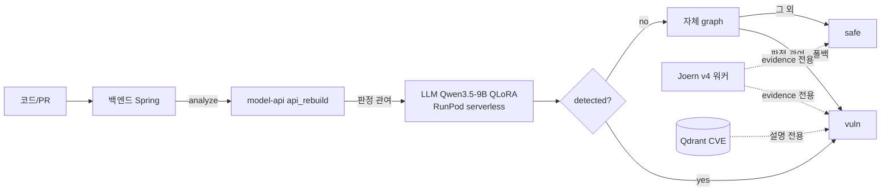
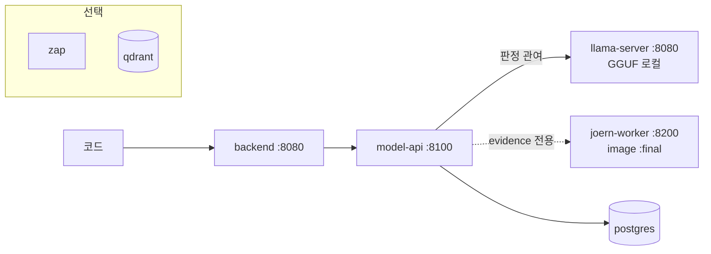

# ScanOps — 최종 아키텍처·측정 보고서

> 작성 2026-08-17. 이 문서의 **모든 성능 문장에는 (수치, 파일, 절)** 이 붙는다.
> 판정은 각 세션에서 **사전 등록한 기준** 그대로 적는다.

---

## §0 Executive Summary

1. **만든 것**: 파인튜닝 LLM 단독 탐지(Qwen3.5-9B QLoRA) + 자체 정규식 graph 폴백 +
   Joern v4 데이터흐름 **근거(evidence) 수집** + 외부 호출 0 온프레미스 배포 패키지.
2. **측정한 것**: 내부 test AUC/F1은 `rebuild/out/test_report.json`,
   외부 벤치는 CleanVul·PrimeVul(§3), Joern v4 단독 precision은
   CleanVul 240건 **0.5909** (`joern_v4_eval_sample.json`, JOERN_HYBRID_REPORT_V4.md §4)와
   OWASP taint 전용 110건 **0.5172** (`owasp_joern_v4_final_metrics.json`, §3-2).
3. **죽인 것**: LLM Critic 노선 — CTX-1(2026-08-15) · V3(08-16) · V4(08-17) 세 번 모두
   사전 등록 게이트에서 탈락. 마지막에는 **외부 상용 모델과 베이스 모델까지 같은 답**을 냈다(§4).
4. **왜 죽었나**: 질문의 근거가 입력에 없었다 — sanitizer 패치 줄이 Joern 슬라이스에 등장하는
   비율 **4.8%**, 쌍의 **38%** 는 vuln/safe 슬라이스가 글자까지 동일(§4).
5. **남은 것**: Joern은 판정에서 빠지고 **evidence 전용**으로 남았다(§1). 온프레미스 스택은
   실제로 기동해 데모 응답을 받았다(§5·§6). **아직 목표(precision 0.70)에 도달한 arm은 없다**(§3).

---

## §1 아키텍처

### SaaS 경로


### 온프레미스 경로 (외부 호출 0)


> **화살표 표기**: "판정 관여"는 `detected` 값을 바꿀 수 있는 경로,
> "evidence 전용"은 응답에 근거만 싣고 판정을 바꾸지 않는 경로다.
> Joern이 evidence 전용인 근거는 §3-1·§3-2의 precision 측정이다.

---

## §2 실험 연대기

각 행은 **질문 / 사전등록 기준 / 결과 / 판정 / 배운 것**이다. 실패도 같은 크기로 적는다.

| # | 실험 | 질문 | 사전등록 기준 | 결과 | 판정 | 배운 것 | 파일 |
|---|---|---|---|---|---|---|---|
| 1 | **V3 자율실행** | 여러 MUST 개선안이 듣는가 | 각 MUST별 사전등록 | MUST 전부 실패, F1 지표 무효 | 기각 | self-consistency만 유효 | `V3_RUN_SPEC` |
| 2 | **CTX-1 문맥주입** | 같은 파일 문맥을 주면 나아지는가 | ①식별자 포함률 ≥60% ②쌍내부 이동 > 전체이동 | 포함률 **17.1%**, 0.198 vs 0.550 | **KILL** | 문맥에 정보가 없었다. AUC보다 **정보 유입을 먼저 재라** | `CTX_RESULTS.md` |
| 3 | **ABLATION** | 자체 graph가 하이브리드에 기여하는가 | ΔF1 CI가 0을 배제 | ΔF1 −0.0014, CI 0 포함. unknown 91.6% | 기여 없음 | graph는 **거의 답을 안 한다** | `ABLATION_RESULTS.md` |
| 4 | **Joern v1/v2** | Joern taint가 graph보다 나은가 | precision CI하한 ≥0.80(TRUST) / 점추정 ≥0.60(SIGNAL) | 전건 1,878건 precision **0.5068** CI [0.4715, **0.5434**] | **JOERN-NO-BETTER** | CI 상한이 0.60에 미달 = 통계적 배제. 규칙 v2로 과탐 절반 줄여도 precision 불변 | `JOERN_HYBRID_REPORT.md` §4-5 |
| 5 | **Joern v3 + Critic** | 흐름 슬라이스를 LLM에 주면 sanitizer를 가리는가 | T1 마진 ≥0.15, T2 ≥0.60, T3 성립 | YES **0건**, T1 마진 **0.000**, T2 0.8265 | **CRITIC-KILL** + **V3-FAIL** | T2는 통과했으나 T1 마진 0 | `JOERN_HYBRID_REPORT_V3.md` |
| 6 | **Joern v4 결함수정** | self/this 제외·sanitizer applies_to로 나아지는가 | precision 점추정 ≥0.70 | self/this source **35/98 → 0/89**, precision 0.5652→**0.5909** | **V4-FAIL** | 결함은 고쳐졌으나 다른 흐름이 자리를 채운다 | `JOERN_HYBRID_REPORT_V4.md` §2 |
| 7 | **전략 A (외부 모델)** | 더 강한 모델이면 되는가 | 마진 ≥0.15, YES ≥5, UNP <0.20 | UNPARSED **0%**, YES **0**, 마진 **0.000** | 미통과 | **모델 탓 근거가 사라졌다** | `critic_v4_A_external_metrics.json` |
| 8 | **전략 E (union 슬라이스)** | 순환 제거하면 되는가 | 위와 동일 | 흐름 1→3.9개로 넓혔으나 sanitizer 포함률 **4.8% 불변**, YES 0 | 미통과 | 넓히는 것으로는 해결 안 됨 | `critic_v4_E_union_external_metrics.json` |
| 9 | **전략 D (베이스 모델)** | 어댑터 과적합인가 | 위와 동일 | UNPARSED 0%, YES **0**, 마진 0.000 | 미통과 | 형식은 어댑터 문제가 맞으나(v1 27.6% vs 베이스 0%) **판정은 안 바뀜** | `critic_v4_D_base_metrics.json` |
| 10 | **OWASP taint 전용** (오늘) | taint 계열만 보면 Joern이 나은가 | 사전등록: precision/recall/FPR/F1 + 자명 기준선 | precision **0.5172** CI [0.4023, 0.6207] | 가설 **미지지** | taint 전용이라고 나아지지 않는다 | `owasp_joern_v4_final_metrics.json` |

---

## §3 성능표

### §3-1 CleanVul_v2 (외부 벤치, 실제 커밋 유래) — 층화 240건

| arm | precision | 95% CI | recall | FPR | F1 |
|---|---|---|---|---|---|
| **all-vuln (자명 기준선)** | 0.5000 | [0.4333, 0.5625] | 1.0000 | 1.0000 | **0.6667** |
| LLM only | 0.5872 | [0.4954, 0.6789] | 0.5333 | 0.3750 | 0.5590 |
| **LLM + 자체graph (현재 채택)** | 0.5909 | [0.5091, 0.6909] | 0.5417 | 0.3750 | 0.5652 |
| Joern v3 단독 | 0.5652 | [0.4130, 0.6957] | 0.2167 | 0.1667 | 0.3133 |
| **Joern v4 단독** | **0.5909** | [0.4318, 0.7273] | 0.2167 | 0.1500 | 0.3171 |
| v4 + Critic | 0.5909 | [0.5076, 0.6742] | 0.6500 | 0.4500 | 0.6190 |

출처: `rebuild/out/joern_v4_eval_sample.json`, JOERN_HYBRID_REPORT_V4.md §4.

> **어떤 arm도 자명 기준선 F1 0.6667을 넘지 못한다**(최고 0.6190).
> 이 벤치에서 **F1로 성능을 주장할 수 없다.** 대외 자료에는 AUC를 쓴다.

### §3-2 OWASP Benchmark holdout (합성 벤치, taint 계열 전용) — 110건

| arm | precision | 95% CI | recall | FPR | F1 |
|---|---|---|---|---|---|
| **all-vuln (자명 기준선)** | 0.5000 | [0.4091, 0.5909] | 1.0000 | 1.0000 | **0.6667** |
| **Joern v4 단독** | **0.5172** | [0.4023, 0.6207] | 0.8182 | 0.7636 | 0.6338 |

혼동행렬 TP=45 FP=42 FN=10 TN=13. 카테고리 분포: xss 76 / cmdi 10 / crypto 7 /
pathtraver 6 / hash 4 / weakrand 4 / sqli 3. 출처: `rebuild/out/owasp_joern_v4_final_metrics.json`.

**sanitizer 판정의 부분 성과**: `safe_sanitized` 23건 중 gold=safe가 13건(56.5%).
sanitizer 로직이 없었다면 전부 vuln이 되어 precision은 0.5000(=자명)이므로,
sanitizer가 **0.5000 → 0.5172** 만큼 기여했다.

> **주의 (반드시 함께 읽을 것)**
> - OWASP는 **합성 벤치**다. 자체 정규식 graph는 여기에 손튜닝된 이력이 있다.
> - **Joern v4 쿼리는 OWASP를 보고 만들지 않았다.** `taint_v4.sc`·`sanitizers.json`은
>   CleanVul 실패 사례에서만 도출됐다(커밋 이력 `49ce14d` 이전에 OWASP 참조 없음).
> - **이 표의 숫자를 §3-1(CleanVul)과 섞지 않는다.** 벤치 성격이 다르다.

> **가설 미지지**: "taint 계열만 보면 Joern이 낫다"는 기대가 있었으나,
> precision 0.5172는 CleanVul의 0.5909보다도 낮다. recall은 0.8182로 훨씬 높지만
> FPR이 0.7636이라 자명 기준선(FPR 1.0)에 가까워지는 방향이다.

---

## §4 CleanVul 벤치에 대한 발견 — 사실만

### §4-1 측정한 숫자 (Critic 대상 98건 / safe 측 48건, tune split)

| 측정 | 값 | 뜻 |
|---|---|---|
| sanitizer 성 패치의 **그 줄이 Joern 슬라이스에 등장** | **1/21 (4.8%)** | union으로 넓혀도 동일 |
| safe 측 패치가 **sanitizer 호출 추가가 아님** | **26/48 (54.2%)** | sink 교체·리팩터링·시그니처 축소 등 |
| 쌍의 vuln/safe 슬라이스가 **글자까지 동일** | **16/42 (38%)** | 같은 입력에 다른 답을 요구한 셈 |
| Critic이 고칠 수 있는 상한 (슬라이스에 sanitizer 토큰 존재 ∧ gold=safe) | **5/98 (5.1%)** | 완벽한 Critic이어도 이 이상 불가 |

출처: JOERN_HYBRID_REPORT_V4.md §3-2·§3-4.

### §4-2 대표 사례 `cvh_124`

패치는 **한 줄**이었다:
```diff
+            body = StringEscapeUtils.escapeHtml4andJS(body);
```
그런데 sink는 `mapper.readValue(body, PushEvent.class)` — **Jackson 역직렬화**다.
HTML 이스케이프는 역직렬화를 안전하게 만들지 않는다.

**세 모델이 독립적으로 같은 답(NO)을 냈고, 그중 둘은 이유까지 댔다**:
- 베이스 Qwen3.5-9B: "the `escapeHtml4andJS` function only sanitizes HTML/JS characters
  but does not validate or deserialize the JSON structure"
- 외부 Claude Haiku 4.5: 같은 취지
- v1 어댑터: NO (근거는 카테고리 문구 재생)

### §4-3 CleanVul이 무엇을 라벨링한 데이터인가 (Q1)

공식 출처: **arXiv:2411.17274**, *"CleanVul: Automatic Function-Level Vulnerability Detection
in Code Commits Using LLM Heuristics"* (초록 원문 확인, <https://arxiv.org/abs/2411.17274>).

초록에서 확인된 사실(인용):
> "the automatic and indiscriminate labeling of **all changes in vulnerability-fixing commits (VFCs)**
> as vulnerability-related… not all changes in a commit aimed at fixing vulnerabilities pertain to
> security threats; many are routine updates like bug fixes or test improvements"

> "the first methodology that uses the Large Language Model (LLM) with a heuristic enhancement to
> **automatically identify vulnerability-fixing changes from VFCs**, achieving an F1-score of 0.82"

> "CleanVul, a high-quality dataset comprising 8,198 functions… demonstrating **Correctness (90.6%)**"

**따라서**: CleanVul의 라벨은 "**이 변경이 취약점을 고치는 변경인가**"를 LLM 휴리스틱(VulSifter,
그 과제에서 F1 0.82)으로 판정한 결과다. "**이 sink가 이제 안전한가**"를 정적 분석으로 판정한 것이 아니다.

**이 벤치가 무엇을 재는지**:
CleanVul은 **함수 단위 취약점 존재 여부**를 재기에는 적합하다(Correctness 90.6%).
그러나 **"이 데이터흐름이 sanitize 되었는가"를 묻는 질문**에는 부분적으로만 맞는다 —
취약점 수정은 sanitizer 추가만이 아니라 **sink 교체·구조 변경**으로도 이뤄지고,
우리 측정에서 그런 유형이 54.2%였기 때문이다.

> **라벨이 틀렸다는 주장이 아니다.** 우리가 던진 질문("SANITIZED YES/NO")이
> 라벨이 담은 의미의 **일부만** 덮는다는 뜻이다.
> 이것이 §2 #5·#7·#8·#9에서 네 번 연속 YES 0건이 나온 구조적 이유다.

### §4-4 자기 정정

JOERN_HYBRID_REPORT_V3.md는 T2=0.8265를 근거로 "정보 전달은 성공했다"고 적었다.
**이 문장은 2026-08-17에 철회됐다.** T2는 "바뀐 줄의 **식별자**가 슬라이스 텍스트에 있는가"를
셌는데, `self`·`kwargs`·`results` 같은 흔한 이름이면 자동 통과한다.
**판단 근거(sanitizer 호출 자체)로 다시 재면 4.8%다**(§4-1).
