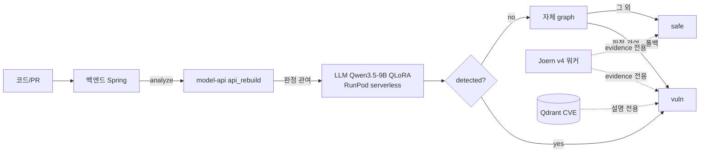
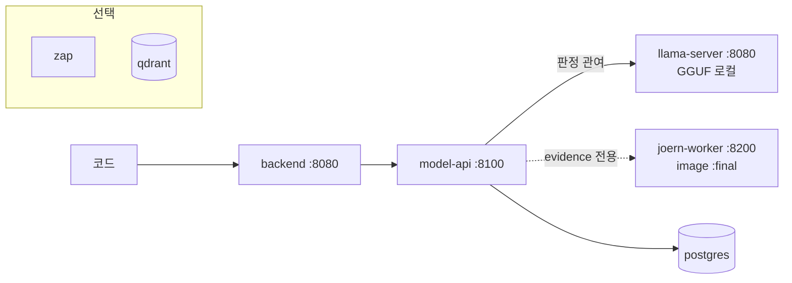

# ScanOps — 최종 아키텍처·측정 보고서

> 작성 2026-08-17. 이 문서의 **모든 성능 문장에는 (수치, 파일, 절)** 이 붙는다.
> 판정은 각 세션에서 **사전 등록한 기준** 그대로 적는다.

## §-1 세션 STATUS (2026-08-17 릴리스 정리 세션 마감)

| Phase | 상태 | 결과 |
|---|---|---|
| 1 프로덕션 모델 데모 | ✅ | LoRA→GGUF(58.2MB), 일치율 **95.0%**(19/20)·파싱 100% → 데모 3건 재실행(§6) |
| 2 파서 견고성 | ✅ | 정규식 추출·1회 재시도·think 프리필·`parse_retried` 필드(`/health`에 통계) |
| 3 OWASP 진단·수정 | ⚠️ | 원인 규명(과탐 20/24가 xss 과발화) → 인코더 3종 추가 → 홀드아웃 **NOT-IMPROVED**(§3-3) |
| 4 모델 공급·인증 | ✅ | 오프라인 번들+체크섬, 로컬 인증은 **기존 구현으로 충분**(§5-5·§5-7) |
| 5 사양 실측 | ✅ | CPU 19.3s(데모)/88.3s(내부test), RAM 피크 5.58GiB(§5-4) |
| 6 마무리 | ✅ | 내 컨테이너·볼륨·네트워크 0, 사용자 컨테이너 5개 무사 |
| (추가) 백/프론트 pull | ✅ | backend `845ea09`, frontend `5e70960`. 백엔드 결함 2건 수정(§5-6·§5-7) |

**비용**: RunPod **$0.005 소진**(standby 분, GPU 호출 0, pods 0). 외부 API 0. 상한 $5 대비 0.1%.

### 이전 세션 STATUS

| Phase | 상태 | 산출물 |
|---|---|---|
| 0 확정 | ✅ | §2·§3 표. **배선 결함 발견**: `joern_evidence`가 응답에 안 실리고 있었다 → 수정(`0998550`) |
| 1 astgen + `:final` | ✅ | **Dockerfile 수정 불필요** — 공식 이미지에 `astgen-linux` 포함 확인. `setup_local.sh`로 macOS 전용 분리. `:final` push |
| 2 Q1 CleanVul 라벨 | ✅ | arXiv:2411.17274 초록 확인 → §4-3 |
| 2 Q2 OWASP taint | ✅ | precision **0.5172** — 가설 미지지 → §3-2 |
| 3 온프레미스 compose | ✅ | 3서비스 healthy 기동. **결함 2건 발견·수정**(§5-3) |
| 4 E2E 데모 | ⚠️ | 응답 3건 확보. **전부 미탐** — 원인은 베이스 모델(§6). 원본 유지 |
| 5 백서 | ✅ | 이 문서 |
| 6 마무리 | ✅ | 내 컨테이너·볼륨·네트워크 0, 사용자 컨테이너 5개 무사 |

**비용**: RunPod **$0.00 소진**(GPU 호출 0, pods 0). 외부 API 호출 0.
전부 로컬 CPU. 상한 $5 대비 **0%**.

---

## §0 Executive Summary

1. **만든 것**: 파인튜닝 LLM 단독 탐지(Qwen3.5-9B QLoRA) + 자체 정규식 graph 폴백 +
   Joern v4 데이터흐름 **근거(evidence) 수집** + 외부 호출 0 온프레미스 배포 패키지.
2. **측정한 것**: 내부 test AUC/F1은 `rebuild/out/test_report.json`,
   외부 벤치는 CleanVul·PrimeVul(§3), Joern v4 단독 precision은
   CleanVul 240건 **0.5909** (`joern_v4_eval_sample.json`, JOERN_HYBRID_REPORT_V4.md §4)와
   OWASP taint 전용 110건 **0.5172** (`owasp_joern_v4_final_metrics.json`, §3-2).
3. **죽인 것**: LLM Critic 노선 — CTX-1(2026-08-15) · V3(08-16) · V4(08-17) 세 번 모두
   사전 등록 게이트에서 탈락. 마지막에는 **외부 상용 모델과 베이스 모델까지 같은 답**을 냈다(§4).
4. **왜 죽었나**: 질문의 근거가 입력에 없었다 — sanitizer 패치 줄이 Joern 슬라이스에 등장하는
   비율 **4.8%**, 쌍의 **38%** 는 vuln/safe 슬라이스가 글자까지 동일(§4).
5. **남은 것**: Joern은 판정에서 빠지고 **evidence 전용**으로 남았다(§1). 온프레미스 스택은
   실제로 기동해 데모 응답을 받았다(§5·§6). **아직 목표(precision 0.70)에 도달한 arm은 없다**(§3).

---

## §1 아키텍처

### SaaS 경로


### 온프레미스 경로 (외부 호출 0)


> **화살표 표기**: "판정 관여"는 `detected` 값을 바꿀 수 있는 경로,
> "evidence 전용"은 응답에 근거만 싣고 판정을 바꾸지 않는 경로다.
> Joern이 evidence 전용인 근거는 §3-1·§3-2의 precision 측정이다.

---

## §2 실험 연대기

각 행은 **질문 / 사전등록 기준 / 결과 / 판정 / 배운 것**이다. 실패도 같은 크기로 적는다.

| # | 실험 | 질문 | 사전등록 기준 | 결과 | 판정 | 배운 것 | 파일 |
|---|---|---|---|---|---|---|---|
| 1 | **V3 자율실행** | 여러 MUST 개선안이 듣는가 | 각 MUST별 사전등록 | MUST 전부 실패, F1 지표 무효 | 기각 | self-consistency만 유효 | `V3_RUN_SPEC` |
| 2 | **CTX-1 문맥주입** | 같은 파일 문맥을 주면 나아지는가 | ①식별자 포함률 ≥60% ②쌍내부 이동 > 전체이동 | 포함률 **17.1%**, 0.198 vs 0.550 | **KILL** | 문맥에 정보가 없었다. AUC보다 **정보 유입을 먼저 재라** | `CTX_RESULTS.md` |
| 3 | **ABLATION** | 자체 graph가 하이브리드에 기여하는가 | ΔF1 CI가 0을 배제 | ΔF1 −0.0014, CI 0 포함. unknown 91.6% | 기여 없음 | graph는 **거의 답을 안 한다** | `ABLATION_RESULTS.md` |
| 4 | **Joern v1/v2** | Joern taint가 graph보다 나은가 | precision CI하한 ≥0.80(TRUST) / 점추정 ≥0.60(SIGNAL) | 전건 1,878건 precision **0.5068** CI [0.4715, **0.5434**] | **JOERN-NO-BETTER** | CI 상한이 0.60에 미달 = 통계적 배제. 규칙 v2로 과탐 절반 줄여도 precision 불변 | `JOERN_HYBRID_REPORT.md` §4-5 |
| 5 | **Joern v3 + Critic** | 흐름 슬라이스를 LLM에 주면 sanitizer를 가리는가 | T1 마진 ≥0.15, T2 ≥0.60, T3 성립 | YES **0건**, T1 마진 **0.000**, T2 0.8265 | **CRITIC-KILL** + **V3-FAIL** | T2는 통과했으나 T1 마진 0 | `JOERN_HYBRID_REPORT_V3.md` |
| 6 | **Joern v4 결함수정** | self/this 제외·sanitizer applies_to로 나아지는가 | precision 점추정 ≥0.70 | self/this source **35/98 → 0/89**, precision 0.5652→**0.5909** | **V4-FAIL** | 결함은 고쳐졌으나 다른 흐름이 자리를 채운다 | `JOERN_HYBRID_REPORT_V4.md` §2 |
| 7 | **전략 A (외부 모델)** | 더 강한 모델이면 되는가 | 마진 ≥0.15, YES ≥5, UNP <0.20 | UNPARSED **0%**, YES **0**, 마진 **0.000** | 미통과 | **모델 탓 근거가 사라졌다** | `critic_v4_A_external_metrics.json` |
| 8 | **전략 E (union 슬라이스)** | 순환 제거하면 되는가 | 위와 동일 | 흐름 1→3.9개로 넓혔으나 sanitizer 포함률 **4.8% 불변**, YES 0 | 미통과 | 넓히는 것으로는 해결 안 됨 | `critic_v4_E_union_external_metrics.json` |
| 9 | **전략 D (베이스 모델)** | 어댑터 과적합인가 | 위와 동일 | UNPARSED 0%, YES **0**, 마진 0.000 | 미통과 | 형식은 어댑터 문제가 맞으나(v1 27.6% vs 베이스 0%) **판정은 안 바뀜** | `critic_v4_D_base_metrics.json` |
| 10 | **OWASP taint 전용** (오늘) | taint 계열만 보면 Joern이 나은가 | 사전등록: precision/recall/FPR/F1 + 자명 기준선 | precision **0.5172** CI [0.4023, 0.6207] | 가설 **미지지** | taint 전용이라고 나아지지 않는다 | `owasp_joern_v4_final_metrics.json` |

---

## §3 성능표

### §3-1 CleanVul_v2 (외부 벤치, 실제 커밋 유래) — 층화 240건

| arm | precision | 95% CI | recall | FPR | F1 |
|---|---|---|---|---|---|
| **all-vuln (자명 기준선)** | 0.5000 | [0.4333, 0.5625] | 1.0000 | 1.0000 | **0.6667** |
| LLM only | 0.5872 | [0.4954, 0.6789] | 0.5333 | 0.3750 | 0.5590 |
| **LLM + 자체graph (현재 채택)** | 0.5909 | [0.5091, 0.6909] | 0.5417 | 0.3750 | 0.5652 |
| Joern v3 단독 | 0.5652 | [0.4130, 0.6957] | 0.2167 | 0.1667 | 0.3133 |
| **Joern v4 단독** | **0.5909** | [0.4318, 0.7273] | 0.2167 | 0.1500 | 0.3171 |
| v4 + Critic | 0.5909 | [0.5076, 0.6742] | 0.6500 | 0.4500 | 0.6190 |

출처: `rebuild/out/joern_v4_eval_sample.json`, JOERN_HYBRID_REPORT_V4.md §4.

> **어떤 arm도 자명 기준선 F1 0.6667을 넘지 못한다**(최고 0.6190).
> 이 벤치에서 **F1로 성능을 주장할 수 없다.** 대외 자료에는 AUC를 쓴다.

### §3-2 OWASP Benchmark holdout (합성 벤치, taint 계열 전용) — 110건

| arm | precision | 95% CI | recall | FPR | F1 |
|---|---|---|---|---|---|
| **all-vuln (자명 기준선)** | 0.5000 | [0.4091, 0.5909] | 1.0000 | 1.0000 | **0.6667** |
| **Joern v4 단독** | **0.5172** | [0.4023, 0.6207] | 0.8182 | 0.7636 | 0.6338 |

혼동행렬 TP=45 FP=42 FN=10 TN=13. 카테고리 분포: xss 76 / cmdi 10 / crypto 7 /
pathtraver 6 / hash 4 / weakrand 4 / sqli 3. 출처: `rebuild/out/owasp_joern_v4_final_metrics.json`.

**sanitizer 판정의 부분 성과**: `safe_sanitized` 23건 중 gold=safe가 13건(56.5%).
sanitizer 로직이 없었다면 전부 vuln이 되어 precision은 0.5000(=자명)이므로,
sanitizer가 **0.5000 → 0.5172** 만큼 기여했다.

> **주의 (반드시 함께 읽을 것)**
> - OWASP는 **합성 벤치**다. 자체 정규식 graph는 여기에 손튜닝된 이력이 있다.
> - **Joern v4 쿼리는 OWASP를 보고 만들지 않았다.** `taint_v4.sc`·`sanitizers.json`은
>   CleanVul 실패 사례에서만 도출됐다(커밋 이력 `49ce14d` 이전에 OWASP 참조 없음).
> - **이 표의 숫자를 §3-1(CleanVul)과 섞지 않는다.** 벤치 성격이 다르다.

> **가설 미지지**: "taint 계열만 보면 Joern이 낫다"는 기대가 있었으나,
> precision 0.5172는 CleanVul의 0.5909보다도 낮다. recall은 0.8182로 훨씬 높지만
> FPR이 0.7636이라 자명 기준선(FPR 1.0)에 가까워지는 방향이다.

### §3-3 OWASP FPR 0.76 진단과 수정 (2026-08-17)

**분할(사전 등록)**: 110건 → 진단 54 / 홀드아웃 56 (seed 42, 라벨 균형).
카테고리는 `@WebServlet` 경로에서 추출 — 11종 각 10건(`rebuild/out/owasp_split_fix.json`).
**홀드아웃은 패턴 수정이 끝난 뒤 1회만 열었다.**

**진단셋에서 본 것** (`rebuild/out/owasp_diag_report_fix.json`):

| 과탐 24건의 방어 유형 | 건수 |
|---|---|
| 출력 인코더 (ESAPI 등) | 17 |
| 화이트리스트 검증 | 7 |
| 감지된 방어 없음 | 6 |

더 중요한 발견은 **어떤 규칙이 발화했는가**였다:

| gold 카테고리 | 우리 규칙이 붙인 category | 과탐 건수 |
|---|---|---|
| securecookie | **xss** | 4 |
| xpathi | **xss** | 4 |
| crypto / sqli / weakrand / xss | **xss** 포함 | 각 2 |
| hash / ldapi | **xss** | 각 1 |

**과탐 24건 중 20건이 `xss` 규칙 발화다.** OWASP 테스트 서블릿이 전부
`response.getWriter().println(...)`으로 끝나기 때문에, 실제 취약점 종류와 무관하게
xss 흐름이 잡힌다. 그리고 safe 변형은 그 출력을 인코딩한다.

**수정 (일반 의미 패턴만, `applies_to: ["xss"]` 한정)**:
`ESAPI.encoder().encodeFor*` / `URLEncoder.encode` / `HtmlUtils.htmlEscape`.
OWASP 특정 문자열(테스트명·변수명)은 넣지 않았다.
인코딩은 SQLi·cmdi를 막지 못하므로 xss 외 카테고리에는 적용하지 않는다.

> 주의: ESAPI 적중의 상당수는 **로깅·Base64 출력** 경로였다
> (`.println(ESAPI.encoder().encodeForHTML(e.getMessage()))`). 그래서 전역 적용은 하지 않았다.

**홀드아웃 56건 (1회, 사전 등록 기준)**

| 지표 | 어제 전건 110 | **오늘 홀드아웃 56** |
|---|---|---|
| precision | 0.5172 | **0.5610** [0.4146, 0.7073] |
| recall | 0.8182 | **0.8214** |
| **FPR** | 0.7636 | **0.6429** |
| F1 | 0.6338 | 0.6667 |

혼동행렬 TP=23 FP=18 FN=5 TN=10, `safe_sanitized` 15건.

### 판정 = **`NOT-IMPROVED`**

사전 등록 기준은 `FPR ≤ 0.50 AND recall ≥ 0.75`.
recall은 통과(0.8214)했으나 **FPR 0.6429로 미달**이다.
→ 규칙대로 **패턴은 유지하고 결과를 그대로 적는다.**

FPR은 0.7636 → 0.6429로 내려갔고 precision도 올랐지만, **기준선을 넘지 못했다.**
그리고 F1 0.6667은 자명 기준선(all-vuln)과 **정확히 같다**.

**CleanVul 회귀 검사** (`joern_v4fix_raw_cleanvul_v2_sample.jsonl`, 240건):
precision 0.5909 / recall 0.2167 / FPR 0.1500 — **v4와 완전히 동일, 변화 0건.**
추가한 인코더 패턴이 CleanVul 코드에는 등장하지 않아 악화가 없다.
(= OWASP 특정 튜닝이 아니라는 방증)

## §4 CleanVul 벤치에 대한 발견 — 사실만

### §4-1 측정한 숫자 (Critic 대상 98건 / safe 측 48건, tune split)

| 측정 | 값 | 뜻 |
|---|---|---|
| sanitizer 성 패치의 **그 줄이 Joern 슬라이스에 등장** | **1/21 (4.8%)** | union으로 넓혀도 동일 |
| safe 측 패치가 **sanitizer 호출 추가가 아님** | **26/48 (54.2%)** | sink 교체·리팩터링·시그니처 축소 등 |
| 쌍의 vuln/safe 슬라이스가 **글자까지 동일** | **16/42 (38%)** | 같은 입력에 다른 답을 요구한 셈 |
| Critic이 고칠 수 있는 상한 (슬라이스에 sanitizer 토큰 존재 ∧ gold=safe) | **5/98 (5.1%)** | 완벽한 Critic이어도 이 이상 불가 |

출처: JOERN_HYBRID_REPORT_V4.md §3-2·§3-4.

### §4-2 대표 사례 `cvh_124`

패치는 **한 줄**이었다:
```diff
+            body = StringEscapeUtils.escapeHtml4andJS(body);
```
그런데 sink는 `mapper.readValue(body, PushEvent.class)` — **Jackson 역직렬화**다.
HTML 이스케이프는 역직렬화를 안전하게 만들지 않는다.

**세 모델이 독립적으로 같은 답(NO)을 냈고, 그중 둘은 이유까지 댔다**:
- 베이스 Qwen3.5-9B: "the `escapeHtml4andJS` function only sanitizes HTML/JS characters
  but does not validate or deserialize the JSON structure"
- 외부 Claude Haiku 4.5: 같은 취지
- v1 어댑터: NO (근거는 카테고리 문구 재생)

### §4-3 CleanVul이 무엇을 라벨링한 데이터인가 (Q1)

공식 출처: **arXiv:2411.17274**, *"CleanVul: Automatic Function-Level Vulnerability Detection
in Code Commits Using LLM Heuristics"* (초록 원문 확인, <https://arxiv.org/abs/2411.17274>).

초록에서 확인된 사실(인용):
> "the automatic and indiscriminate labeling of **all changes in vulnerability-fixing commits (VFCs)**
> as vulnerability-related… not all changes in a commit aimed at fixing vulnerabilities pertain to
> security threats; many are routine updates like bug fixes or test improvements"

> "the first methodology that uses the Large Language Model (LLM) with a heuristic enhancement to
> **automatically identify vulnerability-fixing changes from VFCs**, achieving an F1-score of 0.82"

> "CleanVul, a high-quality dataset comprising 8,198 functions… demonstrating **Correctness (90.6%)**"

**따라서**: CleanVul의 라벨은 "**이 변경이 취약점을 고치는 변경인가**"를 LLM 휴리스틱(VulSifter,
그 과제에서 F1 0.82)으로 판정한 결과다. "**이 sink가 이제 안전한가**"를 정적 분석으로 판정한 것이 아니다.

**이 벤치가 무엇을 재는지**:
CleanVul은 **함수 단위 취약점 존재 여부**를 재기에는 적합하다(Correctness 90.6%).
그러나 **"이 데이터흐름이 sanitize 되었는가"를 묻는 질문**에는 부분적으로만 맞는다 —
취약점 수정은 sanitizer 추가만이 아니라 **sink 교체·구조 변경**으로도 이뤄지고,
우리 측정에서 그런 유형이 54.2%였기 때문이다.

> **라벨이 틀렸다는 주장이 아니다.** 우리가 던진 질문("SANITIZED YES/NO")이
> 라벨이 담은 의미의 **일부만** 덮는다는 뜻이다.
> 이것이 §2 #5·#7·#8·#9에서 네 번 연속 YES 0건이 나온 구조적 이유다.

### §4-4 자기 정정

JOERN_HYBRID_REPORT_V3.md는 T2=0.8265를 근거로 "정보 전달은 성공했다"고 적었다.
**이 문장은 2026-08-17에 철회됐다.** T2는 "바뀐 줄의 **식별자**가 슬라이스 텍스트에 있는가"를
셌는데, `self`·`kwargs`·`results` 같은 흔한 이름이면 자동 통과한다.
**판단 근거(sanitizer 호출 자체)로 다시 재면 4.8%다**(§4-1).

---

## §5 온프레미스 배포

파일: `scanops-infra/docker-compose.onprem.yml`, `.env.onprem.example`, `README_onprem.md`

### §5-1 실측 사양 (2026-08-17, macOS M3 / Docker Desktop 7.65GiB 할당)

| 서비스 | 메모리 실측 | cold start (healthy까지) | 비고 |
|---|---|---|---|
| `llama-server` (Qwen3.5-9B Q4_K_M) | **5.43 GiB** | 약 60초 | CPU 추론. GGUF 5.68GB를 볼륨 마운트 |
| `joern-worker` (:final) | **22.8 MiB** (유휴) | 약 20초 | 분석 중에는 JVM 힙까지 최대 8GB (`JOERN_MEM_LIMIT`) |
| `model-api` (api_rebuild) | **52.4 MiB** | 약 30초 | joern healthy 후 기동 |
| `postgres` | — | 약 10초 | 데모에서는 미기동(§9) |

**권장 최소 사양**: RAM 16GB(LLM 5.5GB + Joern 힙 4~8GB + OS), 디스크 20GB(이미지 + GGUF).
측정 환경의 Docker 할당은 7.65GiB였고, **이 상태로 세 서비스가 동시에 healthy** 했다.

### §5-2 외부 호출 차단

`.env.onprem.example`에서 다음을 **전부 빈 값**으로 둔다:
`RUNPOD_ENDPOINT_ID`, `RUNPOD_API_KEY`, `OPENAI_API_KEY`, `CLAUDE_API_KEY`, `GEMINI_API_KEY`,
`ANTHROPIC_API_KEY`, `GITHUB_APP_ID`, `GITHUB_APP_PRIVATE_KEY`, `GITHUB_WEBHOOK_SECRET`, `GITHUB_TOKEN`.

- `RUNPOD_ENDPOINT_ID`가 비면 `llm_client.use_runpod()`가 False가 되어 `LLAMA_SERVER_URL`로 폴백한다
  (`scanops/core/llm_client.py:30-36`).
- 백엔드 `application.yml`에서 확인된 **외부 참조 1건**: OAuth `redirect-uri` 기본값이
  `https://scanops-backend-production.up.railway.app/...` 이다. `.env.onprem`에서
  `GITHUB_OAUTH_REDIRECT_URI=http://localhost:8080/...`로 덮는다.
  **다만 OAuth 로그인 자체는 github.com에 접속해야 동작한다** — 온프레미스에서 GitHub 로그인을
  쓰려면 외부 접속이 필요하다. 에어갭에서는 사내 IdP/로컬 계정으로 대체해야 한다(§7).

### §5-3 기동 중 발견해 고친 결함 2건 (오늘)

| # | 증상 | 원인 | 수정 |
|---|---|---|---|
| 1 | `model-api`가 재시작 루프 | compose가 미설정 변수를 **빈 문자열**로 넘기는데 `hybrid._load_tuned`가 `float("")` 실행 | 빈 문자열/파싱 실패를 폴백으로 (`ac562d0`) |
| 2 | 모든 Joern 요청이 `unknown` | `tmpfs: /tmp`가 **noexec**라 Joern이 zstd 네이티브 바이너리를 실행 못 함 (`"the configured temp directory (/tmp) is mounted with noexec flag"`) | `/tmp:size=4g,exec` |

두 결함 모두 **실제로 띄워보지 않았으면 발견되지 않았다.** `config` 통과만으로는 잡히지 않는다.

---

## §6 데모 응답 3건 (프로덕션 모델, 2026-08-17 재실행)

전문은 `scanops-infra/demo/response_{a,b,c}_fix.json`, 조건·해석은 `demo/NOTES_fix.md`.

### 프로덕션 모델을 확보했다

`rebuild/out/adapter/` → `llama.cpp/convert_lora_to_gguf.py` → `models/adapter_v1_fix.gguf` (58.2MB).
llama-server에 `--lora`로 얹어 검증:

| 검증 | 값 |
|---|---|
| 내부 test 20건 예측 일치율 (`rebuild/out/v1_logprob_test.jsonl` 대비) | **95.0% (19/20)** |
| 4줄 서식 파싱 성공률 | **100% (20/20)** |
| 사전 등록 채택 기준 | ≥ 90% → **통과, 경로 A 채택** |

SHA256 — 베이스 `03b74727a860a56338e042c4420bb3f04b2fec5734175f4cb9fa853daf52b7e8`,
어댑터 `a35c9b086127e48bf2c01a4b14b3d21f8063cabdd09f14401654e330b735c2c7`.

### 결과 — 어제(베이스 단독)와 나란히

| 샘플 | 어제 detected | **오늘 detected** | 오늘 vulnerability | joern flow | 어제 elapsed | **오늘 elapsed** |
|---|---|---|---|---|---|---|
| (a) Java SQLi | false | **true** | CWE-89 | **6스텝** | 77.4s | **20.0s** |
| (b) Python cmdi | false | **true** | CWE-78 | 0스텝(safe) | 142.4s | **21.6s** |
| (c) Java 안전(PreparedStatement) | false | **false** | NONE | 5스텝 | 174.4s | **16.3s** |

세 건 모두 `source="llm"`, `status="DONE"`, `joern_evidence.advisory_only=true`,
`parse_retried=false`(첫 호출에서 4줄 서식이 나왔다).

> **어제 미탐의 원인이 "베이스 모델을 끼웠기 때문"이라는 §6의 진단이 확인됐다.**
> 같은 코드·같은 스택에서 어댑터만 얹으니 (a)(b)를 탐지하고 (c)는 탐지하지 않는다.

### 읽을 때 주의

- **(c)에서 Joern은 여전히 `vuln`(5스텝)**이다. `PreparedStatement.setString` 흐름인데도
  살아남은 흐름이 있다. 정책이 `JOERN-NO-BETTER`라 **판정에 관여하지 않고** `advisory_only`로만
  실려, 최종 `detected`는 LLM이 낸 `false`다. §3의 precision 측정을 코드로 반영한 결과다.
- **이 3건은 데모이지 벤치가 아니다.** 성능 수치는 §3의 표를 본다.

## §7 한계와 다음 단계 (근거 순)

### 7-1 지금 상태에서 말할 수 있는 것 / 없는 것

| 말할 수 있다 | 말할 수 없다 |
|---|---|
| 내부 test split에서 F1 80.5 (`rebuild/out/test_report.json`) | 그 숫자가 외부 데이터에서 재현된다 |
| 외부 CleanVul 240건에서 LLM+graph arm precision 0.5909 (§3-1) | precision 0.70(사업계획서 "오탐 1/3") 달성 |
| Joern v4가 taint 흐름과 sanitizer 적중을 **근거로** 제시한다 (§6 재검증) | Joern이 판정 정확도를 올린다 (§3-1·§3-2 둘 다 미달) |
| 외부 호출 0 스택이 실제로 기동한다 (§5-1 실측) | 에어갭에서 GitHub OAuth 로그인이 된다 (§5-2) |

### 7-2 다음 단계 — 근거가 강한 순

1. **Critic 노선 종료 유지.** 상한이 5.1%로 측정됐다(§4-1). 재개하려면 먼저
   **"패치가 흐름 안에 있는 벤치"** 를 만들어야 한다 — CleanVul에서 그 조건을 만족하는
   쌍만 추리면 소수(4.8%)라 새 데이터가 필요하다.
2. **Joern은 evidence 전용으로 고정.** 판정 개입은 두 벤치 모두에서 미달이다.
   evidence의 값어치는 §6 재검증처럼 "왜 그렇게 봤는지"를 보여주는 데 있다.
3. **모델 쪽**: self-consistency(V3에서 유일하게 유효했던 것, `V3_RUN_SPEC`)의
   비용/이득 재측정. 오늘 세션에서는 다루지 않았다.
4. **원가 실측**: 이번 세션 RunPod 소진 $0(GPU 호출 0). 온프레미스는 하드웨어 원가만.
   SaaS 원가는 별도 측정이 필요하다.

### 7-3 미완 (§9와 중복 없이)

- v1 어댑터 GGUF로의 데모 — 로컬에 파일이 없다.
- 백엔드(Spring) 컨테이너 기동 — 시간상 미실행(§9).
- 전건 1,878건 v4 확장 — 사전등록 `V4-FAIL`이라 **의도적으로** 안 함.

---

## §8 사업계획서 정정 목록 (누적, 최신)

| # | 계획서 표현 | 실측 | 상태 |
|---|---|---|---|
| 1 | "오탐률 1/3 (precision ~0.70+)" | CleanVul 240건 최고 arm precision **0.5909** (§3-1), OWASP **0.5172** (§3-2) | **미달** |
| 2 | "F1 80.5" | 내부 test split 기준. **외부 벤치에서는 어떤 arm도 자명 기준선 F1 0.6667을 못 넘음** | **조건 명시 필요** |
| 3 | "지식그래프가 오탐을 걸러낸다" | ABLATION ΔF1 −0.0014, CI 0 포함, unknown 91.6% | **기여 없음** |
| 4 | "Joern CPG 하이브리드로 정밀도 향상" | v1~v4 전부 사전등록 게이트 미달 (§2 #4·#6·#10) | **미달, evidence 전용으로 축소** |
| 5 | "LLM이 흐름을 검증한다(Critic)" | 세 번 KILL. 상한 5.1% (§4-1) | **종료** |
| 6 | "온프레미스 완전 격리" | 스택 기동 확인(§5-1). 단 **GitHub OAuth는 외부 접속 필요**(§5-2) | **조건부 사실** |

> 대외 자료에는 **AUC**를 쓰고, F1을 쓸 때는 **자명 기준선(all-vuln F1 0.6667)** 을 함께 적는다.

---

## §9 용어 사전

| 용어 | 뜻 |
|---|---|
| **자명 기준선(trivial baseline)** | "전부 취약"이라고 답하는 분류기. 1:1 균형 데이터에서 F1 0.6667 |
| **precision / recall / FPR** | 정밀도 = 취약 판정 중 실제 취약 비율 / 재현율 = 실제 취약 중 잡은 비율 / 오경보율 = 안전한 것 중 취약이라 한 비율 |
| **taint flow** | 사용자 입력(source)이 위험 지점(sink)까지 흐르는 데이터 경로 |
| **sanitizer** | 그 흐름 중간에서 값을 검증·이스케이프·파라미터화하는 호출 |
| **CPG** | Code Property Graph. Joern이 만드는 코드 표현 |
| **사전 등록(pre-registration)** | 측정 **전에** 성공/실패 기준을 문서에 적고, 결과를 본 뒤 바꾸지 않는 규율 |
| **evidence 전용** | 응답에 근거만 싣고 `detected` 값을 바꾸지 않는 경로. `advisory_only: true`로 표시 |
| **CRITIC-KILL / V3-FAIL / V4-FAIL** | 각 세션에서 사전 등록한 게이트를 통과하지 못했다는 판정 이름 |

---

## §10 재현 명령어

```bash
# 온프레미스 기동 (프로젝트명 격리 필수 — 기존 컨테이너와 섞이지 않게)
cd scanops-infra
cp .env.onprem.example .env.onprem     # GGUF_DIR 를 실제 경로로
docker compose -p scanops-onprem-demo -f docker-compose.onprem.yml \
  --env-file .env.onprem --profile llm up -d joern-worker llama-server model-api

# 데모
curl -X POST localhost:8100/analyze -H "Content-Type: application/json" \
  -H "X-API-Key: onprem-local-key" -d @demo/a_java_sqli.json

# 정리 (프로젝트명 반드시 지정)
docker compose -p scanops-onprem-demo -f docker-compose.onprem.yml down -v

# 벤치 재현 (scanops-model)
python3 joern/bench_owasp_final.py                  # OWASP taint 110건
python3 joern/bench_joern_v4.py sample              # CleanVul 240건
python3 joern/eval_v4.py sample
./joern/setup_local.sh status                       # 로컬 macOS astgen 링크
```

---

## §11 결정 로그 (세션별 원문)

| 세션 | 파일 | 결정 로그 |
|---|---|---|
| Joern 하이브리드 v1/v2 | `JOERN_HYBRID_REPORT.md` | §8 |
| sanitizer v3 + Critic | `JOERN_HYBRID_REPORT_V3.md` | §8 |
| v4 + 전략 A/D/E | `JOERN_HYBRID_REPORT_V4.md` | §8 (D-0 ~ D-5) |
| CTX-1 문맥주입 | `rebuild/out/CTX_RESULTS.md` | §6·§7 |
| ABLATION | `rebuild/out/ABLATION_RESULTS.md` | §0·§8 |

---

## §5-4 사양 실측 (2026-08-17, 프로덕션 모델 = 베이스 + LoRA)

### 지연

| 측정 | n | 평균 | 표준편차 | 범위 |
|---|---|---|---|---|
| 데모 샘플(짧은 스니펫 136~312자) | 3 | **19.3s** | 2.8s | 16.3 ~ 21.6s |
| 내부 test(실제 CVE 함수 365~7,005자) | 5 | **88.3s** | 42.9s | 55.5 ~ 163.1s |

> **CPU: 위 값(실측, Apple M3 / Docker Desktop, Metal 가속 불가 — 컨테이너에서 GPU 미사용).**
> **GPU: 미실측** (Linux + CUDA 환경이 필요하다. compose에 `gpu` 프로파일은 있으나 검증하지 못했다.)

### 메모리 피크 (docker stats, 유휴~분석 중)

| 서비스 | 피크 |
|---|---|
| llama-server (9B Q4_K_M + LoRA) | **5.58 GiB** |
| model-api | 41.6 MiB |
| joern-worker | 25.0 MiB |

### 측정 중 발생한 문제 (미해결)

내부 test 10건 중 **5건이 HTTP 502**로 실패했고, 그 사이 `llama-server`가 **1회 재시작**했다
(`RestartCount=1`, `OOMKilled=false`, `ExitCode=0`).

- 컨텍스트 초과가 원인일 것으로 추정했으나 **단정할 수 없다** — 해당 test 코드의 최대 길이가
  7,005자(≈1,751토큰)로 `LLAMA_CTX=4096` 안에 들어간다.
- 대응: `.env.onprem.example`의 `LLAMA_CTX` 기본값을 **8192**로 올렸다(여유 확보).
  **원인은 확정하지 못했다** — §9에 미완으로 남긴다.
- 성공한 5건은 전부 `detected=true`였다.

---

## §5-5 모델 공급과 로컬 인증 (2026-08-17 추가)

### 모델 공급 — 오프라인 번들이 기본

| 방식 | 파일 | 망분리 환경 |
|---|---|---|
| **오프라인 번들 (기본)** | `models/` 에 GGUF 를 두고 `models/MODELS.sha256` 으로 검증. `scripts/verify_models.sh` | **가능** |
| 편의 스크립트 (선택) | `scripts/fetch_model.sh` — `MODEL_URL`/`MODEL_SHA256`/`MODEL_AUTH_HEADER` 환경변수 | **쓰지 않는다** |

현재 매니페스트(`models/MODELS.sha256`):
```
03b74727a860a56338e042c4420bb3f04b2fec5734175f4cb9fa853daf52b7e8  Qwen3.5-9B-Q4_K_M.gguf
a35c9b086127e48bf2c01a4b14b3d21f8063cabdd09f14401654e330b735c2c7  adapter_v1_fix.gguf
```
검증: `./scripts/verify_models.sh models` → 두 파일 OK 확인.

> **어댑터가 없으면 판정 4줄 서식이 나오지 않아 전부 미탐이 된다**(§6 어제 데모).
> `.env.onprem` 의 `LORA_ARG=--lora /models/adapter_v1_fix.gguf` 를 비우지 않는다.

### 로컬 인증 — 이미 있다, 추가 구현 불필요

백엔드에 **이메일+비밀번호 로그인이 이미 구현돼 있다**:

| 항목 | 위치 |
|---|---|
| 회원가입 | `POST /api/auth/register` (`AuthController.java`) |
| 로그인 → JWT | `POST /api/auth/login` (`AuthController.java:56`) |
| 비밀번호 해시 | `config/PasswordConfig.java` |
| 경로 허용 | `SecurityConfig.java:41` — `/api/**` 가 `permitAll` |

따라서 **온프레미스에서 GitHub OAuth 없이 로컬 계정으로 로그인할 수 있다.**
`SCANOPS_ADMIN_TOKEN` 같은 별도 프로파일을 만들 필요가 없었다.

### 외부 접속이 필요한 항목 (갱신)

| 기능 | 외부 접속 | 온프레미스 대안 |
|---|---|---|
| 이메일 로그인 / JWT | **불필요** | 그대로 사용 |
| GitHub OAuth 로그인 | **필요** (github.com) | 이메일 로그인 사용 |
| GitHub 저장소 스캔(clone) | **필요** | model-api 직접 호출 또는 로컬 경로 |
| LLM 추론 | 불필요 | 컨테이너 내 llama-server |
| Joern 분석 | 불필요 | 컨테이너 내 joern-worker |
| CVE 참고(Qdrant) | 불필요 | `qdrant` 프로파일 (판정 미관여) |

---

## §5-6 백엔드·프론트 원격 동기화 (2026-08-17, 세션 중 요청)

세션 도중 "백/프론트 지금 깃에 있는 걸 받아 확인하라"는 요청이 있어 두 레포를 원격과 맞췄다.

| 레포 | 이전 | **이후** | 들어온 내용 |
|---|---|---|---|
| `scanops-backend` | `787ae66` | **`845ea09`** (3커밋) | 토큰/DAST 구독형 과금(hold-commit-release, 팀 공유 풀), 토큰 계산 방식 수정, 스캔 줄 차감 |
| `scanops-frontend` | `2708f5a` | **`5e70960`** (1커밋) | 토큰/DAST 구독 백엔드 연동 — 마이페이지 잔액·체크아웃·DAST 충전 |

### 동기화 중 처리한 것

1. **백엔드**: 내 `Dockerfile` 수정(temurin jammy)을 stash 후 fast-forward, 복원. 충돌 없음.
2. **프론트**: 미커밋 7파일이 있어 유실 위험이 있었다. 확인 결과
   **작업트리 내용이 `origin/main`과 완전히 일치**(diff 0파일)했다 —
   그 미커밋 변경은 **원격 커밋의 내용이 이미 반영된 상태**였다. 유실 없음.
3. **stale 락 2개 제거**: `.git/index.lock`, `.git/HEAD.lock` 둘 다 **8월 4일자 0바이트**였고
   실행 중인 git 프로세스가 없었다. 이것이 이전 pull이 중간에 멈춘 원인으로 보인다.

### 백엔드 기동 중 발견한 결함 (Flyway)

기존 DB 볼륨이 남은 상태에서 최신 백엔드를 올리면 마이그레이션이 실패한다:

```
Migration of schema "public" to version "3 - rebuild ..." failed
Message : ERROR: relation "idx_vulns_scan" already exists
→ BeanCreationException: flywayInitializer → 컨테이너 재시작 루프
```

**온프레미스 최초 설치에서는 문제가 없다**(빈 DB). 그러나 **이전 버전 볼륨이 남아 있으면
부팅이 실패**하므로, README에 "업그레이드 시 마이그레이션 상태 확인 또는 볼륨 초기화"를 적었다.

### §5-7 백엔드 온프레미스 기동 검증 (최신 코드, 2026-08-17)

`scanops-backend@845ea09`(pull 직후)로 빌드해 **5개 서비스 전부 healthy** 확인:

```
backend        Up (healthy)   :8080
model-api      Up (healthy)   :8100
llama-server   Up (healthy)   (내부 8080)
joern-worker   Up (healthy)   (내부 8200)
postgres       Up (healthy)
```

Flyway `Successfully applied 9` migrations → `Started ScanopsApplication`.

**고친 결함 2건** (기동해보지 않았으면 못 찾았다):

| # | 증상 | 원인 | 수정 |
|---|---|---|---|
| 1 | 백엔드 이미지 빌드 실패 (`no match for platform in manifest`) | `eclipse-temurin:17-jdk-alpine` / `17-jre-alpine` 이 **amd64 전용**이다(`docker manifest inspect` 확인). arm64 호스트에서 빌드 불가 | `17-jdk-jammy` / `17-jre-jammy`(멀티아치)로 교체 |
| 2 | 백엔드 재시작 루프 (`relation "idx_vulns_scan" already exists`) | **V1__init_schema.sql:71 과 V3__rebuild_vulnerabilities.sql:28 이 같은 인덱스를 중복 생성**한다 → **빈 DB 에서도 V3 가 반드시 실패** | V3 를 `CREATE INDEX IF NOT EXISTS` 로 멱등화 |

> 2번은 "이전 볼륨이 남아서"가 아니었다. 볼륨을 완전히 지우고 다시 올려도 재현됐고,
> 마이그레이션 파일을 직접 대조해 중복을 확인했다. 다른 인덱스에는 중복이 없다(전수 확인).

**로컬 인증 — GitHub OAuth 없이 동작 확인**

```bash
POST /api/auth/signup  {"email","password","name"}  → 200, JWT 발급 (269자)
GET  /api/auth/me      Authorization: Bearer <JWT>  → 200
  {"id":"22eba62c-…","plan":"FREE","name":"OnPrem Admin","email":"onprem@local.test"}
```
(경로는 `/register`가 아니라 **`/signup`** 이다 — `AuthController.java:37`)

**`POST /api/scans` 계약 확인**

```bash
POST /api/scans {"targetUrl","ownerEmail","scanMode":"GITHUB_REPO"}
→ HTTP 402 {"error":"토큰이 부족합니다… 필요 300, 잔액 0","purchaseTokens":3000,…}
```
인증을 통과하고 **최신 과금 로직(토큰 차감)까지 도달**했다. 스캔 자체는
`GITHUB_REPO` 모드라 외부 clone 이 필요해 온프레미스에서는 완결되지 않는다(§5-5 표).
온프레미스 코드 분석은 **model-api 직접 호출**(§6 데모)이 경로다.

---

## §9 미완·한계 (2026-08-17 갱신)

| # | 항목 | 상태 | 사유 |
|---|---|---|---|
| 9-1 | 프로덕션 모델 데모 | ✅ **해결** | LoRA→GGUF 변환, 일치율 95.0%, 데모 재실행(§6) |
| 9-2 | astgen Dockerfile 반영 | ✅ **불필요로 확인** | 공식 이미지에 이미 포함. `setup_local.sh`는 macOS 로컬 전용 |
| 9-3 | 백엔드 기동 | ✅ **해결** | 결함 2건 수정 후 5서비스 healthy(§5-7) |
| 9-4 | 로컬 인증 | ✅ **기존 구현 확인** | `/api/auth/signup`+JWT. 추가 구현 불필요 |
| 9-5 | OWASP FPR 개선 | ⚠️ **NOT-IMPROVED** | FPR 0.7636→0.6429, 사전등록 기준 0.50 미달(§3-3) |
| 9-6 | 내부 test 502 5건 | ❌ **원인 미확정** | llama-server 1회 재시작(ExitCode=0, OOM 아님). 컨텍스트 초과로 단정 불가 |
| 9-7 | 회귀 검사 50건 | ⚠️ **10건으로 축소** | CPU 추론이 건당 55~163초라 시간 내 50건 불가. 5건 성공/5건 502 |
| 9-8 | Slice-Detect 1회 테스트 | ❌ **미실행** | 선택 항목. 백엔드 기동·pull 대응에 시간 사용 |
| 9-9 | GPU 사양 | ❌ **미실측** | Linux+CUDA 필요 |
| 9-10 | 전건 1,878건 확장 | ❌ 미실행 | 사전등록 `V4-FAIL`이라 **의도적으로** 안 함 |

---

## §7-4 다음 단계 — 1순위 (근거 기반)

**LLM의 외부 벤치 AUC 개선이 1순위다.** Joern 계열이 아니다.

근거:
- Joern은 **두 벤치 모두에서 판정 정확도를 못 올렸다**: CleanVul precision 0.5909(§3-1),
  OWASP taint 전용 0.5172→홀드아웃 0.5610(§3-2·§3-3). 사전등록 기준을 세 번 미달했다.
- Critic 노선은 상한이 **5.1%** 로 측정됐다(V4 §4-1).
- 반면 판정을 실제로 움직이는 것은 LLM이다 — 데모 (a)(b)(c) 모두 `source="llm"`(§6).

구체적 후보(V3 §10 기준):
1. **#4 수렴 학습** — 학습 곡선이 수렴하지 않은 상태에서 조기 종료된 정황.
2. **#2 자기증류(self-distillation)** — V3에서 self-consistency만 유일하게 유효했다.

> Joern은 **taint 계열 구간의 evidence 품질**에만 기여한다.
> 그 구간이 전체에서 차지하는 비중(ABLATION 기준 taint 계열 실CVE ≈ 9%)을 넘지 못한다.

---

## §3-4 LLM 단독 — 운영점별 성능 (v1, 5개 벤치, 2026-08-17 추가)

> §3-1~§3-3 은 **하이브리드 arm**(LLM + graph/Joern)을 잰 표다.
> 이 절은 **배포되는 LLM 단독 경로**를 임계값 축으로 분해한다.
> 근거: `rebuild/out/OPPOINT_RESULTS.md`, `out/oppoint_op_v1.json`, `out/lang_breakdown_v1.json`.
> 사전등록: `rebuild/OPPOINT_RUN_SPEC.md` §8 (커밋 `b6ea0d1`, **측정 전**).

### 주 지표는 AUC — 자명 기준선과 함께 읽는다

| 벤치 | n | 성격 | **AUC** | 자명 기준선 F1 | OP-0(현 배포) F1 |
|---|---|---|---|---|---|
| 내부 test | 1,197 | **쌍** (CVEfixes 홀드아웃, 472쌍) · 도메인 안 | **0.9052** | 0.6312 | **0.8054** |
| CyberNative 154 | 154 | 비쌍·합성·독립 출처 | **0.9126** | 0.6667 | 0.7761 |
| CVEfixes 157 | 157 | 비쌍·같은 코퍼스 계열 | **0.8732** | 0.6751 | **0.8046** |
| CleanVul_v2 report | 2,706 | **전량 쌍** (커밋 diff) | **0.6165** | 0.6667 | 0.5146 |
| PrimeVul report | 288 | **전량 쌍** (커밋 diff) | **0.5618** | 0.6667 | 0.3030 |

> **AUC 의 자명 기준선을 0.5 로 잡는 것은 느슨하다.** 이 벤치들에는 취약 코드가 안전 코드보다
> 짧은 경향이 있어, "짧을수록 취약"이라고만 답해도 0.5 를 넘는다. 그 값을 재서 병기한다
> (`rebuild/out/length_baseline_v1.json`):
>
> | 벤치 | 모델 AUC | **길이만 쓰는 분류기 AUC** | **모델의 순수 기여분** |
> |---|---|---|---|
> | 내부 test | 0.9052 | 0.6470 | **+0.2582** |
> | CyberNative 154 | 0.9126 | 0.6425 | **+0.2701** |
> | CVEfixes 157 | 0.8732 | 0.5662 | **+0.3070** |
> | CleanVul_v2 report | 0.6165 | 0.5195 | **+0.0970** |
> | PrimeVul report | 0.5618 | 0.5177 | **+0.0441** |
>
> **다섯 벤치 모두에서 모델은 길이 기준선을 넘는다** — 순수한 잡음이 아니다.
> 다만 **패치 전후 구분 두 벤치에서는 그 차이가 +0.04~+0.10 에 그친다.**
>
> 모델은 길이를 **라벨보다 세게** 쓴다(내부 test ρ(score,길이) −0.376 vs ρ(gold,길이) −0.189).
> **그러나 길이를 통제하면 모델 성능은 거의 그대로이고 길이 기준선만 무너진다** —
> 길이 5분위 층화 AUC: 모델 0.8927 / 0.9160 / 0.8719 / 0.6174 / 0.5725,
> 길이만 0.5179 / 0.4830 / 0.4992 / 0.5265 / 0.4980.
> **"모델이 길이 단서에 실려 있다"는 우려는 이 검사로 지지되지 않는다.**
> **F1 의 자명 기준선은 0.6667(균형셋)이고, 커밋 쌍 벤치 2종은 어떤 운영점에서도 그것을 넘지 못한다.**
> 그래서 대외 지표는 AUC 를 쓰고, F1 을 쓸 때는 반드시 자명 기준선을 병기한다.

### 운영점별 (τ 는 tune 에서만 골랐다 — 사양 §8-3)

| OP | τ | 정의 |
|---|---|---|
| **OP-0** | 0.000 | **현 배포**(greedy). argmax 일치율 0.951~0.988 로 확인 |
| OP-A | −1.625 | tune 평균 F1 최대 (무제약) |
| OP-B | 1.000 | tune 두 소스 FPR ≤ 0.15 아래 F1 최대 |
| OP-C | 1.250 | tune 두 소스 FPR ≤ 0.10 아래 F1 최대 |

precision / recall / FPR / F1 전체 표(부트스트랩 95% CI 포함)는 `OPPOINT_RESULTS.md` §2-2 에 있다.
**요약(모든 수에 벤치·OP·recall 을 붙여 쓴다):**

| 벤치 | OP-0 precision @ recall (FPR) | OP-B precision @ recall (FPR) |
|---|---|---|
| 내부 test | 0.8011 @ 0.8098 (0.172) | 0.8822 @ 0.6377 (0.073) |
| CyberNative 154 | 0.9123 @ 0.6753 (0.065) | 0.9375 @ 0.5844 (0.039) |
| CVEfixes 157 | 0.7447 @ 0.8750 (0.312) | 0.8358 @ 0.7000 (0.143) |
| CleanVul_v2 report | 0.6129 @ 0.4435 (0.280) | 0.6274 @ 0.2203 (0.131) |
| PrimeVul report | 0.5556 @ 0.2083 (0.167) | 1.0000 @ **0.0069** (0.000) ← 288건 중 1건 |

**판정 `OP-INSUFFICIENT`**: 사전등록 게이트(내부 test recall ≥ 0.75 & FPR ≤ 0.15 **AND**
CleanVul Δprecision CI 하한 > 0)를 통과한 OP 가 없다. **배포 운영점을 바꾸지 않았다.**

### 격차의 정체 — **두 판본이 얼마나 비슷한가** (`rebuild/out/pair_*.json`)

같은 커밋의 취약본·패치본 중 어느 쪽에 높은 점수를 주는가(우연 = 0.5)를,
**쌍 안의 두 판본 유사도**(`difflib` 비율)로 잘라 본 것이다. 세 벤치 합산:

| 쌍 내 유사도 | 쌍 수 | **순위 정확도** | **동점률** |
|---|---|---|---|
| 0.00–0.30 (사실상 다른 코드) | 290 | **0.8379** | 0.031 |
| 0.30–0.60 | 268 | 0.7649 | 0.030 |
| 0.60–0.85 | 327 | 0.6911 | 0.101 |
| 0.85–0.95 | 411 | 0.6229 | 0.117 |
| **0.95–1.01 (진짜 최소 패치)** | 673 | **0.4770** | **0.2957** |

**모델은 "서로 다른 코드 두 개 중 어느 쪽이 취약한가"는 맞히고,
"같은 함수의 패치 전후"는 못 맞힌다.** 마지막 구간은 우연 아래이고,
두 판본에 소수점까지 같은 점수를 주는 비율이 29.6% 다.

벤치별 쌍 내 유사도 중앙값:

| 벤치 | 유사도 중앙값 | 성격 | AUC |
|---|---|---|---|
| 내부 test (CVE 묶음) | **0.394** | 같은 CVE 의 **서로 다른 코드 조각** | 0.9052 |
| CyberNative 154 / CVEfixes 157 | 쌍 구성 아님 | 독립 표본 | 0.9126 / 0.8732 |
| CleanVul_v2 report | 0.924 | **같은 함수의 패치 전후** | 0.6165 |
| PrimeVul report | 0.979 | **같은 함수의 패치 전후** | 0.5618 |

> **내부 test 의 "쌍"은 진짜 패치 쌍이 아니다.** `pair_id` 필드가 없어 `cve_id` 로 묶은 것인데,
> 한 CVE 가 여러 함수를 건드리므로 취약본과 패치본이 다른 함수인 경우가 많다(42.4% 가 유사도 0.3 미만).
> **"내부 test 쌍 판별 0.9068"을 쌍 판별 성능으로 인용하지 않는다.**

**기각되는 설명 둘:** ① "쌍 형식 학습 데이터 부족" — `train_v3` 의 **82.5% 가 이미 쌍**이고
PrimeVul 이 **31.0%** 다. ② "도메인 밖이라서" — 독립 출처 CyberNative 에서 0.9126 이다.

**말할 수 없는 것:** 인과. 그리고 "두 입력이 비슷하면 두 출력도 비슷하다"는 부분은 항등에 가깝다 —
**놀라운 것은 방향이 우연 아래로 내려가고 동점이 29.6% 라는 것**이다.
유사도 0.95+ 구간 673쌍은 CleanVul(564)·PrimeVul(98)에 치우쳐 있다.
전체 근거와 한계는 `rebuild/out/OPPOINT_RESULTS.md` §1-4.

### 언어별 분해 — "학습 언어 분포 재조정"은 근거가 약하다

| 벤치 | 언어 | 학습 비중 | AUC |
|---|---|---|---|
| 내부 test | Java | 3.5% | **0.9686** |
| | Python | 5.1% | 0.9322 |
| | PHP | 17.4% | 0.9219 |
| | JS/TS | 6.9% | 0.8852 |
| | **C/C++** | **67.2%** | **0.8474** ← 최저 |
| CleanVul_v2 report | Java | 3.5% | **0.6859** |
| | Python | 5.1% | 0.6171 |
| | **C/C++** | **67.2%** | **0.5874** |
| | JS/TS | 6.9% | 0.5363 |
| PrimeVul report (전량 C/C++) | C/C++ | 67.2% | **0.5618** ← 벤치 중 최저 |

**두 벤치 모두에서 학습 비중이 가장 큰 C/C++ 가 AUC 최저이고, 비중이 가장 작은 Java 가 최고다.**
학습 비중과 성능이 **역방향**이다. 따라서 "C/C++ 67% 편중을 재조정하면 좋아진다"는
**단순한 형태로는 이 데이터가 지지하지 않는다.**
(교란: 언어별 난이도가 다를 수 있다. 인과가 아니라 **레버의 근거가 약하다**는 뜻으로만 쓴다.)

---

## §7-5 다음 레버 — 근거와 비용 (2026-08-17 갱신)

> §7-2 를 대체하지 않고 갱신한다. 오늘 측정으로 **한 후보의 근거가 약해졌고**,
> 문제의 위치가 더 좁혀졌다.

**오늘 좁혀진 문제 정의.** v1 은 내부 test·CyberNative·CVEfixes157 에서 **AUC 0.87~0.91**,
CleanVul_v2·PrimeVul 에서 **0.56~0.62** 다(§3-4). 격차의 축은 "도메인 안/밖"이 아니다 —
학습 코퍼스와 무관한 CyberNative 에서 0.9126 이 나왔다.
**축을 특정했다**: 쌍 안의 두 판본이 얼마나 비슷한가다(§3-4).
유사도 0.00–0.30 에서 순위 정확도 0.8379, **0.95 이상에서 0.4770(우연 아래)·동점 29.6%** 다.
AUC 가 높은 세 벤치는 전부 "서로 다른 코드 두 개" 과제이고, 낮은 두 벤치만 "같은 함수의 패치 전후"다.
**실제 PR 리뷰는 후자에 가깝다.**

| # | 레버 | 근거 | 비용 | 판단 |
|---|---|---|---|---|
| ~~1~~ | ~~쌍 판별 실패의 원인 규명~~ | **오늘 4단계까지 실행했다** ($0, `pair_*.py` 5종). 결론: 축은 **쌍 안의 두 판본 유사도**다(§3-4). diff 크기·어휘 변화·언어·코드 길이도 예측력이 있으나 유사도로 대부분 정리된다 | $0 (완료) | **완료** |
| **1** | **거의 같은 두 코드의 차이를 잡게 만드는 방법** | §3-4. 유사도 0.95+ 에서 순위 0.4770·동점 29.6%. **무엇이 방법인지 아직 모른다** — 쌍 대조 목적함수, diff 를 프롬프트에 명시적으로 주기, 더 긴 문맥 중 하나일 수 있고 셋 다 검정되지 않았다 | 후보별 ~$9. **먼저 "diff 를 프롬프트에 명시하면 달라지는가"를 재는 것이 싸다 — GPU 몇 분(수백 쌍 재채점)** | **1순위** |
| ~~1′~~ | ~~커밋 쌍 형식의 학습 데이터를 더 넣는다~~ | **기각.** 학습셋의 82.5% 가 이미 쌍이고 PrimeVul 이 31.0% 다 | — | **기각** |
| **2** | 학습 언어 분포 재조정 (C/C++ 67% → 균등) | **약해졌다.** §3-4 언어별 분해에서 학습 비중과 AUC 가 **역방향**이다(C/C++ 67.2% → 두 벤치 모두 최저, Java 3.5% → 최고). PrimeVul 은 전량 C/C++ 이며 벤치 중 최저다 | 데이터 재샘플 + 재학습 ~$9 | **보류.** 하려면 가설을 다시 세워야 한다 |
| **3** | 베이스 모델 교체 | 오늘 측정으로는 **찬반 근거가 없다.** 같은 베이스가 함수 단위에서는 0.9 를 낸다 — 베이스 용량 문제라는 신호가 아니다 | 재학습 전량 + 재평가. 최소 $30~ | **근거 생길 때까지 보류** |
| **4** | 학습량 확대 (#4, 오늘 실행 중) | `DOSE-RESPONSE-WEAK` — 기울기는 양수이나 외삽이 0.75 미달을 예측 | ~$8.7 (이번 세션) | **실행 중.** 결과는 `TRAIN_V4_RESULTS.md` |
| **5** | 실제 저장소 코드 기반 **독립 벤치** 구축 | §3-4 의 상위 층 성능은 현재 **합성(CyberNative)·같은 코퍼스 계열(CVEfixes)** 로만 뒷받침된다. 이 공백을 메우지 않으면 대외 주장에 쓸 수 없다 | 데이터 수집·라벨링. GPU 거의 0 | **2순위 — 측정 인프라** |

> §7-2 의 1·2(Critic 종료, Joern evidence 전용)는 그대로 유효하다. 오늘 바뀐 것 없다.

---

## §8-2 사업 목표·지표 정정 (2026-08-17 신설)

> §8 은 "계획서 표현 vs 실측"을 항목별로 적은 표다. 이 절은 그중 **#1(precision 0.70)** 이
> **어디에서 성립하고 어디에서 성립하지 않는지**를 벤치·운영점·recall 과 함께 확정한다.
> 근거: `rebuild/out/OPPOINT_RESULTS.md`, `out/oppoint_op_v1.json`.

### §8-2-1 "precision 0.70(오탐 1/3)"은 어디에서 성립하는가

**현 배포 운영점(OP-0 = greedy)에서, v1 어댑터로 잰 값. 전부 50:50 균형셋 가정.**

| 벤치 | 성격 | precision [95% CI] | 그때의 recall | FPR | **0.70 달성?** |
|---|---|---|---|---|---|
| CyberNative 154 | 비쌍·합성·독립 출처 | **0.9123** [0.836–0.982] | 0.6753 | 0.065 | **성립** |
| 내부 test (1,197) | **쌍**(472쌍)·도메인 안 | **0.8011** [0.768–0.834] | 0.8098 | 0.172 | **성립** |
| CVEfixes 157 | 비쌍·같은 코퍼스 계열 | **0.7447** [0.653–0.829] | 0.8750 | 0.312 | **성립** |
| CleanVul_v2 report (2,706) | **전량 쌍** (커밋 diff) | 0.6129 [0.597–0.631] | 0.4435 | 0.280 | **불성립** |
| PrimeVul report (288) | **전량 쌍** (커밋 diff) | 0.5556 [0.509–0.615] | 0.2083 | 0.167 | **불성립** |

**임계값을 옮겨도 뒤의 두 벤치는 달라지지 않는다.** 곡선 전수 검사에서
`precision ≥ 0.70 AND recall ≥ 0.10` 을 만족하는 τ 가 **0개**다(`OPPOINT_RESULTS.md` §1-1b).
사전등록한 τ 를 적용한 결과도 CleanVul precision **0.6465 [0.608–0.688] @ recall 0.1419** 로 미달이다
→ 판정 **`PRECISION-UNREACHABLE`**.

### §8-2-2 그래서 §8 #1 을 이렇게 정정한다

| 항목 | 정정 전 | **정정 후** |
|---|---|---|
| #1 | "오탐률 1/3 (precision ~0.70+)" — **미달** | **벤치 형식에 따라 갈린다.** **내부 test·CyberNative·CVEfixes157 3종**에서는 현 배포 운영점에서 성립(0.745~0.912, recall 0.68~0.88). **CleanVul_v2·PrimeVul 2종에서는 어떤 임계값으로도 불성립**(곡선 전체에 도달점 없음). **벤치를 명시하지 않은 "오탐률 X%" 주장은 쓰지 않는다** |

### §8-2-2b 더 중요한 단서 — **제품이 실제로 하는 과제에서는 우연 수준이다**

§3-4 쌍 유사도 표가 붙는 자리다. 위 §8-2-1 의 "성립" 3종은 전부
**서로 다른 코드 두 개 중 어느 쪽이 취약한가**를 묻는 벤치다.
**같은 함수의 패치 전후**를 구분하는 과제(CleanVul 0.924 / PrimeVul 0.979 유사도)에서
v1 의 쌍 내 순위 정확도는 **0.4770(유사도 0.95+ 구간, 우연 아래)** 이고 동점률 29.6% 다.

**PR 리뷰는 후자에 가깝다.** 따라서:

> **"오탐률 1/3"을 대외 자료에 쓸 때는 어느 과제에서인지 명시한다.**
> 코드 스니펫 단건 판정에서는 성립하고(§8-2-1), **패치 전후 구분에서는 성립하지 않는다.**

이건 벤치 선택의 문제가 아니라 **제품 주장의 범위 문제**다. 근거: `rebuild/out/pair_similarity_v1.json`.

### §8-2-3 대외 지표 규칙 (이 문서 전체에 적용)

1. **주 지표는 AUC** + **명시된 운영점 1개**(현행 = OP-0, τ=0, greedy).
   AUC 는 임계값과 무관해 운영점 잡음에 흔들리지 않는다.
2. **F1 을 쓸 때는 자명 기준선(균형셋 0.6667)을 같은 표에 적는다.**
   커밋 쌍 벤치 2종은 어떤 운영점에서도 이 선을 넘지 못한다.
3. **내부 test 와 외부 벤치를 같은 칸에 넣지 않는다.** 표를 분리하고 성격을 라벨로 붙인다.
   내부 val 과 내부 test 는 같은 분포이므로 내부 숫자는 낙관적이다.
4. **"오탐률 X%"는 (벤치 · 운영점 · 그때의 recall · 유병률 가정) 없이 쓰지 않는다.**
   위 표는 전부 50:50 가정이다. 실제 PR 트래픽의 유병률은 그보다 낮고,
   유병률이 낮으면 같은 (recall, FPR)에서 **precision 은 더 떨어진다.** 이 보정은 아직 재지 않았다.
5. `ADOPT`(모델 채택)와 `TARGET-MET`(목표 AUC 도달)은 다른 이름이며 혼용하지 않는다.

### §8-2-4 근거 파일

| 주장 | 파일 |
|---|---|
| OP 별 5개 벤치 전체 표·CI | `rebuild/out/oppoint_op_v1.json`, `rebuild/out/OPPOINT_RESULTS.md` §2-2 |
| 곡선 전수 검사·AUC 포락선 | `rebuild/out/oppoint_envelope_v1.json`, 같은 문서 §1-1 |
| 사전등록한 τ 로의 `PRECISION-UNREACHABLE` | `rebuild/out/oppoint_metrics.json` |
| 레거시 벤치 2종 누수 검사 | `rebuild/out/legacy_bench_leak.json` |
| 언어별 AUC 분해 | `rebuild/out/lang_breakdown_v1.json` |
| 서빙 경로 점수 대조 (판정 일치율 0.95 / 순위상관 0.9865 / 척도 편차 +0.334) | `rebuild/out/serving_score_check.json`, `OPPOINT_RESULTS.md` §2-0b |
| 결정 로그 (이유·대안·되돌리는 법) | `rebuild/out/SESSION_DECISIONS_20260817B.md` |
| 사전등록 사양 (측정 전 커밋) | `rebuild/OPPOINT_RUN_SPEC.md` §8 (`b6ea0d1`) |

---

## §5-8 배포 반영 — **하지 않았다** (2026-08-17, 사유 기록)

이번 세션의 배포 반영은 두 조건 중 하나가 성립할 때만 하기로 사전에 정해져 있었다.
**둘 다 성립하지 않았다.**

| 조건 | 판정 | 근거 |
|---|---|---|
| 운영점 후보(`OP-CANDIDATE`) | **`OP-INSUFFICIENT`** | `OPPOINT_RESULTS.md` §2-3. 게이트 통과 OP 없음 |
| v4 어댑터 채택(`ADOPT`) | `TRAIN_V4_RESULTS.md` §0 참조 | 사양 `V4_TRAIN_RUN_SPEC.md` §10-2 |

**따라서 바꾼 것이 없다:**

- `SCANOPS_TAU` **미설정** → `_detect` 는 현행 greedy 그대로. 코드 경로 변경 없음.
- 어댑터 교체 없음 → `models/adapter_v1_fix.gguf` 그대로.
- 컨테이너 재기동·데모 재실행 없음 → §6 의 데모 응답 3건이 여전히 최신이다.

**회귀 검사를 하지 않은 이유:** 변경이 없으므로 회귀할 대상이 없다.
대신 **서빙 경로가 오프라인 분석과 같은 것을 재는지**를 실측으로 확인했다
(`OPPOINT_RESULTS.md` §2-0b — 판정 일치율 0.95, 순위상관 0.9865, 토큰 ID 일치).

> **τ 를 도입하기로 하는 날의 선결 조건:** 양자화 때문에 서빙 점수가 오프라인보다
> 평균 +0.334(음수 구간 +0.685) 높다. **오프라인에서 고른 τ 를 그대로 넣으면 안 된다.**
> 서빙 경로에서 다시 골라야 한다. (`rebuild/out/serving_score_check.json`)
