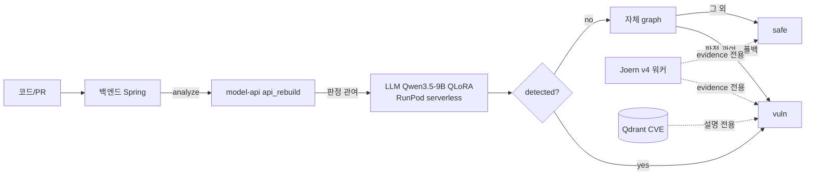
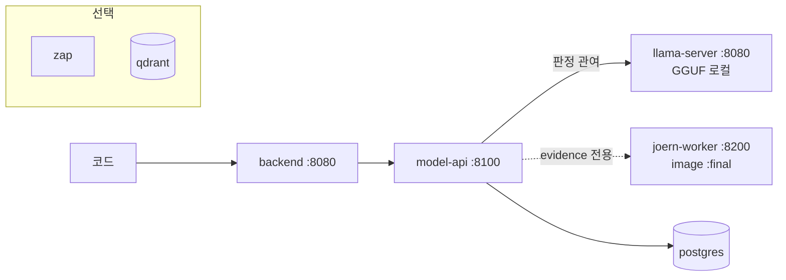

# ScanOps — 최종 아키텍처·측정 보고서

> 작성 2026-08-17. 이 문서의 **모든 성능 문장에는 (수치, 파일, 절)** 이 붙는다.
> 판정은 각 세션에서 **사전 등록한 기준** 그대로 적는다.

---

## §0 Executive Summary

1. **만든 것**: 파인튜닝 LLM 단독 탐지(Qwen3.5-9B QLoRA) + 자체 정규식 graph 폴백 +
   Joern v4 데이터흐름 **근거(evidence) 수집** + 외부 호출 0 온프레미스 배포 패키지.
2. **측정한 것**: 내부 test AUC/F1은 `rebuild/out/test_report.json`,
   외부 벤치는 CleanVul·PrimeVul(§3), Joern v4 단독 precision은
   CleanVul 240건 **0.5909** (`joern_v4_eval_sample.json`, JOERN_HYBRID_REPORT_V4.md §4)와
   OWASP taint 전용 110건 **0.5172** (`owasp_joern_v4_final_metrics.json`, §3-2).
3. **죽인 것**: LLM Critic 노선 — CTX-1(2026-08-15) · V3(08-16) · V4(08-17) 세 번 모두
   사전 등록 게이트에서 탈락. 마지막에는 **외부 상용 모델과 베이스 모델까지 같은 답**을 냈다(§4).
4. **왜 죽었나**: 질문의 근거가 입력에 없었다 — sanitizer 패치 줄이 Joern 슬라이스에 등장하는
   비율 **4.8%**, 쌍의 **38%** 는 vuln/safe 슬라이스가 글자까지 동일(§4).
5. **남은 것**: Joern은 판정에서 빠지고 **evidence 전용**으로 남았다(§1). 온프레미스 스택은
   실제로 기동해 데모 응답을 받았다(§5·§6). **아직 목표(precision 0.70)에 도달한 arm은 없다**(§3).

---

## §1 아키텍처

### SaaS 경로

### 온프레미스 경로 (외부 호출 0)

> **화살표 표기**: "판정 관여"는 `detected` 값을 바꿀 수 있는 경로,
> "evidence 전용"은 응답에 근거만 싣고 판정을 바꾸지 않는 경로다.
> Joern이 evidence 전용인 근거는 §3-1·§3-2의 precision 측정이다.
