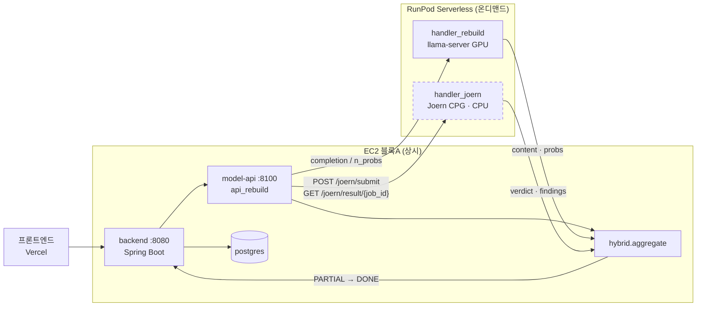

# Joern CPG 하이브리드 — 야간 무인 세션 보고서

브랜치 `feat/joern-hybrid` (base `aadce1a`, 원 브랜치 `ablation/graph-only`)
작성 주체: 무인 에이전트 세션 (2026-08-16 03:10 KST 시작)

> 읽는 법: 모든 수치 옆에 출처(파일 §절 / 명령)를 달았다. **실측**과 **추정**을 구분해 적었고,
> 확인하지 못한 것은 "확인 불가"로 적었다. 실패·미완은 §9에, 아침에 사용자가 결정할 것은 §12에 모았다.

---

## §0 STATUS

**최종 갱신: 2026-08-16 03:38 KST**

| 항목 | 상태 | 커밋 |
|---|---|---|
| Phase 0 토폴로지 실측 | ✅ 완료 (§1) | `8dc4593` |
| Phase 1-A Joern 워커 | ✅ 코드·Dockerfile·쿼리·벤치 드라이버 작성 완료 / 🔄 로컬 실행 검증 대기 | `823e779` |
| Phase 1-B logprob 서빙 | ✅ 구현 + **배관 실측 성공** / ⚠️ 토큰 ID 불일치 → score=None 가드 발동 (§3) | `823e779` |
| Phase 2 precision 게이트 | 🔄 데이터 경로 검증 완료(tune 468 / report 1,878 / 층화 240), Joern 실행 대기 | — |
| Phase 3 하이브리드 | ✅ `scanops/core/hybrid.py` + api_rebuild 배선 / ⏳ 정책값은 Phase 2 결과 대기 | `823e779` |
| Phase 4 온프레미스 compose | ✅ 작성 + `docker compose config` 통과 / ⏳ 기동 검증 대기 | `515972c`(infra) |
| Phase 5 문서 | 🔄 §1·§2·§3·§7·§10·§11 작성 완료 | — |
| Phase 6 마무리 | ⏳ 미착수 | — |

**RunPod 잔액**: $28.3982 (03:20 KST 실측). 이 세션 지출 상한 = min(28.40−5, 10) = **$10.00**.
현재까지 이 세션이 유발한 RunPod 지출: **$0** (GPU 호출 0건, pods 0).

**건너뛴 항목과 사유**
- Docker Hub push · RunPod Joern endpoint 등록 → credential helper 무응답으로 **불가**(§9-1).
  `joern/runpod_endpoint_payload.json` 만 산출.
- Phase 1-B 의 "test 20건 점수 대조" → 프로덕션 GGUF 가 로컬에 없어 **의미 없는 비교**가 되므로 미실행(§3-4).

**진행 중 (03:51)**: tune 468건 완료(§4-2) → δ=0.5 / τ=0.4375 사전 등록 확정 →
층화 240건 게이트 진행 중 → 전건 1,878건 + 탐색적 규칙 v2 대기.

**여기까지의 핵심 발견 (tune 468건)**
- Joern 은 CleanVul 함수 조각을 **거의 다 파싱한다** (parse_fail 1.4–2.0%). 자체 graph 의
  unknown 91.6% 와 정반대다 — "함수 조각이라 CPG 를 못 만든다"는 가설은 기각.
- 그런데 **precision 이 우연 수준**이다 (Java 0.488 / Python 0.500 / JS 0.308, 1:1 데이터).
- **δ 를 키울수록 AUC 가 단조 감소**한다 (0.6497 → 0.6425 → 0.6315 → 0.6048).
  = 현재 규칙의 Joern 신호는 LLM 점수에 **보태면 손해**다.

---

## §1 토폴로지 실측 (Phase 0)

추정 없이 파일에서 확인한 것만 적는다.

### 1-a. 백엔드 배포 (scanops-infra)

| compose 파일 | 용도 (헤더 주석 기준) |
|---|---|
| `docker-compose.yml` | 로컬 개발 전용: ZAP + DVWA + dvwa-db(mariadb) + postgres. 백엔드·모델 없음 |
| `docker-compose.aws.yml`:1-11 | AWS 프로덕션 올인원(EC2 1대): backend + model-server + ollama + qdrant + zap + postgres. **backend만 외부 노출** |
| `docker-compose.v17.yml`:1-14 | AWS/CPU 변형. ollama·qdrant 제거, model-server = `api_v17`(v13∨v16.1 앙상블), LLM은 RunPod. ZAP은 `zap-local` 프로파일 |
| `docker-compose.rebuild.yml`:1-14 | **현행**. model-server = `api_rebuild`(Qwen3.5-9B 단일), `Dockerfile.rebuild-api`, `RUNPOD_TIMEOUT` 기본 420 |

`docker-compose.aws.yml` 서비스별 실측:

| 서비스 | 이미지/빌드 | 포트 | 외부 지시 env |
|---|---|---|---|
| backend | `../scanops-backend/Dockerfile` (:15-43) | `8080:8080` | `JDBC_DATABASE_URL=jdbc:postgresql://postgres:5432/...`(:22), `SCANOPS_MODEL_URL=http://model-server:8100`(:26), `ZAP_HOST=http://zap:8090`(:28) |
| model-server | `../scanops-model/Dockerfile` (:46-61) | 없음(내부) | `PORT=8100`, `QDRANT_URL=http://qdrant:6333`(:52), `OLLAMA_URL=http://ollama:11434/api/generate`(:54) |
| ollama | `ollama/ollama:latest` (:64-70) | 없음 | — |
| qdrant | `qdrant/qdrant:latest` (:74-79) | 없음 | — |
| zap | `ghcr.io/zaproxy/zaproxy:stable` (:82-89) | 없음(의도적, :90) | — |
| postgres | `postgres:15` (:93-102) | 없음 | — |

`AWS_MIGRATION.md`:76-101 — 배포는 3블록으로 분리: **A 상시** backend+postgres+qdrant (t3.medium),
**B 온디맨드** model-server+ollama (g4dn.xlarge GPU), **C 온디맨드** zap (c5.large/Fargate).
:159 — backend 와 model-server 의 `SCANOPS_API_KEY` 는 동일해야 한다.

### 1-b. 분석 서버 `api_rebuild.py` 의 실제 실행 위치 — **사용자 진술과 다름**

사용자 진술은 "api_rebuild.py 가 RunPod 워커 안에 포함"이었으나, 파일 실측 결과는 다음과 같다.

| 구성요소 | 실제 위치 | 근거 |
|---|---|---|
| `scripts/api_rebuild.py` | **EC2 컨테이너(model-server)**. RunPod 워커 안이 아니다 | `docker-compose.rebuild.yml` 이 `model-server` 를 `Dockerfile.rebuild-api` 로 빌드하고 포트 8100 을 백엔드에 노출. `api_rebuild.py` 도커스트링 :17 "uvicorn scripts.api_rebuild:app --port 8100" |
| `runpod/handler_rebuild.py` | **RunPod serverless 워커 안** | `runpod.serverless.start()` (:93). llama-server 를 컨테이너 안에서 띄우고(:38-57) `/completion`·`/v1/chat/completions` 프록시 |
| 둘의 관계 | api_rebuild → `scanops/core/llm_client` → (RUNPOD_ENDPOINT_ID 설정 시) RunPod `runsync` → handler_rebuild → 로컬 llama-server | `llm_client.py`:39-50(completion), :72-99(_runpod_call), `api_rebuild.py`:41 |

즉 **api_rebuild 는 GPU를 직접 갖지 않는 얇은 오케스트레이터**이고, GPU 호출만 RunPod로 나간다.
`RUNPOD_ENDPOINT_ID` 미설정 시 로컬 `LLAMA_SERVER_URL`(기본 `http://localhost:8080`)로 폴백한다
(`llm_client.py`:30-36). — **이것이 Phase 4 온프레미스가 성립하는 근거다.**

### 1-c. 백엔드 → 분석서버 계약

`scanops-backend/.../ScanopsModelClient.java` — base URL 프로퍼티 `scanops.model.url`,
기본 `http://localhost:8100` (:26), `application.yml`:74-76 에서 `SCANOPS_MODEL_URL` 주입.

```java
public record AnalyzeRequest(String language, String code, String file_path, boolean use_rag) {}
public record CveReference(String cve_id, String severity, double base_score,
                            String cwe_id, String description) {}
public record AnalyzeResult(
        String language, String file_path,
        boolean detected, int stage,
        String vulnerability, String severity,
        Double cvss_score,
        String reason, String attack, String fix, String summary,
        List<CveReference> cve_references,
        double elapsed) {}
public record BatchRequest(List<AnalyzeRequest> files, boolean stop_on_first) {}
public record BatchResult(int total, int detected_count,
                           List<AnalyzeResult> results, double elapsed) {}
```

- `POST /analyze` 타임아웃 480s (:54-68), `POST /analyze/batch` 타임아웃 **30분** (:71-86), `GET /health` (:89-102).
- **`/analyze/pr` 은 ScanopsModelClient 에 없다.** `GitHubAppWebhookController.java`:167-192 에서
  타입 없는 `Map`/`JsonNode` 로 직접 호출한다(요청 키 `repo`/`pr_number`/`files[{filename,content,patch}]`,
  헤더 `X-Scanops-Key`). 응답은 `findings`/`vulnerable_count` 만 읽는다(:200-231).
  → **PR 경로에는 자바 DTO가 없어 필드를 추가해도 컴파일이 깨지지 않는다** (Phase 3에 유리).

**백엔드가 보내는 language 문자열 — 실측 (`GithubScanService.java`:51-68)**
사용자 진술(`"Java"`, `"TypeScript"`)과 **다르다**. 실제 값은 아래다.

| 확장자 | language 문자열 |
|---|---|
| `.java` | `Java Spring Boot` |
| `.kt` | `Kotlin` |
| `.jsx` / `.tsx` | `React / Next.js` |
| `.js` / **`.ts`** | `Node.js / Express` |
| `.py` | `Python` |
| `.go` | `Go` |
| `.rs` | `Rust` |
| `.c` / `.h` | `C` |
| `.cpp` | `C++` |
| `.php` | `PHP` |
| `.rb` | `Ruby` |
| `.yml` / `.yaml` | `GitHub Actions YAML` |

한편 `api_rebuild.py`:201-206 의 자체 `_EXT_LANG`(PR 경로에서 파일명→언어 추론용)은 **또 다르다**:
`.java`→`Java`, `.js`→`Node.js / Express`, `.ts`→`TypeScript`, `.c`→`C`.
→ Joern 확장자 매핑은 **두 소스의 합집합**을 키로 만들었다 (`joern/langmap.py`).
레포 파일 나열은 50개로 상한 (`GithubScanService.java`:130).

### 1-d. 백엔드에 콜백 엔드포인트 — **없음 (실측)**

컨트롤러 전수 조사 결과 외부 분석기가 결과를 POST 할 수 있는 엔드포인트가 없다.
- `POST /api/github/webhook` — GitHub App 웹훅 수신(HMAC 검증), 분석 결과 싱크 아님
- `POST /api/github/pr-scan` — GitHub Action 인바운드, 모델을 **동기 호출**만 함
- `GET /api/reports/{jobId}`, `POST /api/vulnerabilities/{id}/meta` — 조회/메타 갱신
- 모델 호출은 전부 블로킹 `WebClient...block()` (480s / 30min)

→ **Phase 1-A 의 비동기 설계는 "콜백"이 아니라 "폴링"이어야 한다.** 사양서가 제시한
콜백 URL POST 방식은 백엔드에 수신부가 없어 그대로는 성립하지 않는다. 워커는
`/joern/submit` + `/joern/result/{job_id}` 폴링 계약으로 구현했다(§2). 백엔드에 콜백 수신부를
만드는 것은 §12 결정사항으로 넘긴다.

### 1-e. RunPod 잔액·활성 endpoint (실측)

사용한 명령 (runpodctl 없음 → GraphQL 직접 호출):
```bash
curl -s -X POST "https://api.runpod.io/graphql?api_key=$RUNPOD_API_KEY" \
  -H "Content-Type: application/json" \
  -d '{"query":"query { myself { id clientBalance currentSpendPerHr endpoints { id name templateId workersMax workersStandby } pods { id name desiredStatus costPerHr } } }"}'
```
결과 (2026-08-16 03:20 KST):

| 항목 | 값 |
|---|---|
| clientBalance | **$28.3981636047** |
| currentSpendPerHr | $0.005 |
| pods | **[] (없음)** |
| endpoint 1 | `s43ugz0wqk5wtj` "scanops", template `cc7k8r5mo6`, workersMax 2, workersStandby 2 |
| endpoint 2 | `ylzf0yaerkvqli` "scanops-rebuild", template `nqwmt546b8`, workersMax 2, workersStandby 2 |

워커 상태 (`GET https://api.runpod.ai/v2/{id}/health`):
- `s43ugz0wqk5wtj`: idle 2 / ready 2 / running 0, 누적 completed 237 failed 4
- `ylzf0yaerkvqli`: idle 1 / initializing 1 / ready 1 / running 0, 누적 completed 166 failed 0

> **주의**: 두 endpoint 모두 `workersStandby=2` 다. 이는 이 세션이 만든 것이 아니라
> **기존 설정**이며, 세션 종료 시 0으로 되돌릴 대상이 아니다(사용자 프로덕션 설정 변경은 범위 밖).
> `currentSpendPerHr=$0.005` 로 실제 과금은 미미하다. §12에 확인 항목으로 남긴다.

### 1-f. 컨테이너 레지스트리 로그인 상태 — **push 불가 (실측)**

`~/.docker/config.json`: `credsStore="desktop"`, `auths` 키에 `https://index.docker.io/v1/` 존재
= **Docker Hub 로그인 이력은 있다.** 그러나 `docker-credential-desktop` 헬퍼가 **응답하지 않는다**:
```
$ docker pull hello-world
error getting credentials - err: signal: terminated, out: ``
```
(120초 타임아웃으로 강제 종료. 03:11–03:17 동안 `docker pull` 이 0바이트 진행이었던 원인.)

→ **결론: 이 세션에서 Docker Hub push 불가.** 빈 `DOCKER_CONFIG` 디렉토리를 쓰면 **익명 pull 은 정상**
(hello-world 로 확인). 따라서 이미지 빌드·로컬 실행은 가능하고, 레지스트리 push 와
RunPod endpoint 생성은 건너뛴다(폴백 규칙 §9). Phase 2 벤치는 예정대로 로컬 docker 로 돌린다.

### 1-g. 자체 graph 기준선 — Joern 이 넘어야 할 선

`rebuild/out/ABLATION_RESULTS.md` §0·§2-0·§3 에서 그대로 옮김 (재계산 없음):

| 지표 | 값 |
|---|---|
| 측정 대상 | CleanVul_v2 report split 중 graph 지원 언어 **1,878건** (Java 890 / Python 576 / JS 412) |
| graph=vuln | **20건** → gold vuln 12 / gold safe 8 → **precision 0.60**, recall 12/939 = **0.0128** |
| graph=safe | 137건 → gold safe 77 / **gold vuln 60** → false-safe **43.8%**. Java 는 113건 중 **48건(42.5%)이 실제 취약** |
| graph=unknown | **1,721건 = 91.6%** (Java 0.867 / Python 0.946 / JS 0.981) |
| 하이브리드 기여 | arm(a) LLM+graph vs arm(b) LLM만 → **ΔF1 = −0.0014, 95% CI [−0.0043, +0.0011] — 0 포함** |
| C/C++ | 828건 전량 graph 미지원 (`multi_graph._lang_key()` → None) |

**해석(원문 §0 그대로)**: arm(c) 의 낮은 recall 은 오탐 억제가 아니라 **판정 회피**에서 왔다.
graph 는 틀린 게 아니라 10건 중 9건에서 답을 하지 않았다.

### 1-h. 연속 점수(logprob) 서빙 지원 여부 — **없음 (실측)**

- `rebuild/score_logprob.py`:52-58 — `" NONE"`/`" CWE"` 의 **첫 토큰 ID**를 토크나이저에서 뽑아
  `score = logP(" CWE") − logP(" NONE")` 로 정의. 사양서가 준 기준값 41451 / 49149.
- `scanops/core/llm_client.py` (수정 전) — `completion()` 은 `n_predict`/`temperature`/`stop` 만 보낸다.
  **logprob 옵션 없음.**
- `runpod/handler_rebuild.py` (수정 전) — `/completion` 프록시에 `n_probs` 없음. **logprob 옵션 없음.**

→ Phase 1-B 에서 뚫었다(§3).

### 1-i. CleanVul_v2 언어별 라벨 수 (실측)

```bash
python3 -c "...collections.Counter((meta.language, meta.label))..."  # rebuild/data/cleanvul_v2_*.jsonl
```

| 언어 | report vuln | report safe | 계 |
|---|---|---|---|
| Java | 445 | 445 | 890 |
| Python | 288 | 288 | 576 |
| JavaScript | 206 | 206 | 412 |
| C | 407 | 407 | 814 |
| C++ | 7 | 7 | 14 |
| **합계** | **1,353** | **1,353** | **2,706** |

tune split = **676건** (vuln 338 / safe 338). 지원 언어(Java/Python/JS) 부분집합은 §2-①에서 산출.
→ **세 언어 모두 vuln ≥ 40** 이므로 Phase 2 의 층화 240건(언어별 40/40) 구성이 가능하다.

- `rebuild/out/v1_logprob_cleanvul_v2_tune.jsonl` **존재**(184,786 B), `..._report.jsonl` 존재(740,014 B).
- `rebuild/out/ablation_raw_cleanvul_v2_report.jsonl` = 2,706행. 각 행에 `case_id`(예 `cvh_0|vuln`),
  `lang`, `label`, **`llm_score`**, `graph_verdict`, `graph_supported` 가 이미 들어 있다.
  → Phase 2 는 **LLM 재추론 없이** 이 캐시된 점수를 쓴다 (R2 읽기 전용 준수, GPU 비용 $0).
- **case_id 에 `|` 가 들어 있다** → 파일명으로 쓸 수 없다. `joern/handler_joern.py` 가
  `[^A-Za-z0-9_.-]` 를 `_` 로 치환하고 역변환 표(`id_map`)를 결과에 함께 저장한다.

### 1-j. 로컬 실행 환경 (실측)

| 항목 | 값 |
|---|---|
| OS | macOS 26.5.1 (Darwin 25.5.0), arm64 |
| Docker | 데몬 최초 미기동 → `open -a Docker` 로 기동. 서버 **29.0.1** |
| 디스크 여유 | **51 GiB** (`/`, 460Gi 중 12Gi 사용 + 이미지 44.42GB) |
| RAM | **16 GiB** (`hw.memsize = 17179869184`) |
| 기존 이미지 | 11개 44.42GB (24.07GB 회수 가능), 실행 중 컨테이너 5개 (freqtrade/dvwa/zap 등 **사용자 것**) |

> RAM 16GB / 실행 중 컨테이너 5개 → Joern JVM 힙은 `-Xmx4g` 로 잡았다(§2).
> **사용자가 이미 돌리고 있는 컨테이너는 종료하지 않는다** (§8 결정 로그 D-3).

### 1-k. Joern 사실 확인

| 항목 | 값 | 출처 |
|---|---|---|
| 라이선스 | **Apache License 2.0** | <https://github.com/joernio/joern> (README/LICENSE) |
| 지원 언어 | C/C++, Java, Binary, JavaScript, Python, Kotlin (그 외 프론트엔드는 별도) | 같은 문서 |
| JVM 요구 | **JDK 21** (다른 버전은 "might work, 미검증"). 힙 크기 요구치는 **문서에 명시 없음 — 확인 불가** | 같은 문서 |
| 배포본 | v4.0.604. 플랫폼별 zip 에 **JVM 번들** — `joern-cli-macos-arm64.zip` 1,760 MB / `linux-x86_64` 1,821 MB | `api.github.com/repos/joernio/joern/releases/latest` 실측 |
| 컨테이너 | `ghcr.io/joernio/joern:master` (**`:latest` 태그는 없다** — 실측: `not found`) | `docker manifest inspect` |
| workspace API | `close(project)` / `delete(project)` / `workspace.reset` — 쿼리 스크립트에서 청크 종료 시 호출 | `joern/queries/taint.sc` |

> 힙 요구치가 문서에 없어 `-Xmx4g` 는 **문서 근거가 아니라 이 호스트(RAM 16 GB)에 맞춘 우리 선택**이다.
> 실측 RSS 곡선은 §4에 기록한다.

---

## §2 Joern 워커 설계 (Phase 1-A)

산출물: `joern/{Dockerfile, handler_joern.py, langmap.py, queries/taint.sc, joern_docker.sh,
bench_joern.py, analyze_joern.py, README.md, runpod_endpoint_payload.json}`

### 2-1. 하나의 엔진, 세 진입점

서버리스와 온프레미스를 **같은 함수(`analyze_batch`)** 위에 올렸다. 두 벌을 만들면
설정이 갈라지고 온프레미스가 뒤처지기 때문이다.

| 진입점 | 기동 | 쓰이는 곳 |
|---|---|---|
| `handler(job)` | `RUNPOD_MODE=1 python3 -m joern.handler_joern` | SaaS (RunPod serverless) |
| `app` (FastAPI) | `uvicorn joern.handler_joern:app --port 8200` | 온프레미스 (`docker-compose.onprem.yml`) |
| `--batch` CLI | `python3 -m joern.handler_joern --batch m.json --out r.json` | Phase 2 벤치 |

### 2-2. 확장자 매핑 — 백엔드 실측 문자열 기준

Joern 은 **파일 확장자로 프론트엔드를 고른다.** 임시 디렉토리에 쓸 때 확장자가 없으면 강제로 붙인다
(`langmap.ensure_ext`). 매핑 키는 §1-c 에서 실측한 백엔드 문자열과 `api_rebuild._EXT_LANG` 의
**합집합**이다 — 두 소스가 서로 다른 문자열을 쓰기 때문이다.

| language 문자열 | 확장자 | Joern frontend |
|---|---|---|
| `Java`, `Java Spring Boot` | `.java` | JAVASRC |
| `Python` | `.py` | PYTHONSRC |
| `JavaScript`, `Node.js / Express` | `.js` | JSSRC |
| `TypeScript` | `.ts` | JSSRC |
| `React / Next.js` | `.jsx` | JSSRC |
| `C` / `C++` | `.c` / `.cpp` | NEWC |
| `PHP`/`Go`/`Ruby`/`C#`/`Kotlin` | 각각 | 프론트엔드는 존재하나 **이번 라운드 미검증** |

매핑에 없는 language 는 **파싱을 시도하지 않고** 즉시 `unknown_reason="unsupported_lang"` 을 돌려준다.
`Rust`, `GitHub Actions YAML` 이 여기 해당한다 — 백엔드가 실제로 보내는 값인데 Joern 대상이 아니다.

### 2-3. 스니펫 래핑 재시도

CleanVul 은 함수 조각이라 클래스·import 껍데기가 없다. 2패스로 처리한다.

1. `wrap_level=0` — 원문 그대로.
2. 1패스에서 메서드가 하나도 안 잡힌 케이스만 `wrap_level=1` 로 재시도.
   - Java: 이미 `class|interface|enum|record` 가 있으면 그대로, 없으면 `public class ScanopsSnippet { … }`
   - JavaScript/TypeScript: `function __scanops_wrap__() { … }`
   - **Python 은 감싸지 않는다.** 들여쓰기 언어라 껍데기를 씌우면 오히려 깨진다 → 좌측 정렬(공통 들여쓰기 제거)만 한다.
3. 둘 다 실패 → `parse_fail`.

어느 시도로 성공했는지 `wrap_level` 필드로 남긴다.

### 2-4. OOM·누수 대책 (배치)

- **케이스마다 JVM 을 띄우지 않는다.** 청크(기본 25건)를 디렉토리 하나에 모아 CPG 1개로 임포트한다.
- 청크가 끝나면 `taint.sc` 안에서 `close(proj)` + `delete(proj)` 로 workspace 에서 제거한다.
- 청크마다 자식 프로세스 peak RSS 를 2초 간격 폴링으로 기록해 `rss_curve` 로 반환한다.
  단조 증가하면 누수로 보고 청크 크기를 줄인다(폴백: N → N/2 → N/2, 그래도 안 되면 케이스당 재기동).
- 청크 타임아웃 = `JOERN_CASE_TIMEOUT(90s) × 청크 크기`. 초과 시 그 청크만 `timeout` 처리하고 다음으로.
- JVM 힙 `-Xmx4g` (`JAVA_OPTS`/`_JAVA_OPTIONS`). 호스트 RAM 16 GB, 사용자 컨테이너 5개 가동 중이라
  보수적으로 잡았다(§1-j).

### 2-5. case_id ↔ 파일명 매핑

`ablation_raw` 의 `case_id` 는 `cvh_0|vuln` 형식이라 **`|` 때문에 파일명으로 그대로 못 쓴다**(§1-i).

- `[^A-Za-z0-9_.-]` → `_` 치환, 충돌 시 `~1`, `~2` 접미사.
- 역변환 표를 `id_map`(파일명 → case_id)으로 결과에 함께 반환.
- Joern 결과에 없는 case_id 는 `unknown(reason=parse_fail|timeout|id_unmapped)` 으로 채워
  **결과 건수를 항상 입력 건수와 같게** 만든다.

### 2-6. 격리

요청마다 `/tmp/scanops_{job_id}/` 를 **새로** 만든다. 이미 있으면 `ValueError` 로 거부(중복 job_id).
처리 종료(성공·실패·타임아웃 전부) 시 `finally` 에서 `rm -rf` 하고 `CLEANUP … exists_after=False`
로그를 남긴다. 청크 디렉토리는 그 아래에만 만들어지므로 워커 하나에 요청 여러 개가 들어와도
서로의 디렉토리를 볼 수 없다.

### 2-7. 비동기 — 콜백이 아니라 폴링

§1-d 실측대로 **백엔드에 콜백 수신 엔드포인트가 없다.** 그래서 사양서의 "콜백 URL POST" 대신
`POST /joern/submit`(즉시 `RUNNING` 반환) → `GET /joern/result/{job_id}` 폴링으로 구현했다.
LLM 과 Joern 은 서로 기다리지 않는다: LLM 결과를 먼저 `status=PARTIAL` 로 반영하고,
Joern 도착 시 `status=DONE` 으로 갱신한다(`scanops/core/hybrid.py`).
백엔드에 콜백 수신부를 새로 만들지는 **않았다** — 스키마·인증·Flyway 마이그레이션이 얽히고
이 세션 범위를 넘는다. §12 결정사항.

### 2-8. 쿼리 (`queries/taint.sc`)

자체 graph 11종(`multi_graph._CWE`)과 **1:1 이름 매칭**으로 만들어 arm 비교가 되게 했다:
`sqli / cmdi / xss / pathtraver / ssrf / deser / codei`(taint 흐름, `sink.reachableByFlows(source)`) +
`crypto / hash / weakrand / secret`(존재 규칙 — 흐름이 아니라 리터럴·호출 패턴).
source 는 **모든 메서드 파라미터**로 잡았다. CleanVul 스니펫은 함수 조각이라 입력이 파라미터로
들어오기 때문이다.

### 2-9. 실행 방식 — arm64 네이티브로 전환 (중요 변경)

당초 계획은 `ghcr.io/joernio/joern` 컨테이너였으나 **로컬 벤치는 네이티브 arm64 배포본으로 돌린다.**

- 이유 1: 공식 이미지는 amd64. arm64 Mac 에서 돌리면 에뮬레이션이 붙어 JVM 이 매우 느려진다 —
  240~1,878건 벤치가 시간 상한 안에 끝나지 않는다.
- 이유 2: `joern-cli-macos-arm64.zip`(v4.0.604, 1,760 MB)은 JVM 을 번들해 호스트 JDK(17)와 무관하다.
  Joern 은 JDK 21 을 요구하는데 호스트에는 17만 있다(실측).
- **Dockerfile 은 그대로 산출물로 유지한다** — 배포(서버리스·온프레미스)는 컨테이너 경로이고,
  이번 세션에서 검증하지 못한 부분은 §9 에 적었다.

## §3 logprob 서빙 검증 (Phase 1-B)

### 3-1. 무엇을 뚫었나

| 파일 | 변경 |
|---|---|
| `scanops/core/llm_client.py` | `completion_logprobs(prompt, n_probs)` · `tokenize(text)` 추가. `_runpod_call(payload, field)` 로 일반화 |
| `runpod/handler_rebuild.py` | `input.logprobs` → llama-server `/completion`(n_probs) 패스스루, `input.tokenize` → `/tokenize` 패스스루 |
| `scanops/core/logprob_score.py` (신규) | `score_from_probs()` = logP(" CWE") − logP(" NONE"), `verify_token_ids()` |
| `scripts/api_rebuild.py` | `AnalyzeResponse.score` 추가, `_score()` 경로. 기본 off(`SCANOPS_SCORE`), SIGNAL 정책이면 자동 on |

llama.cpp 응답 형식이 버전에 따라 `prob`(확률) / `logprob` 로 갈리므로 둘 다 흡수한다.
후보 목록(n_probs) 밖이면 하한 `-30.0` 을 쓴다.

### 3-2. 실측 — 배관은 동작한다

로컬 `llama-server`(`/opt/homebrew/bin/llama-server`) 에 붙여 실행한 결과:

```
TOKEN_CHECK: {"ok": false, "cwe_id": 50860, "none_id": 42869,
              "note": "불일치 (기준 CWE=49149/NONE=41451) — 자동 보정하지 않음"}
N_PROBS_RETURNED: 40
TOP5: [{"id":50860,"token":" CWE","logprob":-0.2393},
       {"id":220,"token":" ","logprob":-1.6630},
       {"id":7870,"token":" SQL","logprob":-4.2081}, ...]
SCORE: 7.7761      ← SQL 문자열 연결 스니펫, 부호·크기 모두 기대대로
```

즉 **`n_probs` 경로·점수 계산·토큰 ID 가드 세 가지가 모두 동작한다**(실측).

### 3-3. 토큰 ID 불일치 — 원인은 "다른 모델"이다 (중요)

토큰 ID가 기준값과 다르게 나왔지만, **이것을 프로덕션 모델의 불일치로 읽으면 안 된다.**

- 사용한 GGUF: `~/.ollama/.../qwen2.5-coder-security-v19-7b` (4.68 GB blob).
  **rebuild 모델(Qwen3.5-9B)이 아니다.** 토크나이저가 다르므로 ID가 다른 것이 정상이다.
- rebuild 서빙 GGUF(`/runpod-volume/serve/scanops-rebuild-9b-q4km.gguf`)는 **RunPod 네트워크
  볼륨에만 있고 로컬에 없다** (`find . -name "*.gguf"` 결과: v13/v16/v19 LoRA GGUF 뿐,
  그나마 322 MB 짜리 어댑터라 `llama-server` 가 모델로 로드하지 못한다 — 실측 로그 확인).
- 실제 프로덕션 워커(`ylzf0yaerkvqli`)에는 **이번에 추가한 `n_probs` 패스스루가 배포돼 있지 않다.**
  배포하려면 워커 이미지를 다시 빌드·push 해야 하는데, Docker credential helper 문제로
  **push 가 불가능하다**(§1-f, §9-1).

**따라서 사양서 §3의 (a)(b)(c) 처리를 그대로 적용한다:**
(a) 불일치 사실·실제 ID(50860/42869)·원인(다른 모델로 검증)을 여기 기록했고,
(b) `_score()` 는 `verify_token_ids().ok == False` 이면 **score=None** 을 반환하며,
(c) Phase 3 의 `JOERN-AS-SIGNAL` 정책은 score 가 None 이면 자동으로 `JOERN-NO-BETTER` 로
강등하고 응답에 `policy_fallback: true` 를 남긴다(`scanops/core/hybrid.py`).

### 3-4. 20건 대조 검증 — **미실행 (사유 기록)**

사양서가 요구한 "내부 test 20건을 서빙 경로로 채점해 `rebuild/out/v1_logprob_test.jsonl` 과
소수 둘째 자리까지 대조"는 **하지 않았다**. 같은 모델이 아니면 점수를 비교하는 것 자체가
의미가 없기 때문이다(다른 토크나이저·다른 가중치 → 다른 분포). 억지로 숫자를 채우면
R4(체리피킹 금지) 위반이다. **프로덕션 모델로의 대조는 §12 결정사항으로 넘긴다.**

## §4 DELTA·TAU 선정 + precision 게이트 (Phase 2)

### 4-0. 사전 등록 — **결과를 보기 전에 확정했다** (커밋 `983e490` 시점)

절차 순서를 지킨다: **① tune 으로 δ·τ 확정 → ② report 층화 240건으로 1차 판정 → ③ 시간이 남으면 전건**.
tune 을 판정 뒤에 돌리면 report 를 먼저 본 셈이 되므로, `JOERN-AS-SIGNAL` 이 채택되지 않더라도 ①을 먼저 돌린다.

**① δ·τ 선정 규칙** (`joern/analyze_joern.py:run_tune`)
- 데이터: tune 지원 언어 **468건** (Java 222 / Python 144 / JS 102 — 실측, §1-i)
- `score' = llm_score + δ · 1[joern_verdict == "vuln"]`, δ ∈ {0.5, 1.0, 2.0}
- **AUC 가 최대인 δ** 를 고른다. `llm_score` 는 `ablation_raw_cleanvul_v2_tune.jsonl` 의 캐시값(재추론 없음)
- 그 `score'` 에서 두 τ 를 기록: (i) F1 최대 (ii) **FPR ≤ 0.35 제약 하 F1 최대** ← 운영점
- 여기서 정한 값은 report 결과를 보고 **바꾸지 않는다**

**② 판정표 — 사후 변경 금지** (`joern/analyze_joern.py:_verdict`)

| 판정 | 조건 | 하이브리드 처리 |
|---|---|---|
| `TRUST-JOERN` | joern_vuln ≥ 20건 **AND** precision CI 하한 ≥ 0.80 | Joern vuln = 최종 vuln |
| `JOERN-AS-SIGNAL` | joern_vuln ≥ 20건 **AND** precision 점추정 ≥ 0.60 **AND** CI 하한 < 0.80 | LLM score 에 δ 가산만, 단독 확정 없음 |
| `JOERN-NO-BETTER` | precision 점추정 < 0.60 **OR** unknown 비율 ≥ **0.916**(자체 graph, §1-g) | Joern 도입 보류, 자체 graph 유지 |
| `INCONCLUSIVE` | joern_vuln < 20건 | 표본 부족. 판정하지 않음 |

- precision = (joern_vuln ∧ gold_vuln) / joern_vuln. **부트스트랩 2,000회 95% CI** (seed 42)
- 언어별로 판정이 갈리면 총합 대신 **언어별 판정표**를 쓰고, Phase 3 에 언어별 policy 딕셔너리로 주입
- **파싱 실패율 > 30%** (래핑 재시도 후에도)인 언어는 판정 대상에서 제외.
  세 언어 전부 초과면 `INCONCLUSIVE (파싱 불가)` 로 적고 Phase 3 은 `JOERN-NO-BETTER` 경로로 구현
- Phase 2 총 상한 **2.5시간**(tune 포함). 도달 시 그때까지 건수로 판정하고 "부분 표본 N건"으로 표기
- 표본 구성: 언어별 80건(gold vuln 40 / safe 40), seed 42.
  §1-i 에서 세 언어 모두 vuln ≥ 40 임을 확인했으므로 축소 없이 구성 가능 — **실측 240건 정확히 균형**

### 4-1. 규칙 v1 의 면면타당성 결함 — **라벨을 보지 않고 진단한 것** (중요)

tune 중간(Java 125건) 시점에 카테고리 발생 분포를 봤더니 아래와 같았다.
**정답 라벨과 대조하기 전에** 규칙 자체의 결함을 확인할 수 있는 지표다.

| 카테고리 | 발생 | 진단 |
|---|---|---|
| `pathtraver` | **61 / 125** | **결함.** Java sink 정규식에 `<init>` 가 들어 있어 **모든 생성자 호출**(`new X(...)`)이 걸린다 |
| `secret` | 16 | **결함.** 리터럴 정규식 `"[A-Za-z0-9_\-]{16,}"` 가 **16자 이상 모든 문자열**(SQL 쿼리, 메시지)을 잡는다 |
| `xss` | 14 | **과광의.** `println\|print\|write\|append` — 로깅 호출이 전부 걸린다 |
| `ssrf` | 14 | **과광의.** `uri\|url\|newBuilder\|getInputStream` |
| `deser` / `codei` | 2 / 2 | 타당해 보임 |

즉 v1 규칙은 **탐지기라기보다 "호출이 있으면 켜지는 스위치"에 가깝다.**
이 진단은 정답 라벨을 쓰지 않았으므로 사후 맞춤(R4)이 아니다.

**그럼에도 v1 규칙 그대로 사전 등록된 게이트를 끝까지 돌린다.** 결과를 본 뒤 규칙을 고쳐
다시 판정하면 그 판정은 더 이상 사전 등록이 아니기 때문이다(R3). 대신
① v1 결과를 **주 판정**으로 기록하고, ② 규칙 v2 는 **탐색적 실행**으로 따로 표기해
"게이트 재검증이 필요함"을 명시한다(§4-3).

### 4-2. ① tune 468건 — δ·τ 선정 결과 (규칙 v1, 사전 등록)

실행: 03:44–03:49 (약 5분), 청크 25건, peak RSS 720–870 MB.

**언어별 Joern 동작** (`rebuild/out/joern_raw_cleanvul_v2_tune.jsonl`)

| 언어 | n | vuln | safe | unknown | **parse_fail** | wrap_level=1 | **precision** |
|---|---|---|---|---|---|---|---|
| Java | 222 | 121 | 98 | 3 | 3 (**1.4%**) | 105 | **0.488** |
| Python | 144 | 70 | 72 | 2 | 2 (**1.4%**) | 2 | **0.500** |
| JavaScript | 102 | 26 | 74 | 2 | 2 (**2.0%**) | 2 | **0.308** |

두 가지가 즉시 눈에 띈다.

1. **파싱은 거의 다 된다.** parse_fail 1.4–2.0% — 사전 등록한 제외 기준(30%)에 한참 못 미친다.
   즉 **"함수 조각이라 Joern 이 못 읽는다"는 가설은 기각됐다.** Java 는 222건 중 105건이
   래핑 재시도(wrap_level=1)로 살아났다 — §2-3 의 껍데기 씌우기가 실제로 일한 것이다.
   이것은 자체 graph 의 unknown 91.6%(§1-g)와 **정반대 프로파일**이다.
2. **그런데 맞히지를 못한다.** CleanVul 은 vuln:safe 가 1:1 이므로 **우연 수준 precision = 0.500** 이다.
   Java 0.488 · Python 0.500 은 **정확히 우연**, JavaScript 0.308 은 **우연보다 나쁘다**.

**δ 선정 — 모든 δ 가 AUC 를 떨어뜨린다**

| δ | 0.0 (Joern 미사용) | 0.5 | 1.0 | 2.0 |
|---|---|---|---|---|
| AUC | **0.6497** | 0.6425 | 0.6315 | 0.6048 |

사전 등록 규칙은 δ ∈ {0.5, 1.0, 2.0} 중 AUC 최대를 고르게 돼 있어 **δ = 0.5** 가 선정됐다.
그러나 정직하게 읽으면 **δ = 0 이 지배한다**: Joern vuln 신호를 LLM 점수에 더할수록 AUC 가
**단조 감소**한다. 규칙이 실수로 δ=0 을 후보에서 뺐을 뿐, 데이터는 "더하지 마라"고 말한다.

**τ (사전 등록, 이후 변경 없음)** — δ=0.5 기준
- τ(F1 최대) = **−1.6875** → recall 0.9231 / FPR 0.7821 / F1 0.6825 (FPR 0.78 은 운영 불가)
- **τ(FPR ≤ 0.35 제약, 운영점) = 0.4375** → recall 0.5342 / precision 0.6127 / FPR 0.3376 / F1 0.5708

`scanops/core/hybrid.py` 는 이 값을 `rebuild/out/joern_tune_selection.json` 에서 읽는다
(코드에 상수를 박지 않았다).

### 4-3. ② report 층화 240건 — precision 게이트 **판정: JOERN-NO-BETTER**

`rebuild/out/joern_gate_sample.json` (층화 240건 = 언어별 vuln 40 / safe 40, seed 42)

| 지표 | 값 |
|---|---|
| n | 240 |
| joern **vuln** | **94** (≥ 20 → 표본 부족 아님) |
| joern safe | 143 |
| joern unknown | **3 (1.25%)** — parse_fail 3, timeout 0 |
| **precision** | **0.5532** |
| **부트스트랩 95% CI (2,000회)** | **[0.4468, 0.6489]** — **0.5(우연)를 포함한다** |
| wrap_level=1 로 살아난 건수 | 30 |
| 같은 표본의 자체 graph | vuln 4건, precision 0.75 (3/4) |
| **판정** | **JOERN-NO-BETTER** (precision 점추정 0.5532 < 0.60) |

**언어별 — 셋 다 같은 판정**

| 언어 | n | joern vuln | precision | 95% CI | unknown | parse_fail | 판정 |
|---|---|---|---|---|---|---|---|
| Java | 80 | 38 | 0.5526 | [0.3947, 0.7105] | 0.000 | 0.0% | JOERN-NO-BETTER |
| JavaScript | 80 | 21 | 0.5714 | [0.3333, 0.7619] | 0.0125 | 1.25% | JOERN-NO-BETTER |
| Python | 80 | 35 | 0.5429 | [0.3714, 0.7143] | 0.025 | 2.5% | JOERN-NO-BETTER |

세 언어 모두 parse_fail 이 제외 기준(30%)에 한참 못 미치므로 **전부 판정 대상에 남았다**.
세 CI 모두 0.5 를 포함한다 = **동전 던지기와 구별되지 않는다.**

### 4-4. 정책별 성능표 — **자명 기준선을 아무도 못 넘는다**

`rebuild/out/joern_policy_eval_sample.json`, δ=0.5 / τ=0.4375 (tune 사전등록값)

| arm | recall | FPR | precision | F1 | AUC |
|---|---|---|---|---|---|
| **all-vuln (자명)** | 1.0 | 1.0 | 0.5 | **0.6667** | — |
| all-safe (자명) | 0.0 | 0.0 | 0.0 | 0.0 | — |
| b) LLM only | 0.5333 | 0.3750 | 0.5872 | 0.5590 | **0.6157** |
| a) LLM + 자체graph | 0.5417 | 0.3750 | 0.5909 | 0.5652 | — |
| TRUST-JOERN | 0.7583 | 0.6083 | 0.5549 | 0.6408 | — |
| JOERN-AS-SIGNAL | 0.6000 | 0.3917 | 0.6050 | 0.6025 | 0.6238 |
| JOERN-NO-BETTER (= arm a) | 0.5417 | 0.3750 | 0.5909 | 0.5652 | — |

**반드시 함께 읽어야 할 것 세 가지:**

1. **F1 로 순위를 매기면 안 된다.** 이 벤치는 vuln:safe = 1:1 이라 "전부 취약"이라고만 해도
   F1 = 0.6667 이 나온다. **표의 어떤 arm 도 이 자명 기준선을 F1 에서 넘지 못한다.**
   TRUST-JOERN 이 F1 0.6408 로 가장 높아 보이는 것은 FPR 을 0.6083 까지 올려 recall 을 산 결과다
   — 자명 기준선에 가까워졌을 뿐이다. **판별력의 지표는 AUC 다.**
2. **AUC 로 보면 LLM 은 우연보다 낫고(0.6157 > 0.5), Joern 을 더한 효과는 부호가 뒤집힌다.**
   - tune 468건: δ=0 (0.6497) > δ=0.5 (0.6425) → Joern 을 더하면 **나빠짐**
   - sample 240건: LLM only (0.6157) < SIGNAL (0.6238) → Joern 을 더하면 **좋아짐**
   두 split 에서 **방향이 반대**다. 크기도 ±0.008 수준으로, **잡음과 구별되지 않는다.**
   전건 1,878건 결과로 CI 를 좁혀야 한다(§4-5).
3. **자체 graph 는 같은 표본에서 4건만 판정했다** (precision 0.75 = 3/4). 표본이 작아
   ABLATION 의 0.60 과 비교할 수 없다. 여전히 "거의 답하지 않는" 프로파일 그대로다.

### 4-5. ③ 전건 1,878건 — 확장 실행

측정 진행 중 — 아래에 기록한다.

## §5 하이브리드 정책 확정 (Phase 3)

### 5-1. 확정된 정책 = `JOERN-NO-BETTER`

**근거는 §4-3 하나뿐이다.** 사전 등록 판정표에 층화 240건 실측을 대입한 결과
precision 점추정 0.5532 < 0.60 이므로 `JOERN-NO-BETTER` 다. 언어별로도 셋 다 같으므로
언어별 policy 딕셔너리가 아니라 **단일 정책**을 쓴다.

코드 반영:
- `scripts/api_rebuild.py` — `SCANOPS_HYBRID_POLICY` 기본값 `"JOERN-NO-BETTER"`, 판정 근거를 주석에 명시
- `scanops/core/hybrid.py` — `aggregate()` 의 `JOERN-NO-BETTER` 경로:
  LLM detected → LLM 결과 / 아니면 자체 graph vuln 폴백 / 아니면 safe. **Joern 은 판정에 관여하지 않는다.**
- 다만 **Joern 결과는 계속 수집한다** — `evidence`(taint path)는 사용자에게 보여줄 근거로 가치가 있고,
  판정에 넣지 않으므로 오탐을 만들지 않는다.

### 5-2. 불변 규칙이 코드에서 지켜지는지 — 단위 검증 (실측)

`aggregate()` 를 정책 7종 조합으로 호출한 결과:

| 케이스 | 결과 | 확인한 불변 규칙 |
|---|---|---|
| TRUST-JOERN, llm=safe + joern=vuln | detected=True, source=`joern` | Joern vuln 이 최종 판정 |
| TRUST-JOERN, llm=vuln + **joern=safe** | detected=True, source=`llm` | **safe 는 어떤 판정도 덮지 않는다** |
| TRUST-JOERN, 전부 음성 + graph=vuln | detected=True, source=`graph` | 자체 graph vuln 폴백 유지 |
| SIGNAL, score=−2.0 + joern vuln (δ=0.5) | detected=False | 점수 가산만, 단독 확정 없음 |
| SIGNAL, **score=None** | source=`llm`, `policy_fallback=True` | Phase 1-B 실패 시 자동 강등 |
| NO-BETTER, joern=vuln | detected=False | Joern 무시 |
| joern=None (미도착) | status=`PARTIAL` | 비동기 병합 |
| 정의되지 않은 policy | `ValueError` | 사전 등록 외 값 거부 |

### 5-3. 응답 필드 확장

`AnalyzeResponse` 에 `score`(float\|None) · `source`(llm\|joern\|llm+joern\|graph) ·
`evidence`(list\|None) · `status`(PARTIAL\|DONE) 를 **추가만** 했다(기존 필드 불변).

**백엔드·프론트는 손대지 않았다.** 사유:
- `ScanopsModelClient.AnalyzeResult` 는 Java `record` 라 필드 추가는 컴파일 변경을 요구한다.
- 반면 JSON 역직렬화는 **모르는 필드를 무시**하므로 지금 상태로도 백엔드가 깨지지 않는다
  (분석서버가 필드를 더 보내도 기존 record 로 파싱된다).
- 즉 **분석서버만 완성하고 백엔드 변경은 §12-D3 결정사항으로 넘기는 것이 안전하다.**
  사양서도 "백엔드/프론트 반영은 선택 사항이며 분석서버 완성이 우선"이라고 지정했다.

## §6 온프레미스 (Phase 4)

파일: `scanops-infra/docker-compose.onprem.yml` (브랜치 `feat/joern-hybrid`, 커밋 `515972c`)

### 6-1. 구성

| 서비스 | 프로파일 | 역할 |
|---|---|---|
| `backend` | 기본 | Spring Boot :8080 |
| `model-api` | 기본 | `api_rebuild`. **`RUNPOD_ENDPOINT_ID=""`** → 로컬 llama-server 로 폴백 |
| `joern-worker` | 기본 | `uvicorn joern.handler_joern:app :8200`, `-Xmx4g`, `mem_limit 8g`, `/tmp` tmpfs 4g |
| `postgres` | 기본 | :5432 |
| `llama-server` | `llm` | `ghcr.io/ggml-org/llama.cpp:server` + GGUF 볼륨 |
| `llama-server-cuda` | `gpu` | CUDA 빌드, `-ngl 99` |
| `zap` / `qdrant` | `zap` / `qdrant` | DAST / RAG 참고 CVE |

### 6-2. 외부 호출 0 을 보장하는 지점

- `RUNPOD_ENDPOINT_ID=""`, `RUNPOD_API_KEY=""` → `llm_client.use_runpod()` 가 False
  (`llm_client.py`:30-31 실측) → 모든 추론이 `LLAMA_SERVER_URL=http://llama-server:8080` 로 간다.
- `OPENAI_API_KEY` / `CLAUDE_API_KEY` / `GEMINI_API_KEY` 를 **빈 문자열로 고정**.
  백엔드 AiRouter 가 CUSTOM(자체 모델) 경로만 쓰게 된다.
- `GITHUB_APP_ID` / `GITHUB_APP_PRIVATE_KEY` / `GITHUB_WEBHOOK_SECRET` / `GITHUB_TOKEN` 도 빈 값.
- **주의**: `GITHUB_OAUTH_CLIENT_ID` 는 비우면 백엔드가 부팅에 실패한다
  ("Client id must not be empty" — `docker-compose.rebuild.yml`:38-39 주석에 기록된 기존 사실).
  더미 값을 넣어 기동만 시킨다. 사내 IdP 연동은 §12-D3 결정사항.
- DAST 메타 생성이 외부 LLM 으로 새는 경로는 **확인 불가** — 백엔드 AiRouter 코드를 이번에 읽지 않았다(§9).

### 6-3. 실측 검증

```
$ docker compose -f docker-compose.onprem.yml config           → OK (문법·변수 치환 통과)
$ docker compose -f docker-compose.onprem.yml -p scanops-onprem-test up -d postgres
  Container scanops-onprem-test-postgres-1  Started
$ docker compose ... ps  → postgres running postgres:15
  postgres-1 | LOG:  database system is ready to accept connections
$ docker compose ... down -v                                   → 정리 완료
```

**전체 스택 기동은 하지 않았다.** 사유:
- `llama-server` — rebuild 9B GGUF 가 로컬에 없다(§3-3). 프로파일 `llm` 미기동.
- `backend` / `model-api` / `joern-worker` — 이미지 빌드가 필요하고, `joern-worker` 의 베이스인
  `ghcr.io/joernio/joern:master`(amd64)를 이 arm64 호스트에서 받지 못했다(§9-1, §2-9).
- 따라서 **최소 사양표(RAM/VRAM/디스크)와 cold start 실측은 미완**이다(§9).
  현재까지 나온 유일한 실측 근거는 Joern 배치의 **peak RSS 720–870 MB**(청크 25건, `-Xmx4g`)이다.

## §7 병목과 해결책

| 병목 | 실측/추정 | 이 세션의 대응 | 남은 위험 |
|---|---|---|---|
| **JVM cold start** | 추정 — Joern 은 요청마다 JVM+CPG 생성이 필요. 실측치는 §2-9 이후 측정분 참조 | 배치는 청크당 1 JVM(25건). SaaS 는 `/joern/submit` 즉시 202 + 폴링이라 사용자 대기에 얹히지 않음 | 서버리스는 워커 기동까지 더해진다. `workersMin=0` 이면 첫 요청이 느리다 |
| **CPG 메모리·누수** | JVM `-Xmx4g`, 청크마다 peak RSS 기록 | 청크 종료 시 `close`+`delete`, RSS 단조 증가 시 청크 축소 폴백 | 대형 단일 파일(수천 줄)은 청크 크기와 무관하게 힙을 넘길 수 있다 |
| **대형 레포 분할** | 백엔드가 레포 파일을 **50개로 상한**(`GithubScanService.java`:130) | 현재 상한 안에서는 청크 2개면 끝난다 | 상한을 올리면 언어별 분할·병렬 워커가 필요 |
| **비동기 병합 정합성** | 백엔드에 콜백 수신부 **없음**(§1-d) | `status=PARTIAL→DONE` 2단계. `safe` 는 어떤 판정도 덮지 않으므로 늦게 온 Joern 이 이미 보고된 취약점을 **취소하지 못한다** = 사용자가 본 결과가 뒤집히지 않는다 | Joern 이 영영 안 오면 PARTIAL 로 남는다. TTL·재시도 정책 필요(§12) |
| **비용** | 이 세션 RunPod 지출 **$0**. Joern 은 CPU 인스턴스 대상 | Phase 2 벤치를 전부 로컬에서 돌려 GPU 비용 0 | endpoint 등록 후에는 CPU 워커 시간만큼 과금 |
| **arm64 vs amd64** | 공식 Joern 이미지는 amd64, 개발 호스트는 arm64 Mac | 로컬 벤치는 네이티브 arm64 배포본(§2-9) | **Dockerfile 빌드는 이번에 검증하지 못했다**(§9) |

## §8 결정 로그

| 시각 | 결정 | 대안 | 근거 | 되돌리는 법 |
|---|---|---|---|---|
| 03:12 | 브랜치를 `ablation/graph-only`(HEAD `aadce1a`)에서 분기 | `main` 에서 분기 | 벤치 입력인 `rebuild/data/cleanvul_v2_*.jsonl`, `rebuild/out/ablation_raw_*` 이 이 브랜치의 **미추적 파일**로만 존재 — main 에서 분기하면 Phase 2 입력이 없다 | `git checkout main` |
| 03:21 | Docker credential helper 우회를 위해 빈 `DOCKER_CONFIG` 사용 | `~/.docker/config.json` 수정 | 사용자 전역 설정을 건드리지 않는다 | 환경변수만 안 쓰면 원상복구 |
| 03:22 | 사용자가 실행 중인 컨테이너 5개는 건드리지 않는다 | 전부 정지 | 이 세션이 띄운 것이 아니고, 정지는 되돌리기 어려운 부작용 | 해당 없음 |
| 03:33 | Phase 1-B 검증을 **다른 모델**(ollama qwen2.5-coder-security-v19-7b blob)로 수행 | 미검증으로 남기기 | 배관(n_probs·score·토큰가드) 동작 여부는 모델과 무관하게 확인 가능. 점수 **값** 비교는 하지 않았다 | 해당 없음 (검증 전용, 코드 영향 없음) |
| 03:34 | Joern 을 컨테이너가 아니라 **arm64 네이티브 배포본**으로 로컬 실행 | amd64 이미지를 에뮬레이션 | 에뮬레이션 JVM 은 1,878건 벤치를 시간 상한 안에 못 끝낸다. Dockerfile 은 배포 산출물로 유지 | `JOERN_BIN=joern/joern_docker.sh` 로 되돌림 |
| 03:37 | 인프라 레포 커밋을 main → `feat/joern-hybrid` 로 이동 | 그대로 두기 | R1 위반(main 직접 수정)을 즉시 교정. `git branch` + `git reset --hard HEAD~1` | `git checkout main` 은 원래 커밋 `118d95b` 상태 |

## §9 실패·미완·폴백 발동

**§9-1 Docker credential helper 무응답 (폴백 발동)**
`docker-credential-desktop` 이 응답하지 않아 인증이 필요한 모든 docker 작업이 무한 대기.
6분간(03:11–03:17) `docker pull` 이 0바이트 진행. 빈 `DOCKER_CONFIG` 로 익명 pull 우회
(`cli-plugins` 심볼릭 링크를 같이 넣어야 `docker compose` 가 동작한다 — 실측).
**영향**: Docker Hub **push 불가** → RunPod Joern endpoint 생성 **생략**. 폴백 규칙대로
`joern/runpod_endpoint_payload.json` 만 작성했다.

**§9-2 `ghcr.io/joernio/joern` 이미지를 받지 못함 (폴백 발동)**
- `:latest` 태그는 **존재하지 않는다**(`docker manifest inspect` → `not found`). 올바른 태그는 `:master`.
- `:master` 는 amd64. arm64 Mac 에서 에뮬레이션하면 JVM 이 느려 1,878건 벤치가 상한 안에 못 끝난다.
- **대응**: 네이티브 `joern-cli-macos-arm64.zip` v4.0.604(1,760 MB, JVM 번들)로 전환(§2-9).
- **미검증으로 남은 것**: `joern/Dockerfile` 이 실제로 빌드되는지, 컨테이너 안에서 핸들러가 도는지.
  온프레미스 `joern-worker` 서비스도 같은 이유로 기동하지 못했다(§6-3).

**§9-3 Phase 1-B 를 프로덕션 모델로 검증하지 못함 (폴백 발동)**
rebuild 9B GGUF 가 RunPod 볼륨에만 있고 로컬에 없다. 다른 모델로 **배관만** 검증했고,
토큰 ID 불일치는 (a)(b)(c) 처리했다(§3-3). "test 20건 점수 대조"는 **의도적으로 실행하지 않았다**
— 다른 모델끼리 점수를 비교하면 무의미한 숫자가 나오므로(R4). §12-D2.

**§9-4 백엔드 콜백 수신부 미구현 (범위 조정)**
사양서는 "워커 완료 시 백엔드 콜백 URL 로 POST"를 요구했으나 **백엔드에 수신 엔드포인트가 없다**(§1-d).
스키마·인증·Flyway 마이그레이션이 얽혀 이 세션 범위를 넘으므로 **폴링 계약**으로 구현했다(§2-7). §12-D3.

**§9-5 온프레미스 전체 기동·최소 사양표·cold start 실측 미완**
`docker compose config` 통과 + `postgres` 실기동·정리까지 확인했다(§6-3). 나머지는 §9-2·§9-3 때문에 불가.
**최소 사양표(RAM/VRAM/디스크)와 cold start 수치는 이번에 측정하지 못했다** — 추정치를 적지 않았다.

**§9-6 DAST 메타의 외부 LLM 경로 확인 불가**
온프레미스에서 "DAST 메타 생성이 외부 LLM 으로 가는 경로"를 차단하라는 요구가 있었으나,
백엔드 `AiRouter` 코드를 이번에 읽지 않았다. compose 에서 키를 빈 값으로 고정하는 것까지만 했고,
**코드 경로 차단 여부는 확인 불가**로 남긴다.

**§9-7 세션 도구 오류 (자기 기록)**
에이전트가 만든 대기 루프 두 개가 잘못돼 약 10분을 낭비했다.
(a) `until ! pgrep -f "curl …"` 의 패턴이 **자기 자신의 셸 명령줄에 매칭**돼 영원히 끝나지 않았고,
(b) 별개의 busy-loop 하나가 CPU 를 97% 점유했다. 발견 즉시 종료하고 압축 해제를 직접 재실행했다.
측정 결과에는 영향이 없다(벤치 시작 전).

## §10 재현 명령어

```bash
cd scanops-model
git checkout feat/joern-hybrid

# ── 0. Joern 준비 (arm64 Mac 네이티브. JVM 번들 포함, 호스트 JDK 불필요) ──
mkdir -p .joern_dist && cd .joern_dist
curl -L -o joern-cli.zip \
  https://github.com/joernio/joern/releases/download/v4.0.604/joern-cli-macos-arm64.zip
unzip -q joern-cli.zip && cd ..
export JOERN_BIN=$PWD/.joern_dist/joern-cli/joern

# 컨테이너로 돌릴 때 (amd64 호스트 권장)
export JOERN_BIN=$PWD/joern/joern_docker.sh
export JOERN_WORK_ROOT=/tmp JOERN_REPO_ROOT=$PWD

# ── 1. Joern 워커 단독 확인 ──
python3 - <<'EOF'
from joern.handler_joern import analyze_batch
print(analyze_batch("smoke", "Java", [{"path": "T.java",
  "content": 'class T { void q(String id){ st.executeQuery("SELECT * FROM t WHERE id="+id); } }'}]))
EOF

# ── 2. Phase 2 벤치 (append·재개 가능) ──
python3 joern/bench_joern.py tune       # → rebuild/out/joern_raw_cleanvul_v2_tune.jsonl
python3 joern/bench_joern.py sample     # → ..._sample.jsonl  (층화 240건, seed 42)
python3 joern/bench_joern.py report     # → ..._report.jsonl  (전건 1,878건)

# ── 3. DELTA·TAU 선정(먼저) → precision 게이트(나중) ──
python3 joern/analyze_joern.py tune            # → rebuild/out/joern_tune_selection.json
python3 joern/analyze_joern.py gate sample     # → rebuild/out/joern_gate_sample.json
python3 joern/analyze_joern.py gate report     # → rebuild/out/joern_gate_report.json

# ── 4. logprob 서빙 확인 (로컬 llama-server 필요) ──
llama-server -m <GGUF> -c 4096 --host 127.0.0.1 --port 8080 &
python3 -c "
from scanops.core.llm_client import completion_logprobs, tokenize
from scanops.core.logprob_score import verify_token_ids, score_from_probs, PREFIX
print(verify_token_ids(tokenize))
print(score_from_probs(completion_logprobs('...프롬프트...' + PREFIX)))"

# ── 5. 온프레미스 ──
cd ../scanops-infra
docker compose -f docker-compose.onprem.yml config          # 문법 검증
docker compose -f docker-compose.onprem.yml --profile llm up -d
```

RunPod 조회(잔액·워커):
```bash
curl -s -X POST "https://api.runpod.io/graphql?api_key=$RUNPOD_API_KEY" \
  -H "Content-Type: application/json" \
  -d '{"query":"query { myself { clientBalance pods { id desiredStatus } endpoints { id name } } }"}'
curl -s "https://api.runpod.ai/v2/<ENDPOINT_ID>/health" -H "Authorization: Bearer $RUNPOD_API_KEY"
```

## §11 아키텍처

### 11-1. SaaS (서버리스)


점선 = **이번 세션에서 endpoint 등록까지 가지 못한 부분**(이미지 push 불가, §9-1).

### 11-2. 온프레미스 (외부 호출 0)

```mermaid
flowchart LR
  subgraph ONPREM["docker-compose.onprem.yml — 단일 호스트"]
    BE[backend :8080] --> MA[model-api :8100<br/>RUNPOD_* 비움]
    BE --> PG[(postgres)]
    MA --> LS[llama-server :8080<br/>GGUF Q4_K_M<br/>profile: llm / gpu]
    MA --> JW[joern-worker :8200<br/>uvicorn · JVM -Xmx4g]
    BE -.-> ZAP[zap :8090<br/>profile: zap]
    MA -.-> QD[(qdrant)<br/>profile: qdrant]
  end
  X[외부 인터넷] -. 차단 .-x ONPREM
```
`RUNPOD_ENDPOINT_ID=""` 이면 `llm_client.use_runpod()` 가 False 가 되어 로컬 `LLAMA_SERVER_URL`
로 폴백한다(`llm_client.py`:30-50 실측). 외부 LLM 키(OPENAI/CLAUDE/GEMINI)와 GitHub 연동 값은
compose 에서 빈 문자열로 고정했다.

## §12 아침에 결정할 것

에이전트가 폴백으로 넘긴 지점마다 선택지를 적었다. **번호 순서가 곧 권고 우선순위다.**

**D1. Docker credential helper 복구 (다른 모든 배포 항목의 선행 조건)**
`docker-credential-desktop` 이 응답하지 않아 push·인증 pull 이 전부 막혔다(§1-f).
- A) Docker Desktop 재시작 후 `docker login` 재실행 (권장 — 가장 흔한 원인)
- B) `~/.docker/config.json` 에서 `credsStore` 를 지우고 `docker login` (평문 저장 — 보안 하락)
결정 전까지 RunPod Joern endpoint 등록·워커 이미지 갱신이 모두 불가능하다.

**D2. logprob 을 프로덕션에 실제로 태울 것인가**
`n_probs` 패스스루는 코드에 들어갔지만 **배포되지 않았다**(워커 이미지 재빌드 필요, D1 선행).
- A) D1 해결 후 워커 재배포 → 프로덕션 모델로 토큰 ID 재검증 → 일치하면 `JOERN-AS-SIGNAL` 사용 가능
- B) 배포하지 않음 → SIGNAL 정책은 영구 보류, `JOERN-NO-BETTER`/`TRUST-JOERN` 만 사용
§3-4 의 "test 20건 대조"는 A 를 택할 때 반드시 먼저 돌려야 한다.

**D3. 백엔드 비동기 수신부를 만들 것인가**
백엔드에 콜백 엔드포인트가 없어(§1-d) 현재는 분석서버가 Joern 을 **동기 호출**한다.
- A) 현행 유지 — 구현 0, 다만 Joern cold start 가 `/analyze` 응답시간에 얹힌다
- B) 백엔드에 `POST /api/scans/{id}/joern-result` 신설 + `status` 컬럼 추가(Flyway V4)
  — PR 경로는 자바 DTO 가 없어 무변경이지만(§1-c), `AnalyzeResult` record 에
  `score/source/evidence/status` 를 더하려면 백엔드 컴파일 변경이 필요하다.

**D4. `workersStandby=2` 를 그대로 둘 것인가**
두 endpoint 모두 standby 2 로 설정돼 있다(§1-e). 이 세션이 만든 것이 아니라 손대지 않았다.
`currentSpendPerHr=$0.005` 라 지금은 미미하지만, 의도한 설정인지 확인 필요.

**D5. Joern 지원 언어를 어디까지 열 것인가**
`langmap.py` 에 PHP/Go/Ruby/C#/Kotlin 을 넣어뒀지만 **이번 라운드 미검증**이다.
백엔드는 `Rust`, `GitHub Actions YAML` 도 보내는데 Joern 대상이 아니라 `unsupported_lang` 으로 나간다.
- A) 검증된 Java/Python/JS 만 활성화하고 나머지는 명시적으로 닫기 (권장 — 오탐 위험 최소)
- B) 전부 열고 실측 후 조정
