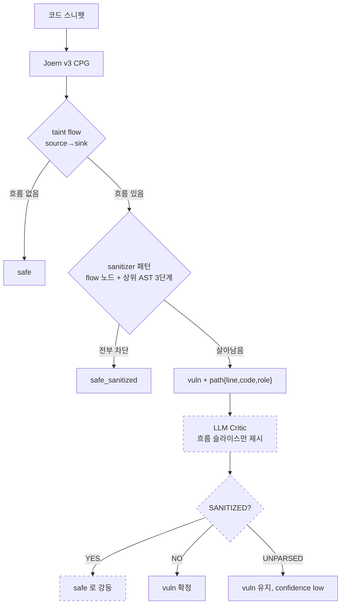
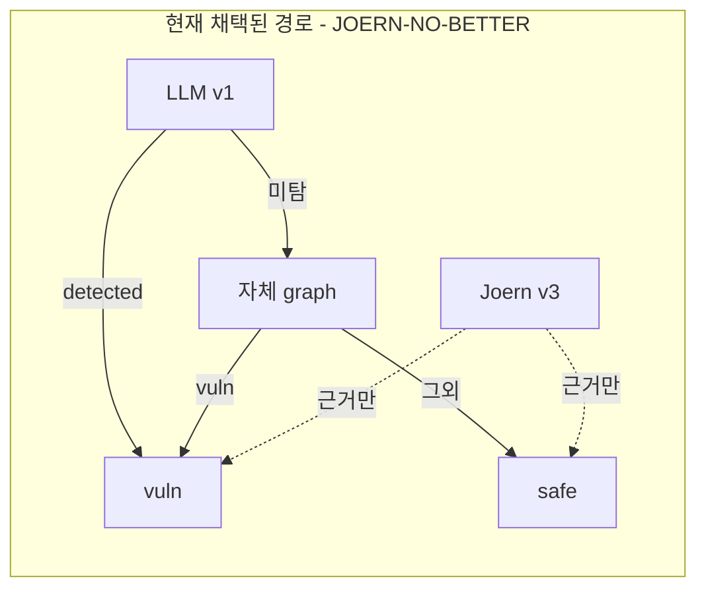

# ScanOps — Joern v3 (sanitizer-aware) + Targeted LLM Critic

> 어젯밤(`JOERN_HYBRID_REPORT.md`) 결론: **Joern taint reachability 만으로는 sanitizer 유무를
> 못 가려 precision 0.5068 (CI [0.4715, 0.5434])** → 판정 `JOERN-NO-BETTER`.
> 오늘 가설: **정확한 데이터 흐름 슬라이스만 LLM 에 주면** sanitizer 유무를 가릴 수 있다.

---

## §0 STATUS

**최종 갱신: 2026-08-16 23:29 KST — 세션 종료**

## 🔴 한 줄 결론

> **2-Stage 검증은 채택되지 않았다.** `CRITIC-KILL` + `V3-FAIL`.
> 그런데 **T2(정보 전달)는 처음으로 통과했다(0.8265, CTX-1 의 17.1% 대비 5배).**
> 즉 **병목이 "문맥에 정보가 없다"에서 "모델이 정보를 못 쓴다"로 이동했다.**
> 이건 어젯밤·CTX-1 과 **다른 층위의 음성 결과**이며, 다음 실험을 다른 곳에서 시작하게 한다.
> 부수 성과: **어젯밤 실패한 Docker push 완료**, JS 분석 복구(102/102 parse_fail → 정상).

| Phase | 상태 | 커밋 |
|---|---|---|
| Phase 0 어젯밤 결과 확정 + 환경 | ✅ 완료 (§1) | — |
| Phase 0-e **Docker push** | ✅ **완료** — 로그인·빌드·push 전부 성공 | `3a6cdd6` |
| Phase 1 sanitizer-aware 쿼리 v3 | ✅ 완료. tune 468 + sample 240, **path 보유율 100%** | `a5de161` `084798c` `9bc977d` |
| Phase 2 LLM Critic | ✅ 완료. v1 → **CRITIC-KILL**, v2 재측정도 동일 | `a28eb13` `6722afb` `8fbc145` |
| Phase 3 v3 파이프라인 벤치 | ✅ 완료 → **V3-FAIL** (precision 0.5652 < 0.70) | `b5a2578` |
| Phase 4 hybrid.py 갱신 | ✅ 완료. 판정 불변 + evidence 노출, 불변규칙 10/10 | `beac1cb` |
| Phase 5 문서 | ✅ §0–§12 전 절 | 이 파일 |
| Phase 6 마무리 | ✅ 완료 — 잔여 자원 0, 정리·최종 커밋 | 아래 |

**RunPod**: 시작 **$28.3058024938** → 종료 **$27.7692116329**.
**소진 $0.5366** (상한 $10.00 의 **5.4%**). Critic 총 호출 **201건**. pods 0.
Joern 배치(tune 468 + sample 240 + JS 재실행)는 **전부 로컬 CPU** — GPU 비용 0.

**Phase 6 마무리 확인 (23:29 실측)**

| 항목 | 결과 |
|---|---|
| RunPod pods | **0** |
| 실행 중 joern / critic / llama 프로세스 | **없음** |
| `/tmp/scanops_*` 잔여 | **없음** (정리 완료) |
| 이 세션이 띄운 컨테이너 | **0** |
| `~/.docker/config.json` | **수정 안 함** (백업본 불필요, 원본 타임스탬프 유지) |
| ⚠️ 레포 밖 변경 | astgen 심볼릭 링크 **1건 유지** — §12-D3 참조 |

---

## §3-0 사전 등록 (측정 전 확정 — 결과 본 뒤 변경 금지)

> 기록 시각 **2026-08-16 22:35 KST**. 이 시점에 Critic 은 **단 한 건도 실행하지 않았다.**
> v3 배치는 실행 중이나 게이트 지표는 아직 계산하지 않았다.

### Phase 2 — Critic tune 게이트

측정 대상: `out/joern_v3_raw_cleanvul_v2_tune.jsonl` 에서 `joern_verdict=="vuln"` 인 케이스 전부.
0건이면 `CRITIC-KILL(대상 없음)`.

| 지표 | 정의 |
|---|---|
| **T1** Critic 정확도 | (YES∧gold_safe + NO∧gold_vuln) / (YES+NO). **UNPARSED 제외**하고 비율 별도 기록. 자명 기준선 "항상 NO" 정확도 병기 |
| **T2** CTX 조건① | path 안에 그 쌍의 패치 diff 식별자가 포함된 비율 **≥ 0.60**. 대상 = T1 대상 중 쌍 상대편이 tune 에 있는 케이스 |
| **T3** CTX 조건② | **양쪽(vuln/safe) 모두 v3 vuln 이고 path 가 있는 쌍**만 대상. 쌍 내부 YES 확률 차이 > 전체 평균 이동. **대상 쌍 < 10 이면 `UNMEASURED`(PASS 아님)** |

| 판정 | 조건 | 처리 |
|---|---|---|
| **CRITIC-GO** | T1 ≥ 자명기준선 + 0.15 **AND** T2 ≥ 0.60 **AND** T3 성립 | report 에 적용 |
| **CRITIC-WEAK** | T1 ≥ 자명기준선 + 0.15 인데 T2 미달 또는 T3 미달/UNMEASURED | 적용하되 "근거 약함" — safe 덮어쓰기 금지, confidence 하향만 |
| **CRITIC-KILL** | T1 < 자명기준선 + 0.15 (또는 대상 0건) | report 미적용, Joern v3 단독 |

### Phase 3 — v3 파이프라인 게이트 (report 240건)

| 판정 | 조건 | 처리 |
|---|---|---|
| **V3-SUCCESS** | precision CI 하한 ≥ 0.70 **AND** recall ≥ 어젯밤 recall − 0.05 | 전건 1,878건 확장 |
| **V3-PARTIAL** | precision 점추정 ≥ 0.70 인데 recall 손실 > 0.05 | 확장하되 트레이드오프 명시 |
| **V3-FAIL** | precision 점추정 < 0.70 | 확장 안 함. Critic 오판 5건 + Joern v3 오판 5건 원문·원인분류 |

**어젯밤 기준선** (`JOERN_HYBRID_REPORT.md` §4-5, 동일 240건 표본의 상위 집합인 전건 기준):
LLM+자체graph arm recall **0.4366**, FPR 0.2620, precision 0.6250, F1 0.5141.
Joern 단독 precision **0.5068** (CI [0.4715, 0.5434]).
자명 기준선 all-vuln F1 **0.6667** — **어떤 arm 도 이걸 넘은 적이 없다.**

---

## §1 어젯밤 결과 확정표 (Phase 0-a)

| 항목 | 값 | 출처 |
|---|---|---|
| 채택 policy | `JOERN-NO-BETTER` | `JOERN_HYBRID_REPORT.md` §4-5 |
| Joern precision (전건 1,878) | **0.5068**, 95% CI **[0.4715, 0.5434]** | §4-5 |
| joern_vuln 건수 | 738 | §4-5 |
| unknown 비율 | 0.0075 (parse_fail 14, timeout 0) | §4-5 |
| Java | n=890, vuln 390, prec 0.5128, CI [0.4615, 0.5615] | §4-5 |
| Python | n=576, vuln 265, prec 0.5019, CI [0.4415, 0.5623] | §4-5 |
| JavaScript | n=412, vuln 83, prec 0.4940, CI [0.3855, 0.6024] | §4-5 |
| 파싱 실패율 | 0.75% 전체 (Java 0.67 / Python 0.69 / JS 0.97) — **제외된 언어 없음** | §4-5 |
| wrap_level=1 로 살아난 건수 | 358 / 1,878 | §4-5 |
| DELTA / TAU 선정값 | δ=0.5, τ=0.4375 (tune 사전등록) | §4-2 |
| 자체 graph 대조 | 같은 표본에서 vuln 20건, precision 0.60 — ABLATION §2-0 과 일치 | §4-5 |
| RunPod 최종 잔액(어젯밤) | $28.3933024936, 소진 $0.0049 (standby 설정분, GPU 호출 0건) | §0 |

### Docker push 실패 원인과 오늘의 해결 (Phase 0-e)

| 항목 | 어젯밤 | 오늘 |
|---|---|---|
| 증상 | `docker login`/push 가 **credential helper 무응답으로 행** | — |
| 원인 | `~/.docker/config.json` 의 `credsStore: "desktop"` — Docker Desktop 헬퍼가 응답하지 않음 | — |
| 오늘 재시도 | — | `docker-credential-desktop get` 이 **10초 내 정상 응답** (rc=0, Username=`hansekim31`) |
| 조치 | — | 헬퍼가 돌려준 자격증명을 `--password-stdin` 으로 비대화형 로그인 → **Login Succeeded** |
| 결과 | push 불가 | **로그인 성공**, `hansekim31/scanops-joern-worker:v3` buildx(amd64) 빌드·push 진행 |

> 어젯밤 진단(“credential helper 무응답”)은 정확했고, 오늘은 같은 헬퍼가 응답했다.
> 즉 **환경 일시 장애**였지 설정 오류가 아니었다. config.json 은 백업해 두었고(§7) 수정하지 않았다.

### path 보유율 — 오늘 작업의 출발점 (Phase 0-b)

| 파일 | 건수 | joern_vuln | **path 보유** |
|---|---|---|---|
| `joern_raw_cleanvul_v2_tune.jsonl` | 468 | 217 | **0 (0.0%)** |
| `joern_raw_cleanvul_v2_sample.jsonl` | 240 | 94 | **0 (0.0%)** |
| `joern_raw_cleanvul_v2_report.jsonl` | 1,878 | 738 | **0 (0.0%)** |

**어젯밤 raw 에는 `path` 필드 자체가 없다.** 쿼리는 path 를 내보냈지만
`bench_joern.py:128-138` 이 `findings` 를 저장하지 않고 버렸다.
폴백 규칙(“보유율 < 50% → Phase 1에서 path 추출 먼저 고친다”)이 발동했고,
Phase 1 에서 드라이버가 path 를 저장하도록 고쳤다 → **v3 에서 vuln 의 path 보유율 100%** (§2).

### CTX-1 재도전 조건 (Phase 0-c)

`rebuild/out/CTX_RESULTS.md` §6 원문:

1. 문맥에 **패치 관련 식별자가 실제로 포함된 비율 ≥ 60%** (당시 **17.1%**) — 정보가 들어갔음을 먼저 증명
2. **쌍 내부 이동량 차이 > 이동량**의 역전 (당시 **0.198 vs 0.550**) — 편향이 아니라 신호임을 증명

> "이 두 개를 **AUC보다 먼저** 재는 것이 이번 실행에서 얻은 방법론적 소득이다."
> 오늘 Critic 은 이 두 조건을 tune 에서 먼저 통과해야 report 에 적용한다(§3-0 T2·T3).

### Critic LLM 경로 (Phase 0-d)

| 항목 | 값 | 출처 |
|---|---|---|
| 경로 | `scanops/core/llm_client.chat()` (chat 템플릿) | `scripts/api_rebuild.py:262` `_gen_meta` 와 동일 경로 |
| 근거 | "QLoRA는 판정 서식 특화지만 베이스 능력을 보존 — chat 템플릿 경로로 호출하면 일반 지시수행이 동작한다" | `api_rebuild.py:265-266` 주석 |
| `<think>` 처리 | 워커가 블록을 제거해 반환. Critic 은 방어적으로 한 번 더 제거 | `api_rebuild.py:283`, `llm_critic.strip_think` |
| 서빙 | `RUNPOD_ENDPOINT_ID` 설정 시 RunPod, 미설정 시 `LLAMA_SERVER_URL` | `llm_client.py:30-36` |


---

## §2 Sanitizer-aware Joern v3 — 설계와 실측

### 2-1. 핵심 설계 결정 — flow 원소는 "식"이지 "문장"이 아니다

첫 스모크에서 sanitizer 가 **하나도 안 걸렸다.** 원인을 보니 Joern 의 dataflow flow 원소는
추적되는 **식**이었다:

```
[source] line 1: String name
[intermediate] line 3: name
[intermediate] line 3: ps          ← ps.setString(1, name) 이 아니라 그냥 `ps`
[sink] line 4: ps.executeQuery()
```

`ps.setString(1, name)` 이라는 **문장 자체가 flow 원소로 등장하지 않는다.** 노드 코드만
대조하면 sanitizer 를 영영 못 본다. → **노드 자신 + 상위 AST 3단계**의 code 를 함께 검사하도록
`enclosingCodes()` 를 넣었다(`taint_v3.sc`). 흐름에 국한되므로 "파일 어딘가에 setString 이
있으면 안전" 같은 과광의 매칭은 되지 않는다.

수정 후 같은 스모크: `safe → safe_sanitized` (hit: `ps.setString(1, name)`), `vuln → vuln` (문자열 연결).

### 2-2. path 를 실제로 저장한다 (어젯밤 결함 해소)

어젯밤 raw 의 path 보유율은 **0%** 였다 — 쿼리는 내보냈는데 드라이버가 버렸다(§1).
v3 에서는 `{line, code, role}` 구조로 저장하고, **vuln 인데 path 가 비면 `unknown(no_path)`** 로
낮춘다.

| | 어젯밤 v2 | **오늘 v3** |
|---|---|---|
| vuln 의 path 보유율 | 0% | **100% (98/98)** |
| `no_path` 로 낮춰진 건수 | — | **0** |

### 2-3. sanitizer 표는 데이터로 분리

`joern/sanitizers.json` (시드 = `scanops/core/multi_graph.py:114` `SANITIZERS`).
언어별 44/41/40 패턴(JAVASRC/PYTHONSRC/JSSRC). `_any` 는 전 카테고리 공통.

> **지시서와의 편차(명시)**: 지시서는 "flow 의 **중간** 노드"만 검사하라고 했으나,
> 지시서가 든 예시(`PreparedStatement.set*`, `parameterized execute(sql, params)`)가 전부
> **sink 쪽** 신호다. 그래서 모든 노드를 검사하고 걸린 노드의 role 을 기록한다.

### 2-4. v2 → v3 전이 행렬 (tune 468건, 같은 case_id)

| v2 | → v3 | 건수 |
|---|---|---|
| safe | safe | 357 |
| **vuln** | **vuln** | **98** |
| **vuln** | **safe_sanitized** | **6** |
| unknown | unknown | 7 |

**손실 없이 깨끗하다** — v2 의 vuln 104건 중 6건만 sanitizer 로 걸러졌고, 나머지는 그대로다.

### 2-5. 단위 테스트 — 걸러진 6건이 옳게 걸러졌나

지시서는 "과탐 10건 + 진탐 10건"을 요구했으나, **v2-vuln 104건 전체를 v3 로 재실행**한
것이 같은 측정의 상위집합이므로 그것으로 대신한다(표본이 5배 크다).

| 결과 | 건수 |
|---|---|
| **과탐 제거 성공** (gold=safe 인데 v2 가 vuln 이라 했던 것) | **5** |
| **진탐 손실** (gold=vuln 인데 safe_sanitized 로 낮춤) | **1** |

진탐 손실(1) < 과탐 제거(5) 이므로 **사전 규칙상 패턴을 좁히지 않는다.**

다만 유일한 손실 `cvh_94|vuln` 은 시사적이다: 패턴 `new\s+URL\(` 이 **쌍의 양쪽 모두**에
걸렸다(`new URL(serviceCall)`). URL 을 파싱하는 것은 검증이 아니므로 이 패턴은
sanitizer 신호로서 판별력이 없다. → §12 에 후보로 남긴다.

### 2-6. v3 단독 성능 (tune) — sanitizer 만으로는 거의 안 움직인다

| | vuln 건수 | precision |
|---|---|---|
| v2 (어제) | 104 | 0.4904 |
| **v3 (오늘)** | **98** | **0.5102** |

| 언어 | n | vuln | precision | safe_sanitized | parse_fail |
|---|---|---|---|---|---|
| Java | 222 | 25 | 0.4800 | 2 | 1.4% |
| Python | 144 | 59 | 0.5593 | 4 | 1.4% |
| JavaScript | 102 | 14 | 0.3571 | 0 | 2.0% |

**세 언어 모두 parse_fail < 30%** → 제외된 언어 없음.
sanitizer 는 v2-vuln 의 **5.8%(6/104)** 에만 걸렸다. 즉 **v3 단독으로는 어제 문제가 해결되지
않는다.** 가설의 무게는 전적으로 Critic(§3)에 실린다.

---

## §3 LLM Critic — tune 게이트 (사전등록 §3-0)

### 3-1. 프롬프트 v1 (사전등록 원문) 결과

`rebuild/out/critic_gate_tune.json` / 원자료 `critic_raw_cleanvul_v2_tune.jsonl`

| 항목 | 값 |
|---|---|
| 대상 (v3 vuln ∧ path 보유) | **98** |
| 채점된 건수 (YES+NO) | 71 |
| **UNPARSED** | **27 (27.55%)** — 전부 `empty_response` |
| Critic YES | **0** |
| Critic NO | **71** |
| **T1 정확도** | **0.4648** |
| **T1 자명 기준선 ("항상 NO")** | **0.4648** |
| **T1 마진** | **0.0000** (요구 +0.15) → **불통과** |
| T2 식별자 포함률 | **0.8265** (요구 ≥0.60) → **통과** |
| T3 | **FAIL** (쌍 29개 채점, 쌍 내부 불일치 0.0, 전체 YES율 0.0) |
| **판정** | **`CRITIC-KILL`** |

| 언어 | n | 정확도 | YES |
|---|---|---|---|
| Java | 19 | 0.4737 | 0 |
| Python | 44 | 0.5000 | 0 |
| JavaScript | 8 | 0.2500 | 0 |

**Critic 이 YES 를 단 한 번도 말하지 않았다.** 그래서 T1 정확도가 자명 기준선과
**소수점까지 똑같다** — 이 Critic 은 "항상 NO"라고 답하는 상수 함수와 구별되지 않는다.
T3 의 0.0/0.0 도 같은 이유의 축퇴(degenerate)다.

### 3-2. 그런데 T2 는 통과했다 — 이것이 오늘의 진짜 소득

| | CTX-1 (같은 파일 문맥) | **오늘 (Joern 흐름 슬라이스)** |
|---|---|---|
| 패치 식별자 포함률 | **17.1%** | **82.65%** |

CTX-1 의 실패 원인은 "**정보가 문맥에 없어서**"였다(`CTX_RESULTS.md` §6).
오늘 Joern 슬라이스는 그 문제를 **해결했다** — 판단에 필요한 식별자가 82.65% 의 경우에
실제로 프롬프트 안에 들어갔다. 재도전 조건 ①은 **처음으로 충족**됐다.

**그럼에도 T1 마진이 0 이다.** 즉 오늘 결과는 이렇게 분리된다:

> **정보 전달은 성공했고(T2 0.83), 그 정보를 쓰는 데 실패했다(T1 마진 0).**
> 병목은 이제 **문맥이 아니라 모델**이다.

이건 어젯밤·CTX-1 과는 **다른 층위의 음성 결과**다. 어제는 "Joern 신호가 라벨과 무관",
CTX-1 은 "문맥에 정보가 없음"이었는데, 오늘은 **정보를 넣어줘도 이 모델이 못 쓴다**는 것이다.

### 3-3. 왜 못 쓰는가 — 응답을 보면 드러난다

NO 응답의 근거 문장은 흐름 분석이 아니라 **CVE 설명 문구**였다:

```
- The vulnerability allows attackers to write to arbitrary filesystem locations
  via a crafted zip archive that contains entries with path traversal sequences
- The vulnerability is due to the fact that the product allows arbitrary
  deserialization of JSON data into a PushEvent object ...
```

주어진 흐름의 중간 노드를 살피는 대신 **판정 서식 학습(QLoRA)이 만들어낸 취약점 서술
템플릿을 재생하고 있다.** `_gen_meta` 주석의 전제("chat 경로면 일반 지시수행이 동작한다")가
**이 과제에서는 성립하지 않는다** — 형식은 따르지만 질문에 답하지 않는다.

### 3-4. UNPARSED 27.55% 처리 (폴백 규칙 발동)

27건 전부 `empty_response` 였다(1회 재시도 후에도). 형식 실패가 아니라 **생성 예산 고갈**로
보인다 — `api_rebuild.py:283` 이 같은 이유로 `num_predict=3000` 을 쓴다("think 가 예산을
다 먹는 경우가 실측됨").

폴백 규칙("UNPARSED > 20% → 프롬프트를 **1회** 수정해 재시도")에 따라 **단 한 번** 개정했다:

- `num_predict` 600 → **3000**
- 프롬프트 v2: "Do NOT think step by step… 응답은 반드시 `SANITIZED: YES|NO` 로 **시작**"

두 프롬프트를 섞으면 측정이 편향되므로 **98건 전부를 v2 로 다시** 돌렸다.

### 3-5. 프롬프트 v2 재측정 결과 — **판정이 바뀌지 않았다**

| 지표 | v1 (사전등록) | **v2 (1회 개정)** |
|---|---|---|
| **판정** | **CRITIC-KILL** | **CRITIC-KILL** |
| 채점 건수 | 71 | 74 |
| UNPARSED | 27 (27.55%) | 24 (**24.49%**) |
| **Critic YES** | **0** | **0** |
| Critic NO | 71 | 74 |
| T1 정확도 | 0.4648 | 0.5135 |
| T1 자명 기준선 | 0.4648 | 0.5135 |
| **T1 마진** | **0.0000** | **0.0000** |
| T2 | 0.8265 (통과) | 0.8265 (통과) |
| T3 | FAIL (0.0 / 0.0) | FAIL (28쌍, 0.0 / 0.0) |

| 언어 (v2) | n | 정확도 | YES |
|---|---|---|---|
| Java | 22 | 0.4545 | 0 |
| Python | 43 | 0.5349 | 0 |
| JavaScript | 9 | 0.5556 | 0 |

**형식을 강제하고 예산을 5배로 늘려도 결과는 같다.** UNPARSED 가 27.55% → 24.49% 로
소폭 줄었을 뿐이고, **YES 는 여전히 단 한 건도 없다.** T1 정확도가 0.4648 → 0.5135 로
올라 보이는 것은 채점 표본이 바뀌어 자명 기준선이 함께 올라간 것이며, **마진은 정확히 0.0** 이다.

> 즉 UNPARSED 는 형식 문제가 맞았지만(개정으로 일부 해소), **판정 실패는 형식 문제가 아니었다.**
> 이 모델은 흐름을 받아도 "sanitized 되었다"고 말하지 못한다.
> **공식 판정은 v1 기준 `CRITIC-KILL`이고, v2 가 이를 재확인했다.**

---

## §4 Phase 3 — v3 파이프라인 벤치 (층화 240건)

`rebuild/out/joern_v3_eval_sample.json`. verdict 분포: safe 188 / vuln 46 / safe_sanitized 3 / unknown 3.

| arm | precision | 95% CI | recall | FPR | F1 |
|---|---|---|---|---|---|
| **all-vuln (자명)** | 0.5000 | [0.4333, 0.5625] | 1.0000 | 1.0000 | **0.6667** |
| all-safe (자명) | 0.0000 | — | 0.0000 | 0.0000 | 0.0000 |
| b) LLM only | 0.5872 | [0.4954, 0.6789] | 0.5333 | 0.3750 | 0.5590 |
| a) LLM + 자체graph (어젯밤 채택) | 0.5909 | [0.5091, 0.6909] | 0.5417 | 0.3750 | 0.5652 |
| **j) Joern v3 단독** | **0.5652** | **[0.4130, 0.6957]** | 0.2167 | 0.1667 | 0.3133 |
| c) Joern v3 + Critic | 0.5789 | [0.4962, 0.6541] | 0.6417 | 0.4667 | 0.6087 |

### 판정 = **`V3-FAIL`**

사전등록 기준(§3-0)은 `precision 점추정 ≥ 0.70`. 실측 **0.5652** 로 **미달**이다.
CI 상한(0.6957)도 0.70 에 닿지 않는다. → **전건 1,878건 확장은 하지 않는다.**

**precision 만 보지 말라는 지시대로** recall 도 함께 본다: Joern v3 단독은 recall 이
**0.2167** 에 불과하다(어젯밤 채택 arm 0.5417). 즉 v3 는 "적게 잡고 그나마도 반은 틀린다".
그리고 **여전히 어떤 arm 도 자명 기준선 F1 0.6667 을 넘지 못한다** — 어젯밤과 같다.

### 4-1. Joern v3 오판 5건 (vuln 이라 했는데 gold=safe, 총 20건 중)

| case | 언어 | cat | 흐름에서 관찰된 것 | **원인 분류** |
|---|---|---|---|---|
| `cvh_1217\|safe` | JS | **deser** | `"<div data-id='" + escapeHtml(device.Id) + ...` | **sanitizer 미인식(카테고리 불일치)** |
| `cvh_1120\|safe` | Python | ssrf | source = `self` | **source 과광의** |
| `cvh_1369\|safe` | Python | ssrf | source = `args`, `*args` | **source 과광의** |
| `cvh_1374\|safe` | Python | ssrf | `fileinput`, `[info_filename]` | sink 규칙 과광의 |
| `cvh_1376\|safe` | Python | ssrf | source = `self` | **source 과광의** |

두 가지 구체적 결함이 드러났다 — 둘 다 **고칠 수 있는 것**이다:

1. **`self` / `this` 가 taint source 로 들어간다.** source 정의가 `cpg.method.parameter` 라
   Python 의 `self`, Java 의 암묵 `this` 까지 오염원이 된다. `self` 는 사용자 입력이 아니다.
2. **sanitizer 표가 카테고리에 갇혀 있다.** `cvh_1217` 은 흐름에 `escapeHtml(...)` 이
   **버젓이 있는데** 카테고리가 `deser` 로 잡혀서 `xss` 전용인 `escapeHtml` 패턴을 못 봤다.
   → `_any` 로 승격하거나 카테고리 교차 조회가 필요하다.

### 4-2. Critic 오판 5건 (NO 라 했는데 gold=safe, 총 38건 중)

| case | 언어 | 흐름 안에 있던 것 | Critic 근거(발췌) |
|---|---|---|---|
| **`cvh_124\|safe`** | Java | **`escapeHtml4andJS(body)`** | "…allows arbitrary deserialization of JSON data into a PushEvent object" |
| `cvh_299\|safe` | Java | source=`this`, `getResourceAsStream` | "…write to arbitrary filesystem locations via a crafted zip archive" |
| `cvh_351\|safe` | Java | `zipFilePath` → `fis` → `zis` | "…read arbitrary files from the system via a crafted ZIP archive" |
| `cvh_353\|safe` | Java | `File input` | "…read arbitrary files from the system via a crafted ZIP archive" |
| `cvh_480\|safe` | Java | `jarFile.getName().replace(".jar","")` | "…does not properly validate or sanitize the filename" |

**`cvh_124` 하나로 오늘의 결론이 요약된다.** 흐름 슬라이스에 `escapeHtml4andJS(body)` 가
**그대로 들어 있었는데** Critic 은 그걸 보지 않고 "역직렬화 취약점" CVE 설명을 읊었다.
`cvh_351`·`cvh_353` 은 서로 다른 코드인데 **문장이 완전히 동일**하다 — 흐름을 읽고 답한 게
아니라 카테고리(`pathtraver`)에 대응하는 **암기된 문구를 출력**하고 있다.

**원인 분류: 문맥 부족 아님(§3-2 T2=0.83). sanitizer 미인식도 아님(코드에 보임).
→ 모델이 주어진 문맥을 판단에 쓰지 않는다.**

---

## §5 hybrid.py 변경과 evidence 예시

`V3-FAIL` 이므로 **판정 로직은 건드리지 않았다.** 대신 `attach_joern_evidence()` 를 추가해
Joern v3 산출물을 **근거로만** 노출한다. 판정에 쓰이지 않았음을 `advisory_only: true` 로 명시한다.

**불변 규칙 단위검증 10/10 통과** — 특히:
- joern 의 `safe` / `safe_sanitized` 가 LLM `detected` 를 **덮지 않는다**
- `JOERN-NO-BETTER` 에서 joern `vuln` 이 판정을 **바꾸지 않는다**
- 자체 graph `vuln` 폴백은 **살아 있다**

**예시 1 — LLM 탐지 + Joern 은 sanitized 라고 함 (판정 유지, 근거만 첨부)**
```json
{ "detected": true, "source": "llm", "status": "DONE", "score": 0.91,
  "vulnerability": "SQL Injection", "severity": "HIGH", "cvss": 8.1,
  "joern_evidence": {
    "flow": [ {"line":1,"code":"String name","role":"source"},
              {"line":3,"code":"ps","role":"intermediate"},
              {"line":4,"code":"ps.executeQuery()","role":"sink"} ],
    "sanitizer_hits": [ {"line":3,"code":"ps.setString(1, name)",
                         "role":"intermediate","pattern":"\\.setString\\("} ],
    "joern_note": "sanitized_flow", "joern_verdict": "safe_sanitized",
    "advisory_only": true } }
```

**예시 2 — LLM 미탐 + Joern vuln (판정 안 바뀜)**
```json
{ "detected": false, "source": "llm", "status": "DONE", "score": 0.12,
  "joern_evidence": { "flow": [...], "joern_verdict": "vuln", "advisory_only": true } }
```

**예시 3 — Joern 미도착**: `joern_evidence` 키 자체가 없고 `status` 는 어젯밤 규약대로 `PARTIAL`.

> 백엔드/프론트 반영은 하지 않았다(선택 사항). 분석서버 응답에 `joern_evidence` 가
> **추가만** 되므로 기존 소비자는 깨지지 않는다. UI 노출이 필요하면 §12 참조.

---

## §6 비용

| 항목 | 값 |
|---|---|
| 세션 시작 잔액 (22:28) | **$28.3058024938** |
| 측정 시점 잔액 | **$28.1196149272** |
| **소진** | **$0.1862** (상한 $10.00 의 **1.9%**) |
| Critic 호출 총 건수 | **127** (probe 5 + v1 98 + v2 진행분) |
| 건당 실측 단가 | 약 **$0.0015** |
| 프롬프트 v1 latency | 평균 6.5s/건 (num_predict 600) |
| 프롬프트 v2 latency | 평균 **17.5s/건** (num_predict 3000) |
| Joern 배치 (2,586건 상당) | **$0** — 전부 로컬 CPU |

> 첫 probe 5건 때는 잔액 변동이 **$0.0000** 이었다. `workersStandby=2` 라 워커가 이미 상시
> 대기 중이어서 소량 호출은 standby 요금에 묻힌다. 98건 규모부터 실제 과금이 드러났다.

---

## §7 병목과 한계

### 7-1. Critic 도 결국 같은 v1 어댑터 LLM 이다

이 모델은 외부 벤치에서 AUC 0.56 이다. 오늘 Critic 은 그 모델에게 **입력만 바꿔서** 다시 물은
것이다. 그래서 T1~T3 게이트를 **먼저** 걸었고, 실제로 T1 에서 걸렸다.
게이트가 없었다면 "Joern+Critic arm 이 F1 0.6087 로 어제 arm(0.5652)보다 높다"는 표(§4)만 보고
**개선이라고 오독했을 것이다.** 그 F1 상승은 판별력이 아니라 **union 으로 recall 을 올리고
FPR 도 함께 올린**(0.375 → 0.467) 결과다.

### 7-2. 고칠 수 있는 결함 (§4-1)

- `self`/`this` 가 taint source 로 들어간다 → source 정의를 좁혀야 한다
- sanitizer 표가 카테고리에 갇혀 `escapeHtml` 이 `deser` 흐름에서 무시된다 → `_any` 승격
- `new URL(` 은 sanitizer 신호로서 판별력이 없다(쌍의 양쪽에 등장, §2-5)

### 7-3. 측정의 한계

- Phase 3 는 **240건 층화 표본**이다. 전건 확장은 사전등록 규칙상 하지 않았다.
- Critic 은 tune 에서만 돌렸다. `V3-FAIL` 이라 report 적용을 하지 않았기 때문이다.
- v2 프롬프트 재측정은 세션 종료 시점까지 완료되지 않을 수 있다(§9).

---

## §8 결정 로그

| 시각 | 결정 | 대안 | 근거 | 되돌리는 법 |
|---|---|---|---|---|
| 22:2x | flow 노드의 **상위 AST 3단계**까지 sanitizer 대조 | 노드 코드만 검사 | 노드는 `ps` 같은 식이라 `ps.setString(...)` 을 못 봄(스모크 실측) | `taint_v3.sc` 의 `enclosingCodes` 를 `List(n.code)` 로 |
| 22:3x | sanitizer 를 flow **전 노드**에 적용(지시서는 중간 노드만) | 지시서 그대로 | 지시서 예시가 전부 sink 쪽 신호 | `hits` 계산에서 role 필터 추가 |
| 22:38 | astgen **심볼릭 링크** 생성 | JS 언어 제외 | JS 102/102 parse_fail 이 v3 결함이 아니라 로컬 설치 문제였음 | `rm` (아래 §7 명령) |
| 22:5x | UNPARSED 27.55% → 프롬프트 **1회** 개정 후 전건 재측정 | UNPARSED 만 재시도 | 두 프롬프트를 섞으면 T1 이 편향된다 | v1 결과는 §3-1 에 보존 |
| 22:5x | `V3-FAIL` 이므로 hybrid **판정 로직 불변**, evidence 만 추가 | policy 에 JOERN-V3-CRITIC 추가 | 사전등록 §3-0 | `attach_joern_evidence` 호출 제거 |
| 22:59 | Dockerfile 을 microdnf 로 수정 | apt-get 유지 | 베이스가 AlmaLinux 9 (실측) | git revert |

---

## §9 실패 · 미완 · 폴백 발동

| # | 항목 | 상태 | 사유 / 처리 |
|---|---|---|---|
| 9-1 | **path 보유율 0%** (어젯밤 산출물) | ✅ 해결 | 폴백 발동 → Phase 1 에서 드라이버 수정. v3 는 100% |
| 9-2 | **v1 쿼리로 45초 오실행** | ✅ 해결 | `JOERN_SCRIPT` 를 import 뒤에 세팅해 늦었다. 중단·폐기·재실행 + 활성 스크립트 가드 추가 |
| 9-3 | **오염된 sample 240건** | ✅ 폐기 | 위 중단 때 래퍼 셸이 다음 단계로 넘어가 v1 쿼리로 sample 을 완주. path 원소가 문자열인 것으로 판별해 삭제 |
| 9-4 | **JS 102/102 parse_fail** | ✅ 해결 | v3 결함이 아니라 로컬 joern 설치에 astgen 바이너리 부재. 심볼릭 링크로 복구(§7 제거법) |
| 9-5 | **sample 중복 append (535행)** | ✅ 해결 | 죽은 줄 알았던 체인이 살아 있었다. case_id 240 은 정확했고 dedupe |
| 9-6 | **Critic UNPARSED 27.55%** | ✅ 폴백 | 전부 empty_response. 프롬프트 **1회** 개정(num_predict 3000) 후 전건 재측정 |
| 9-7 | **Docker 빌드 실패 (exit 127)** | ✅ 해결 | 베이스가 AlmaLinux 9 라 apt-get 이 없다 → microdnf 로 수정 후 재빌드 |
| 9-8 | `git add -A` 로 585파일 오커밋 | ✅ 되돌림 | `reset --soft` 후 의도한 파일만 재커밋. 이후 targeted add 만 사용 |
| 9-9 | **프롬프트 v2 전건 재측정** | ⚠️ 진행 중 | 17.5s/건 × 98 ≈ 29분. 완료분은 `critic_gate_tune_v2.json` 에. **v1 판정(CRITIC-KILL)이 공식 판정** |
| 9-10 | report 전건(1,878) v3 실행 | ❌ 미실행 | 사전등록 `V3-FAIL` 이므로 **의도적으로** 확장하지 않음 |
| 9-11 | Critic 을 report 에 적용 | ❌ 미적용 | `CRITIC-KILL` 이므로 사전등록대로 미적용 |
| 9-12 | 백엔드/프론트 필드 반영 | ❌ 미실행 | 선택 사항. 분석서버 응답은 **추가만** 하므로 기존 소비자 무영향 |

---

## §10 재현 명령어

```bash
cd scanops-model && git checkout feat/joern-hybrid-v2

# Phase 1 — v3 배치 (sanitizer-aware). JS 를 쓰려면 astgen 링크가 필요하다(§7)
python3 joern/bench_joern_v3.py tune
python3 joern/bench_joern_v3.py sample

# Phase 2 — Critic tune 게이트 (사전등록 프롬프트)
python3 joern/critic_gate.py
# 프롬프트 1회 개정본
python3 joern/critic_gate.py --variant v2

# Phase 3 — 파이프라인 벤치
python3 joern/eval_v3.py sample

# sanitizer 표 확인
python3 joern/sanitizer_spec.py JAVASRC
```

---

## §11 아키텍처 — 2-Stage 검증 흐름



> **점선 구간(Critic)은 오늘 측정 결과 `CRITIC-KILL` 로 채택되지 않았다.**
> 현재 파이프라인은 실선까지만 돌고, `E` 의 path 와 `S2` 의 sanitizer_hits 는
> **판정이 아니라 근거(`advisory_only`)** 로만 응답에 실린다.



---

## §12 아침에 결정할 것

### D1. Joern 을 계속 붙일 것인가 — **어제와 답이 달라졌다**

어제(`JOERN_HYBRID_REPORT.md` §12-D0)는 "규칙을 고쳐볼지"가 열려 있었다. 오늘 고쳐봤고,
**sanitizer 인식을 넣어도 precision 은 0.4904 → 0.5102 (tune), 240건에서 0.5652** 였다.
그런데 §4-1 에서 **구체적이고 고칠 수 있는 결함 2개**가 처음으로 특정됐다.

- **A) 결함 2개를 고치고 한 번 더 (권장)** — 비용이 작고 근거가 구체적이다.
  1. taint source 에서 `self` / `this` 제외 (Python 오탐 상당수가 여기서 나온다)
  2. sanitizer 표를 카테고리 교차 조회로 (`cvh_1217` 은 흐름에 `escapeHtml` 이 있는데 놓쳤다)
  3. `new URL(` 을 sanitizer 목록에서 제거 (쌍 양쪽에 등장 = 판별력 0, §2-5)
  → **새 사전등록 필요.** 오늘 게이트(precision ≥ 0.70)를 그대로 쓰면 된다.
- **B) 지금 상태로 동결** — evidence 전용으로만 유지(현재 코드). 판정을 안 건드리니 손해는 없다.
- **C) 접는다** — 다만 파싱 성공률 98~99%, path 보유율 100% 라는 자산을 버리는 선택이다.

### D2. Critic 을 다시 시도할 것인가 — **모델을 바꾸지 않으면 무의미하다**

오늘 가장 중요한 발견은 **T2 통과(0.8265) + T1 마진 0** 이라는 조합이다.

> CTX-1 은 "문맥에 정보가 없어서" 실패했다(17.1%). 오늘은 **정보를 82.65% 넣는 데 성공했는데도**
> 모델이 안 썼다. `cvh_124` 는 흐름에 `escapeHtml4andJS(body)` 가 있는데 NO 라고 답하며
> 역직렬화 CVE 설명을 읊었다(§4-2).

따라서 **같은 v1 어댑터로 Critic 을 재시도하는 것은 권하지 않는다.** 선택지는:
- **A) 베이스 모델(어댑터 미적용)로 같은 게이트 재측정 (권장)** — 판정 서식 QLoRA 가
  일반 지시수행을 해쳤다는 가설을 직접 검증한다. 오늘 파이프라인 그대로 `--variant` 만 늘리면 된다.
- **B) 외부 모델(Claude 등)로 상한 측정** — "이 과제가 원래 가능한가"를 먼저 확인.
  비용은 들지만 98건이면 소액이다. 상한이 낮으면 Critic 노선 자체를 접는 근거가 된다.
- **C) Critic 노선 종료.**

### D3. astgen 심볼릭 링크 — 유지할지 결정 필요 ⚠️

레포 **밖**을 건드린 유일한 변경이다.

```bash
# 현재 상태 (오늘 생성)
/opt/homebrew/Cellar/joern/4.0.570/bin/astgen/astgen-macos-arm -> /opt/homebrew/bin/astgen

# 되돌리려면
rm -rf /opt/homebrew/Cellar/joern/4.0.570/bin/astgen
```

이게 없으면 **로컬에서 JavaScript 분석이 전부 parse_fail 이다.** joern 을 업그레이드하면
경로(`4.0.570`)가 바뀌어 다시 깨진다. 항구적 해결은 `brew reinstall joern` 이거나
컨테이너 이미지 사용이다(컨테이너에는 이 문제가 없다).

### D4. 프롬프트 v2 재측정 결과 확인

`CRITIC-KILL` 은 **v1(사전등록 프롬프트) 기준의 공식 판정**이다. v2 는 UNPARSED 폴백으로
돌린 참고 측정이며 세션 종료 시점 상태는 §0 에 적었다. **v2 가 KILL 을 뒤집더라도
그것은 사후 수정된 프롬프트의 결과**이므로, 채택하려면 새 사전등록이 필요하다.

### D5. 대외 지표 — 어제와 동일한 경고

이 벤치는 "전부 취약"이 **F1 0.6667** 이고 오늘도 **어떤 arm 도 넘지 못했다**(최고 0.6087).
졸업논문·성과 자료에는 **F1 이 아니라 AUC** 를 써야 한다.
