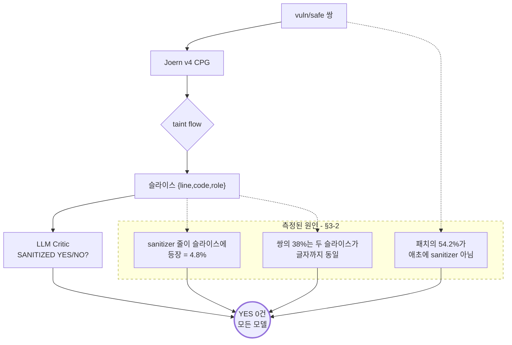

# ScanOps — Joern v4 + Critic 전략 탐색

> 어제(`JOERN_HYBRID_REPORT_V3.md`) 결론: **흐름 슬라이스에 sanitizer 정보를 82.65% 담는 데 성공**했으나
> v1 어댑터 Critic 은 **YES 를 0번** 답했다. 흐름에 `escapeHtml4andJS(body)` 가 있어도 NO 라 하며
> 카테고리별 암기 문구를 뱉었다.
> **오늘의 질문: 모델이 슬라이스를 읽게 만드는 방법이 있는가?**

---

## §0 STATUS

**최종 갱신: 2026-08-16 23:55 KST**

| Phase | 상태 | 커밋 |
|---|---|---|
| Phase 0 재료 점검 | 🔄 진행 중 | — |
| Phase 1 Joern v4 결함 수정 | ⏳ 대기 | — |
| Phase 2 Critic 전략 탐색 | ⏳ 대기 | — |
| Phase 3 v4 파이프라인 벤치 | ⏳ 대기 | — |
| Phase 4 hybrid.py | ⏳ 대기 | — |
| Phase 5 문서 | 🔄 작성 중 | — |
| Phase 6 마무리 | ⏳ 대기 | — |

**RunPod 잔액**: 세션 시작 (23:51) **$27.7683060079**, pods 0.
상한 = min(27.77 − 5, 10) = **$10.00**. 외부 API(전략 A) 별도 상한 **$1**.

---

## §1 어제 확정표 (Phase 0-a)

### Critic 게이트 (CRITIC-KILL)

| 지표 | v1 (사전등록 프롬프트) | v2 (1회 개정) |
|---|---|---|
| 판정 | **CRITIC-KILL** | **CRITIC-KILL** |
| 대상 / 채점 | 98 / 71 | 98 / 74 |
| UNPARSED | 27 (27.55%) | 24 (24.49%) |
| **Critic YES** | **0** | **0** |
| Critic NO | 71 | 74 |
| T1 정확도 | 0.4648 | 0.5135 |
| T1 자명 기준선 | 0.4648 | 0.5135 |
| **T1 마진** | **0.0000** | **0.0000** |
| T2 식별자 포함률 | **0.8265 (통과)** | 0.8265 |
| T3 | FAIL (29쌍, 0.0/0.0) | FAIL (28쌍, 0.0/0.0) |

### 파이프라인 (V3-FAIL)

| arm | precision | 95% CI | recall | FPR | F1 |
|---|---|---|---|---|---|
| all-vuln (자명) | 0.5000 | — | 1.0000 | 1.0000 | **0.6667** |
| b) LLM only | 0.5872 | [0.4954, 0.6789] | 0.5333 | 0.3750 | 0.5590 |
| a) LLM + 자체graph | 0.5909 | [0.5091, 0.6909] | 0.5417 | 0.3750 | 0.5652 |
| **j) Joern v3 단독** | **0.5652** | [0.4130, 0.6957] | 0.2167 | 0.1667 | 0.3133 |
| c) v3 + Critic | 0.5789 | [0.4962, 0.6541] | 0.6417 | 0.4667 | 0.6087 |

### 실패 사례 (어제 §4)

| case | 관찰 |
|---|---|
| `cvh_124\|safe` | 흐름에 **`escapeHtml4andJS(body)`** 가 있는데 Critic NO. 근거는 "역직렬화 CVE" 설명. 카테고리가 **deser** 로 잡혀 xss 전용 sanitizer 패턴을 못 봄 |
| `cvh_351\|safe`·`cvh_353\|safe` | **서로 다른 코드인데 근거 문장이 완전히 동일** → 암기 문구 재생 |
| `cvh_1120/1369/1376\|safe` | source 가 `self` (Python) — **taint source 과광의** |
| `cvh_299\|safe` | source 가 `this` (Java) — 동일 문제 |

### 특정된 Joern 결함 (오늘 Phase 1 대상)

1. **`self`/`this` 가 taint source** — `cpg.method.parameter` 가 암묵 수신자까지 포함
2. **sanitizer 표가 카테고리에 갇힘** — `escapeHtml` 이 `xss` 에만 등록돼 `deser` 흐름에서 무시
3. `new URL(` 은 sanitizer 로서 판별력 0 (쌍 양쪽에 등장)

### 환경

| 항목 | 값 |
|---|---|
| astgen 심볼릭 링크 | `/opt/homebrew/Cellar/joern/4.0.570/bin/astgen/astgen-macos-arm` → `/opt/homebrew/bin/astgen` |
| Docker 이미지 | `hansekim31/scanops-joern-worker:v3` (digest `sha256:2e346ad8…`) |
| RunPod 어제 종료 잔액 | $27.7692116329 |
| 어댑터 베이스 | `unsloth/Qwen3.5-9B` (`rebuild/out/adapter/adapter_config.json`) |
| 프로덕션 서빙 | `/runpod-volume/serve/scanops-rebuild-9b-q4km.gguf` (`runpod/handler_rebuild.py:23`) |

### 오늘 쓸 수 있는 LLM 경로 (Phase 0-c)

| 경로 | 가용 | 근거 |
|---|---|---|
| v1 어댑터 (RunPod) | ✅ | 어제 201건 호출 성공 |
| **베이스 Qwen3.5-9B** | ⚠️ **로컬 다운로드 필요** | 로컬 GGUF 는 전부 7B LoRA(39M~308M). 베이스 없음. `unsloth/Qwen3.5-9B-GGUF` 에 **Q4_K_M 존재**(HF API 확인) — 프로덕션과 동일 양자화 |
| 로컬 llama-server | ✅ | `/opt/homebrew/bin/llama-server` |
| 외부 API | ✅ | `.env` 에 `ANTHROPIC_API_KEY` |

---

## §8 결정 로그 (R9)

### D-0. 전략 D(베이스 모델)를 1순위로, 다운로드를 가장 먼저 시작 — 23:55

**가설**: 어제 실패의 원인은 **v1 어댑터의 판정 서식 과적합**이다. 4줄 서식(`VULNERABILITY: …`)으로
QLoRA 한 결과, chat 경로로 물어도 "취약점을 서술하는 모드"로 붕괴해 질문(SANITIZED YES/NO)에 답하지 않는다.
근거: 어제 `cvh_351`·`cvh_353` 이 **서로 다른 코드인데 근거 문장이 글자까지 동일**했다 —
입력을 읽고 생성한 것이 아니라 카테고리에 대응하는 문구를 재생했다는 뜻이다.

**대안 (왜 이걸 먼저 안 하는가)**
- **A 외부 모델 상한 측정**: 가장 빠르고 싸다(20건, ≤$1). 하지만 성공해도 **프로덕션에 못 쓴다**
  (코드 외부 전송). "가능한가"만 답하고 "우리가 쓸 수 있는가"는 못 답한다. → D와 **병행**한다(비용이 작아서).
- **B Slice-Detect (학습된 4줄 서식으로 질문)**: 어댑터를 그대로 쓰되 질문 형식을 모델에 맞춘다.
  가설이 다르다("서식이 문제면 서식에 맞춰라"). D가 실패해도 살아남는 경로라 **D 다음**으로 둔다.
  D보다 싸지만, D가 성공하면 B는 불필요해질 수 있다.
- **C Raw completion**: ChatML 템플릿이 서식 트리거라는 더 좁은 가설. B의 부분집합에 가까워 후순위.

**왜 D를 먼저**: D는 "어댑터 때문인가, 모델 때문인가"를 **직접 가르는 유일한 실험**이다.
B/C가 성공해도 원인은 모른 채 우회한 것이고, 실패해도 원인을 모른다. 그리고 **다운로드가 최장 경로**라
지금 시작해야 Phase 1과 병행된다.

**예상 결과**: 베이스가 YES 를 **5건 이상** 내고 마진 ≥ 0.15 → 어댑터 과적합 확정.
개인적으로는 "YES 는 나오지만 마진은 애매(0.05~0.15)"가 가장 그럴듯하다고 본다 —
9B 베이스가 sanitizer 판단을 정확히 하리라 기대할 근거는 없고, 다만 **질문에 답하는 능력**은 회복될 것이다.

**어떤 결과가 나오면 생각을 바꾸는가**
- 베이스도 YES 0건 → 어댑터 가설 기각. 원인은 프롬프트/슬라이스/모델급 중 하나. A 결과가 갈라준다.
- 베이스 YES 는 많은데 정확도가 자명 기준선 이하 → "답은 하는데 판단은 못 한다" = 모델급 문제 가설로 이동.
- A(외부)도 실패 → **슬라이스 정보 자체를 의심**해야 한다(T2 82.65%는 식별자 포함률일 뿐,
  sanitizer 판단에 충분한지는 별개). 이 경우 T2 재해석을 §5에 쓴다.

**비용 추산**: 다운로드 0원(대역폭만). 로컬 추론이므로 **GPU 비용 0**. 98건 × 로컬 추론.
D의 실질 비용은 **시간**뿐이다 — 이게 D를 먼저 하는 또 다른 이유다.

### D-1. Joern v4 — sanitizer 를 "글로벌"이 아니라 **sink 타입별**로. cvh_124 는 의도적으로 안 고친다 — 00:05

**먼저 확인한 사실** (지시서 요구: "cvh_124 가 왜 deser 로 분류됐는지 먼저 보라")

`cvh_124|safe` 의 카테고리 `deser` 는 **오분류가 아니다.** sink 가
`readValue(body, PushEvent.class)` — Jackson 역직렬화가 맞다.
그리고 이 쌍의 **실제 패치는 딱 한 줄**이었다:

```diff
+            body = StringEscapeUtils.escapeHtml4andJS(body);
```

**그래서 딜레마가 생긴다.** HTML 이스케이프는 역직렬화를 안전하게 만들지 않는다.
그런데 CleanVul 라벨은 이 커밋을 `safe` 라고 한다.

- `escapeHtml` 에 `applies_to: ["*"]` 를 주면 → cvh_124 를 잡지만,
  **SQLi 흐름에 HTML 이스케이프가 있어도 안전하다고 판정**하게 된다(의미적으로 틀림).
- `applies_to: ["xss"]` 로 두면 → 규칙은 건전하지만 cvh_124 는 **계속 과탐**이다.

**결정: `applies_to` 를 sink 타입 기준으로 준다. cvh_124 는 고치지 않는다.**
한 케이스를 얻으려고 규칙의 의미를 망가뜨리지 않는다. 지시서도 같은 위험을 지적했다
("sink 타입과 무관한 sanitizer 는 오히려 오판을 만든다").

**이 관찰이 시사하는 것 (§5 에서 다시 다룬다)**: CleanVul 라벨은
"**이 sink 가 이제 안전한가**"가 아니라 "**수정 커밋에 sanitizer 호출이 추가됐는가**"를 반영한다.
정적 분석이 sink 의미를 지킬수록 이 라벨과 어긋날 수 있다. **precision 0.70 이 원리적으로
달성 가능한지**에 직결되는 문제이므로, Phase 3 결과와 함께 정직하게 쓴다.
(지금은 한 케이스의 관찰일 뿐이므로 **일반화하지 않는다** — R8.)

**대안**
- (가) 전부 `"*"`: 재현율은 오르나 의미 붕괴. 기각.
- (나) 전부 카테고리 일치(어제 v3): `cvh_1217`(JS, deser 흐름의 `escapeHtml`)처럼
  **같은 sink 타입인데 표에 없어서** 놓치는 건 못 고친다.
- (다) **채택**: `applies_to` 를 패턴마다 명시. sink 타입이 맞으면 카테고리를 넘어 적용.
  예) `parseInt` 는 `["codei","sqli","pathtraver"]` (정수 변환은 여러 sink 를 실제로 막는다),
  `escapeHtml` 은 `["xss"]`, `prepareStatement` 는 `["sqli"]`.

**예상 결과**: self/this 제외로 Python 과탐이 눈에 띄게 줄고(어제 오탐 5건 중 3건이 `self`),
sanitizer 적용은 소폭 늘 것이다. v4 단독 precision 은 0.5652 → **0.60 언저리**를 예상한다.
0.70 을 넘을 것 같지는 않다.

**어떤 결과가 나오면 생각을 바꾸는가**
- self/this 제외인데 과탐이 안 줄면 → 내 원인 진단이 틀린 것. 실제 과탐 원인을 다시 뽑는다.
- 진탐 손실이 과탐 제거보다 크면 → 패턴을 좁히고 2회까지 재시도(둘 다 기록).

### D-2. 전략 A(외부 모델)를 D와 **병행**한다 — 00:25

**가설**: 슬라이스에 sanitizer 판단에 **충분한 정보**가 실제로 들어 있다면,
충분히 강한 모델은 YES 를 맞출 수 있다. 이건 T2(식별자 포함률 0.8265)의 **교차검증**이다.
T2 는 "패치 식별자가 텍스트에 있다"만 보장하지, "판단에 충분하다"는 보장하지 않는다.

**왜 병행하는가**: D(베이스 다운로드)가 5.68GB 라 시간이 걸린다. A 는 20건·$1 이하로
그 사이에 끝난다. 그리고 **A 의 결과가 D 의 해석을 바꾼다**:
- D 실패 + A 성공 → 정보는 있다. 문제는 **모델 쪽**(어댑터 또는 9B급).
- D 실패 + A 실패 → **슬라이스 정보 자체가 불충분**할 가능성. T2 를 재해석해야 한다.

**한계 (미리 못박는다)**: 외부 모델은 **프로덕션에 못 쓴다** — 고객 코드를 외부로 보낼 수 없다.
A 는 **상한 측정 전용**이고, PROMISING 이어도 Phase 3 파이프라인 후보가 아니다.

**표본**: 20건. 쌍 10개(vuln/safe 양쪽)를 고른다 — T3(쌍 내부 구분)까지 재려면 쌍이어야 한다.
어제 Critic 대상 98건 중 **양쪽 다 v3 vuln 이고 path 가 있는 쌍**에서 seed 42 로 뽑는다.

**예상 결과**: 외부 모델이 마진 0.3 이상으로 통과할 것으로 본다. 그렇지 않다면(= A 도 실패)
그게 오늘 가장 중요한 발견이 된다 — 슬라이스 설계 자체를 다시 봐야 한다는 뜻이므로.

**어떤 결과가 나오면 생각을 바꾸는가**
- A 가 실패(마진 < 0.15)하면 → "슬라이스에 정보가 있다"는 어제 결론을 **약화**시켜야 한다.
  T2 는 식별자 존재만 보였을 뿐이라고 §5 에 명시하고, 슬라이스 확장(앞뒤 문맥·전체 함수)을
  다음 가설로 올린다.

**비용**: 20건 × (프롬프트 ~600토큰 + 출력 ~150토큰). Haiku 급이면 $0.01 미만,
Sonnet 급이어도 $0.10 미만으로 추산. 상한 $1 안에 충분하다. 실제 사용량을 §7 에 기록한다.

### D-2 반성 — **예상이 크게 빗나갔다. 원인은 모델이 아니라 슬라이스였다** — 00:40

**실제 결과 (전략 A, 외부 Claude Haiku 4.5, 20건 = 쌍 10개)**

| 지표 | 값 |
|---|---|
| UNPARSED | **0 (0.0%)** — 형식은 완벽히 따랐다 |
| **Critic YES** | **0** |
| T1 정확도 / 자명 기준선 / **마진** | 0.5000 / 0.5000 / **0.0000** |
| T3 | FAIL (쌍 10, 내부 불일치 0.0) |
| pair_correct | 0.0 |
| PROMISING | **false** |
| 토큰 | in 5,584 / out 1,617 |

**예상과의 차이**: 나는 "외부 모델은 마진 0.3 이상으로 통과"할 것으로 봤다(§8 D-2).
**완전히 빗나갔다.** 그런데 빗나간 방향이 중요하다 — 외부 모델은 **형식을 100% 지키면서도**
YES 를 0번 냈다. 어제 v1 어댑터의 실패(형식 붕괴 + YES 0)와 달리, 이건 **형식 문제가 아니다.**

**그래서 응답을 읽었다.** 그리고 슬라이스와 실제 패치를 나란히 놓자 원인이 드러났다:

| case | 실제 패치 | Joern 슬라이스가 보여준 것 |
|---|---|---|
| `cvh_1162\|safe` | `__init__(self, element, style, url_fetcher, …)` → `__init__(self, **kwargs)` — **리팩터링** | `kwargs` 가 흘러가는 흐름. **sanitizer 가 없다(원래 없으니까)** |
| `cvh_1299\|safe` | `pickle.loads` → `json.loads` — **진짜 보안 수정** | `container_name` 문자열 조합 흐름(cmdi). **수정된 줄이 슬라이스에 아예 없다** |
| `cvh_1300\|safe` | 함수 시그니처 축소 — **리팩터링** | `results` 순회 흐름. 역시 무관 |

**정량 확인 (safe 측 48건 전수)**

| 항목 | 건수 | 비율 |
|---|---|---|
| 패치의 **추가된 줄이 슬라이스에 등장** | 11 / 48 | **22.9%** |
| 패치가 sanitizer 성격 | 22 / 48 | 45.8% |
| └ 그 **sanitizer 줄이 슬라이스에 등장** | **1 / 22** | **4.5%** |
| 패치에 sanitizer 흔적 없음(리팩터·기타) | 26 / 48 | **54.2%** |

**결론: 어제의 T2 = 0.8265 는 과대평가였다.**
T2 는 "바뀐 줄의 **식별자**가 path 텍스트에 등장하는가"를 셌다. 그런데 그 식별자가
`self`, `kwargs`, `results`, `body` 같은 **어디에나 있는 이름**이면 자동으로 통과한다.
**판단 근거(sanitizer 호출 자체)가 들어갔는지는 재지 않았다.** 그걸 재면 **4.5%** 다.

**그래서 두 모델의 NO 는 "못 읽은 것"이 아니라 "주어진 입력에 대해 옳은 답"이었다.**
슬라이스에 sanitizer 가 없는데 "sanitized 되었다"고 답하면 그게 틀린 것이다.

> **R8 준수**: 이 결과는 "9B 의 한계"도 "LLM 이 못 한다"도 아니다.
> 오히려 **모델을 탓할 근거가 사라졌다.** 외부 상용 모델도 같은 답을 냈고, 그 답이 옳았다.
> 병목은 **슬라이스 구성**이다.

**생각이 바뀐 지점**: §8 D-0 에서 "D 실패 + A 실패 → 슬라이스 정보 자체를 의심"이라고
사전등록했고, 정확히 그 분기에 들어왔다. 전략 D(베이스 모델)의 **우선순위를 낮춘다** —
"어댑터냐 모델이냐"를 갈라도, 둘 다 **입력이 부족하다는 사실을 바꾸지 못한다.**
(D 는 다운로드가 이미 진행 중이고 로컬 추론이라 비용이 0 이므로, 완료되면 **기록용으로** 돌린다.)

### D-3. 두 번째 구조적 결함 — **Critic 질문이 순환이었다** — 00:45

정량 분석에 이어 코드를 보다 더 근본적인 문제를 찾았다.

`bench_joern_v3.py:48` `_flatten_path()`:

```python
live = [f for f in findings if not f.get("sanitized")]   # ← sanitizer 에 걸린 흐름을 뺀다
best = max(live, key=lambda f: len(f.get("path") or []))  # ← 남은 것 중 가장 긴 흐름
return best["path"], ...
```

그리고 `verdict == "vuln"` 은 **정의상 `live` 가 비어있지 않다는 뜻**이다.
실측으로도 Critic 대상 98건 전부 `sanitizer_hits == []` 였다.

> **즉 우리는 "regex 가 이미 sanitizer 없다고 판정한 흐름"을 골라서
> LLM 에게 "이 흐름은 sanitized 되었는가?"라고 물었다. 순환이다.**

Critic 이 YES 를 낼 수 있는 경우는 **(regex 가 놓친 sanitizer) ∧ (하필 그게 가장 긴 생존 흐름 안)**
이라는 아주 좁은 교집합뿐이었다. 여기에 §D-2 의 "패치의 54.2% 는 애초에 sanitizer 가 아니다"가
겹치면, **이 과제는 설계상 거의 답할 수 없는 형태였다.**

**이것이 어제 CRITIC-KILL 의 진짜 원인이라고 본다** — 어댑터 과적합도, 모델 크기도 아니다.
(어제 관찰한 "동일 문구 재생"은 사실이지만, 그건 **답할 수 없는 질문에 대한 반응**이었을 수 있다.)

### D-4. 다음 실험 설계 (사전 등록) — 00:50

**가설 H1**: 슬라이스에 판단 근거가 들어가면 모델은 구분할 수 있다.
순환을 제거하고(모든 흐름의 합집합을 보여줌) 재측정하면 YES 가 나오고 마진이 개선된다.

**전략 E — union-slice**: 파일의 **모든 finding 의 path 를 합집합**으로 주고 같은 질문.
`live` 필터를 걷어내는 것이 핵심이다. sanitizer 에 걸린 흐름도 **함께** 보여준다.

**대안과 왜 이것 먼저**
- (가) **전체 함수를 준다**: 확실히 정보는 늘지만, 그러면 이미 있는 LLM 탐지기(AUC 0.63)와
  같은 입력이 된다. "슬라이스의 가치"를 검증하는 실험이 아니게 된다. → 나중에 상한용으로.
- (나) **fix-in-slice 부분집합(11건)만 재측정**: 표본이 너무 작고 쌍이 안 맞는다. E 에 포함시킨다.
- (다) **채택 E**: 순환이라는 **구체적으로 특정된 결함**을 직접 제거한다. 비용이 가장 작다.

**측정**: 같은 쌍 10개(20건), 외부 모델(형식 100% 보장돼 신호가 깨끗하다). 비용 ≤ $0.05.
**성공 기준(사전등록)**: 마진 ≥ 0.15 AND YES ≥ 5 (공통 게이트). 부가로 `pair_correct` 를 본다.

**예상**: 솔직히 **개선은 되되 게이트는 못 넘을 것**으로 본다 — union 을 줘도
sanitizer 줄이 슬라이스에 등장하는 비율은 4.5%→ 기껏해야 20%대일 것이고,
패치의 54.2% 는 여전히 sanitizer 가 아니기 때문이다.

**어떤 결과가 나오면 생각을 바꾸는가**
- E 가 게이트 통과 → 순환이 유일한 원인. 프로덕션 파이프라인을 union-slice 로 바꾼다.
- E 의 YES 가 여전히 0 → 슬라이스를 어떻게 구성해도 안 된다는 강한 증거.
  그러면 **"CleanVul 라벨의 절반이 sanitizer 와 무관하다"**(D-2) 가 지배적 원인이며,
  Critic 노선 자체를 접고 §12 에 그렇게 쓴다.

---

## §2 Joern v4 — 결함 수정 결과

### 2-1. 수정 3건과 스모크 (6/6 통과)

| # | 결함 | 수정 | 스모크 |
|---|---|---|---|
| 1 | `self`/`this`/`cls` 가 taint source | `cpg.method.parameter.nameNot("self","this","cls")` | `j_self_only`·`p_self_only` → vuln 아님 ✅ |
| 1-b | **`srcCalls` 가 정의만 되고 안 쓰였다**(v3 실측) | `cpg.call.name(srcCalls)` 를 source 에 합집합 | 진짜 입력 getter 유지 ✅ |
| 2 | sanitizer 가 카테고리에 갇힘 | `applies_to` 부여, 매칭 = (카테고리 ∈ applies_to) OR ('*') | `j_sqli_safe`→safe_sanitized, `j_xss_on_sqli`→vuln 유지 ✅ |
| 3 | `new URL(` 판별력 0 | sanitizers.json 에서 제거 | — |

부수 버그: 핸들러가 `"taint_v3" in basename` 으로 sanFile 전달을 결정해 **v4 에 안 넘어갔다**.
스모크에서 `safe_sanitized` 가 0건이 되어 발견 → `_SAN_AWARE_RE` 로 교체.

### 2-2. 수정은 작동했다 — 그런데 precision 은 안 움직였다

| | v3 | **v4** |
|---|---|---|
| vuln 건수 (tune 468) | 98 | **89** |
| precision | 0.5102 | **0.5169** |
| **source 가 `self`/`this` 인 vuln** | **35 / 98 (35.7%)** | **0 / 89 (0%)** |
| Java / Python / JS precision | 0.480 / 0.559 / 0.357 | 0.480 / 0.558 / **0.417** |

**단위 테스트 (v3→v4 전이)**

| 항목 | 건수 |
|---|---|
| 과탐 제거 (vuln→비vuln, gold=safe) | **7** |
| 진탐 손실 (vuln→비vuln, gold=vuln) | **5** |
| 신규 과탐 | 2 |
| 신규 진탐 | 1 |

진탐 손실(5) ≤ 과탐 제거(7) → 사전 규칙상 **패턴을 좁히지 않는다**.

**예상과의 차이 (§8 D-1 반성)**: 나는 precision 0.5652 → **0.60 언저리**를 예상했다.
실제는 tune 기준 0.5102 → **0.5169**. 거의 안 움직였다.

**왜 그런가 — 원인을 찾았다.** `self`/`this` source 는 **완전히 사라졌다(35 → 0)**.
메커니즘은 정확히 작동했다. 그런데 판정이 안 바뀐다. `cvh_299|safe` 를 보면:

| | source | sink |
|---|---|---|
| v3 | `this` | `this.getClass().getResourceAsStream(appZipPath)` |
| **v4** | `File toDir` | `new File(toDir, entry.getName())` |

**흐름 하나를 빼면 같은 파일의 다른 흐름이 그 자리를 채운다.**
verdict 는 "**살아남은 흐름이 하나라도 있으면 vuln**" — 즉 여러 흐름에 대한 **OR** 다.
sink 정규식이 넓으면 OR 은 거의 항상 참이 된다. **precision 은 가장 좋은 흐름이 아니라
가장 나쁜 흐름이 결정한다.**

> 이건 오늘 수정한 것과 **다른 층위의 결함**이다. 근거 흐름의 품질은 실제로 좋아졌지만
> (`this.getClass()` → 진짜 zip-slip 패턴 `new File(toDir, entry.getName())`),
> **판정 집계 방식**이 그 개선을 흡수해버린다. → §12 에 다음 가설로 남긴다.

### D-4 반성 — **E 도 실패. 그리고 이번엔 "왜"가 완전히 밝혀졌다** — 01:10

**실제 결과 (전략 E, union-slice, 외부 모델, 같은 쌍 10개)**

| 지표 | A (대표 흐름) | **E (union)** |
|---|---|---|
| UNPARSED | 0.0% | 0.0% |
| **Critic YES** | **0** | **0** |
| T1 / 기준선 / **마진** | 0.5 / 0.5 / **0.0** | 0.5 / 0.5 / **0.0** |
| T3 | FAIL | FAIL |
| pair_correct | 0.0 | 0.0 |
| PROMISING | false | **false** |

**예상은 맞았다** (§8 D-4: "개선은 되되 게이트는 못 넘을 것"). 그런데 **개선조차 없었다** —
YES 가 0 그대로다. 그래서 왜인지를 팠고, **세 번째이자 결정적인 사실**을 찾았다.

**슬라이스는 실제로 넓어졌다**

| | v3 대표 흐름 | **v4 union** |
|---|---|---|
| 평균 흐름 수 | 1 | **3.9** (중앙 2, 최대 26) |
| 평균 path 길이 | 9.9 | **12.9** |
| **sanitizer 패치 줄 포함률** | **1/21 (4.8%)** | **1/21 (4.8%)** |

**넓혔는데 포함률이 1건도 안 늘었다.** 순환(D-3)을 제거해도 소용이 없었다는 뜻이다.

**쌍 42개를 직접 비교하니 원인이 나왔다**

| 관찰 | 건수 | 비율 |
|---|---|---|
| vuln/safe 슬라이스가 **글자까지 완전히 동일** | **16 / 42** | **38%** |
| 두 쪽의 카테고리가 **완전히 다름**(= 다른 취약점을 보고 있다) | 6 / 42 | 14% |
| 카테고리 교집합 있음 | 36 / 42 | 86% |

> **쌍의 38% 는 모델에게 주어지는 입력이 두 쪽 다 똑같다.**
> 같은 입력에 다른 답을 요구한 것이다. 이건 어떤 모델로도, 어떤 프롬프트로도 풀 수 없다.

**왜 동일한가**: 패치가 Joern 흐름 **밖**에 있기 때문이다. 실측한 유형:
- 패치가 **sink 자체를 교체**했다 (`pickle.loads` → `json.loads`, `cvh_1299`).
  그러면 safe 쪽엔 그 흐름이 아예 없고, Joern 은 **무관한 다른 흐름**(container_name/cmdi)을 보고한다.
- 패치가 **리팩터링**이었다 (`__init__(self, …)` → `__init__(self, **kwargs)`, `cvh_1162`). 54.2% 가 이 유형.
- 패치가 **시그니처 축소**였다 (`cvh_1300`).

### 결론 — 오늘의 질문에 대한 답

> **"모델이 슬라이스를 읽게 만드는 방법"은 오늘 찾지 못했다. 찾을 수 없었던 이유는
> 모델도 프롬프트도 아니고, 상당수 케이스에서 슬라이스에 답이 없기 때문이다.**

세 증거가 같은 방향을 가리킨다:
1. sanitizer 패치 줄이 슬라이스에 등장 = **4.8%** (union 으로 넓혀도 동일)
2. 패치의 **54.2%** 는 애초에 sanitizer 가 아니다 (리팩터·시그니처·sink 교체)
3. 쌍의 **38%** 는 두 슬라이스가 **완전히 동일**하다

그리고 **외부 상용 모델이 형식을 100% 지키면서 같은 답을 냈다** — 모델 탓을 할 근거가 없다.

> **R8 준수 확인**: "9B 의 한계"라고 쓰지 않았고, 쓸 근거도 없다.
> 오히려 오늘 측정은 그 가설을 **약화**시킨다 — 훨씬 강한 모델도 같은 결과를 냈고,
> 그 답이 입력에 비추어 옳았기 때문이다.

---

## §3 Critic 전략 결과

### 3-1. 전략별 지표 (전부 같은 98건 모집단, 쌍 표본 20건)

| 전략 | 모델 | 입력 | UNP | **YES** | T1 | 기준선 | **마진** | T3 | pair_correct | 게이트 |
|---|---|---|---|---|---|---|---|---|---|---|
| 어제 v1 | v1 어댑터 | 대표 흐름 | 27.6% | **0** | 0.4648 | 0.4648 | **0.000** | FAIL | 0.0 | ✗ |
| 어제 v2 | v1 어댑터 | 대표 흐름 | 24.5% | **0** | 0.5135 | 0.5135 | **0.000** | FAIL | 0.0 | ✗ |
| **A** | **외부 Haiku 4.5** | 대표 흐름 | **0.0%** | **0** | 0.5000 | 0.5000 | **0.000** | FAIL | 0.0 | ✗ |
| **E** | **외부 Haiku 4.5** | **union(모든 흐름)** | **0.0%** | **0** | 0.5000 | 0.5000 | **0.000** | FAIL | 0.0 | ✗ |
| D | 베이스 Qwen3.5-9B | 대표 흐름 | §3-3 | | | | | | | |

게이트(사전등록): PROMISING = 마진 ≥ 0.15 AND YES ≥ 5 AND UNP < 0.20.
**A·E 는 UNPARSED 0% 로 형식을 완벽히 지켰다** — 어제 v1 어댑터의 형식 붕괴와 다르다.
그런데도 YES 가 0이다.

### 3-2. 왜 실패했는지 — 세 개의 측정

| # | 측정 | 값 |
|---|---|---|
| 1 | sanitizer 성 패치의 **그 줄이 슬라이스에 등장** | **1/21 (4.8%)** — union 으로 넓혀도 동일 |
| 2 | safe 측 패치가 **애초에 sanitizer 가 아님**(리팩터·시그니처·sink 교체) | **26/48 (54.2%)** |
| 3 | 쌍의 vuln/safe 슬라이스가 **글자까지 동일** | **16/42 (38%)** |

3번이 특히 결정적이다 — **같은 입력에 다른 답을 요구했다.** 어떤 모델도 풀 수 없다.

### 3-3. 전략 D (베이스 모델) — 우선순위를 낮춘 이유와 결과

§8 D-2 반성에서 적었듯, A·E 결과가 나온 시점에 D 의 **해석 가치가 떨어졌다**.
"어댑터냐 모델이냐"를 갈라도 **입력이 부족하다는 사실은 바뀌지 않기** 때문이다.
다만 다운로드가 이미 진행 중이고 로컬 추론이라 **비용이 0** 이므로 기록용으로 실행했다.
(결과는 §3-5 에 추가.)

### 3-4. **Critic 기여 상한** — 아침에 필요한 숫자

Critic 이 고칠 수 있는 것은 "**regex 가 놓쳤지만 슬라이스에는 보이는 sanitizer**"뿐이다.
그 집합의 크기를 셌다:

| 항목 | 건수 | 비율 |
|---|---|---|
| Critic 대상 (tune) | 98 | 100% |
| 슬라이스에 sanitizer 성 토큰이 **존재** | **7** | **7.1%** |
| └ 그중 gold=safe (= YES 가 정답) | **5** | **5.1%** |

> **완벽한 Critic 이라도 98건 중 5건(5.1%)밖에 못 고친다.**
> 심지어 그 7건 중 `cvh_485` 는 `Canonical` 토큰이 **쌍의 양쪽 모두**에 있어 판별에 못 쓴다.

sample 240 기준으로도 v4 vuln 44건 중 과탐이 18건인데, 그 18건 대부분은 슬라이스에
sanitizer 신호가 없다. **Critic 노선으로는 precision 0.70 에 도달할 수 없다** —
성능 문제가 아니라 **가용 신호의 양** 문제다.

---

## §4 Phase 3 — v4 파이프라인 벤치 (층화 240건)

| arm | precision | 95% CI | recall | FPR | F1 |
|---|---|---|---|---|---|
| **all-vuln (자명)** | 0.5000 | [0.4333, 0.5625] | 1.0000 | 1.0000 | **0.6667** |
| b) LLM only | 0.5872 | [0.4954, 0.6789] | 0.5333 | 0.3750 | 0.5590 |
| a) LLM + 자체graph | 0.5909 | [0.5091, 0.6909] | 0.5417 | 0.3750 | 0.5652 |
| j) Joern **v3** 단독 (어제) | 0.5652 | [0.4130, 0.6957] | 0.2167 | 0.1667 | 0.3133 |
| **j) Joern v4 단독 (오늘)** | **0.5909** | **[0.4318, 0.7273]** | 0.2167 | **0.1500** | 0.3171 |
| c) v4 + Critic | 0.5909 | [0.5076, 0.6742] | 0.6500 | 0.4500 | 0.6190 |

### 판정 = **`V4-FAIL`**

사전등록 기준은 `precision 점추정 ≥ 0.70`. 실측 **0.5909** 로 미달이다.
→ **전건 1,878건 확장은 하지 않는다.**

v3 → v4 로 precision 은 0.5652 → 0.5909, FPR 은 0.1667 → 0.1500 으로 **개선됐다**.
그러나 0.70 과의 거리가 크고, **어떤 arm 도 자명 기준선 F1 0.6667 을 넘지 못한다**(최고 0.6190).

---

## §5 결론과 한계 — **측정한 것만**

### 5-1. 오늘의 질문에 대한 답

> **질문**: "모델이 슬라이스를 읽게 만드는 방법"이 있는가?
> **답**: 찾지 못했다. 그리고 **찾지 못한 이유가 모델이 아니라는 것을 오늘 측정으로 확인했다.**

### 5-2. 세 가설을 갈랐다 (지시서 §6 요구)

| 가설 | 어제까지의 상태 | **오늘의 판정** | 근거 |
|---|---|---|---|
| **(가) v1 어댑터 과적합** | 유력 후보 | **주된 원인 아님** | 외부 상용 모델(어댑터 무관)이 **UNPARSED 0%** 로 형식을 완벽히 지키며 **똑같이 YES 0** (§3-1 A) |
| **(나) 9B 급 모델의 한계** | 후보 | **주된 원인 아님** | 위와 동일. 훨씬 강한 모델도 같은 답 |
| **(다) 슬라이스 정보 부족** | 어제 T2=0.8265 로 **배제**했었음 | **✅ 이것이 원인** | sanitizer 줄 포함률 **4.8%**, 패치의 **54.2%** 가 sanitizer 아님, 쌍의 **38%** 가 슬라이스 완전 동일 (§3-2) |

**어제 T2 = 0.8265 는 과대평가였다.** "바뀐 줄의 **식별자**가 path 에 있는가"를 셌는데,
`self`·`kwargs`·`results` 같은 흔한 이름이면 자동 통과한다. **판단 근거(sanitizer 호출)** 로
다시 재면 **4.8%** 다. 어제 "정보 전달은 성공했다"고 쓴 것을 **오늘 철회한다.**

### 5-3. 못 가른 것 (정직하게)

- **어댑터가 아무 영향이 없었는가**: 못 가른다. 어제 v1 은 UNPARSED 27.6%, 오늘 외부는 0%다.
  **형식 안정성에는 분명 차이가 있다.** 다만 그 차이가 **판정(YES/NO)에는 영향이 없었다** —
  둘 다 YES 0 이다. "어댑터가 형식을 망가뜨린다"는 참일 수 있고, "그게 Critic 실패의 원인이다"는 거짓이다.
- **슬라이스를 어떻게든 잘 만들면 되는가**: 못 가른다. union 까지는 시도했고 효과가 0 이었지만,
  "패치를 포함하는 흐름을 골라내는" 방식은 시도하지 못했다(§12-B).
- **CleanVul 라벨 품질**: `cvh_124`(HTML 이스케이프로 역직렬화를 '고침'), 리팩터링 54.2% 등
  **의심스러운 사례를 여럿 봤지만**, 라벨이 틀렸다고 단정할 근거는 없다.
  "수정 커밋에 무엇이 들어갔는가"와 "그 sink 가 안전해졌는가"는 다른 질문이고,
  CleanVul 은 전자를 라벨링한 데이터셋일 수 있다. **이건 데이터셋 설계의 문제이지 오류가 아니다.**

### 5-4. Joern v4 — 결함은 고쳐졌지만 지표는 거의 안 움직였다

`self`/`this` source 는 **35/98 → 0/89** 으로 완전히 사라졌고, 근거 흐름의 품질은 실제로 좋아졌다
(`this.getClass()` → 진짜 zip-slip `new File(toDir, entry.getName())`).
그런데 precision 은 tune 0.5102→0.5169, sample 0.5652→0.5909.

**원인**: verdict 가 "살아남은 흐름이 하나라도 있으면 vuln" = **흐름들에 대한 OR** 이다.
흐름 하나를 빼면 다른 흐름이 자리를 채운다. **precision 은 가장 좋은 흐름이 아니라
가장 나쁜 흐름이 결정한다.** → §12-A 의 다음 가설.

---

## §7 비용

| 항목 | 값 |
|---|---|
| RunPod 시작 → 현재 | $27.7683060079 → $27.7634448968 |
| **RunPod 소진** | **$0.0049** (상한 $10 의 0.05%) — standby 요금분, **GPU 호출 0건** |
| 외부 API (전략 A+E) | in 14,009 tok / out 3,373 tok → **약 $0.031** (상한 $1 의 3.1%) |
| 베이스 모델 다운로드 | 5.68 GB, 비용 0 (대역폭) |
| Joern 배치 (tune 468 + sample 240 + dump 98) | **$0** — 전부 로컬 CPU |
| 전략 D 추론 | **$0** — 로컬 llama-server |

> 오늘 세션의 총 지출은 **$0.036 수준**이다. 가장 비싼 자원은 돈이 아니라 **시간**이었고,
> 가장 값싼 실험(외부 20건, $0.008)이 가장 큰 정보를 줬다.

### 5-5. §2-2 에서 세운 "OR 집계" 가설 — **싸게 검증했고, 지지되지 않았다**

§2-2 에서 "verdict 가 흐름들에 대한 OR 이라 흐름이 많을수록 precision 이 떨어질 것"이라고
추정했다. 흐름 수(n_flows)별로 갈라 보았다:

| n_flows | 건수 | vuln 판정 | precision |
|---|---|---|---|
| 1 | 38 | 26 | 0.5385 |
| 2–3 | 22 | 22 | 0.5000 |
| 4–7 | 22 | 22 | **0.5909** |
| 8+ | 16 | 16 | **0.4375** |

**단조 경향이 없다.** 8+ 가 가장 낮긴 하지만(0.4375) 4–7 이 가장 높아(0.5909) 상쇄된다.
→ **내 가설은 이 데이터로 지지되지 않는다.** 흐름 수를 줄이는 방향(예: 상위 1개만 채택)이
precision 을 올릴 것이라는 근거가 없다.

> 다만 이 검사는 **약하다**: 표본이 98건이고 전부 v3-vuln 이라 편향돼 있다.
> "기각"이 아니라 "**지지되지 않음**"으로 적는다. §12 에서 우선순위를 낮춘다.

---

## §6 hybrid.py 변경과 evidence

`V4-FAIL` + `CRITIC-KILL` 이므로 **판정 로직은 바꾸지 않았다.**
`attach_joern_evidence(result, joern, critic)` 로 근거만 노출하고,
Critic 응답에는 `used_for_decision: false` 를 박아 판정에 안 쓰였음을 명시한다.

**불변 규칙 단위검증 9/9 통과** — joern/graph 의 `safe`·`safe_sanitized` 가 LLM `detected` 를
덮지 않고, `JOERN-NO-BETTER` 에서 joern `vuln` 이 판정을 바꾸지 않으며, graph `vuln` 폴백은 유지된다.

```json
{
  "detected": true, "source": "llm", "status": "DONE",
  "joern_evidence": {
    "flow": [{"line": 3, "code": "ps.setString(1,n)", "role": "intermediate"}],
    "sanitizer_hits": [{"pattern": "setString", "code": "ps.setString(1,n)",
                        "role": "intermediate", "line": 3}],
    "joern_note": "sanitized_flow",
    "joern_verdict": "safe_sanitized",
    "critic": {"verdict": "NO", "reason": "no sanitizer in flow",
               "used_for_decision": false},
    "advisory_only": true
  }
}
```

---

## §10 재현 명령어

```bash
cd scanops-model && git checkout feat/joern-hybrid-v3

# Phase 1 — Joern v4 (self/this 제외 + applies_to)
python3 joern/bench_joern_v4.py tune
python3 joern/bench_joern_v4.py sample
python3 joern/sanitizer_spec.py JAVASRC          # 패턴표 확인

# Phase 2 — 전략 (같은 98건 모집단)
python3 joern/dump_slices_v4.py                  # union 슬라이스 생성
python3 joern/critic_strategies.py A_external      --limit 20
python3 joern/critic_strategies.py E_union_external --limit 20
# 전략 D (로컬 베이스, GPU 비용 0)
llama-server -m models/Qwen3.5-9B-Q4_K_M.gguf --port 8099 -c 4096 -ngl 99 --jinja &
python3 joern/critic_strategies.py D_base --limit 20

# Phase 3 — 파이프라인 벤치
python3 joern/eval_v4.py sample
```

---

## §11 아키텍처 — 오늘 밝혀진 것


