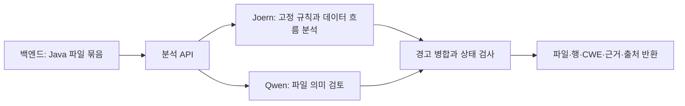

# ScanOps 분석 엔진

Java 소스코드에서 취약점 후보를 찾고 **파일·행 번호·탐지 근거를 백엔드에 반환하는 분석 서버**입니다. Joern으로 코드 구조와 데이터 흐름을 분석하고, Qwen3.8-Max의 코드 의미 검토 결과를 함께 제공합니다.

## 1. 담당 역할과 구현 내용

개발팀은 CPG 분석 작업 연결, API 후보·문맥 구성, LLM 응답 검증, 경고 병합, 분석 API 및 실패 처리를 구현했습니다. Joern의 그래프 생성 기능과 Qwen 기반 모델은 외부 기술을 활용합니다.

| 구분 | 구성과 목적 | 확인할 자료 |
|---|---|---|
| 현재 Java 서비스 | 고정 CPG 경고 + Qwen3.8-Max의 high-confidence 의미 경고 | [현재 엔진 안내](docs/CPG_LLM.md) |
| 규칙 보강 실험 | LLM이 제안한 source/sink 규칙을 검증하여 CPG에 추가하고 효과 비교 | 아래 평가 결과 및 `graph_spec_prod.py` |
| 이전 파인튜닝 모델 | Qwen3.5-9B + QLoRA v1, 기존 비Java 서빙 경로와 개발 이력 | [모델 카드·가중치·실행](docs/FINETUNED_MODEL.md) |

현재 Java 엔진은 외부 Qwen API를 사용합니다. Java 실행에 QLoRA 가중치나 로컬 GPU가 필요한 것은 아닙니다. 이전 학습 어댑터는 [GitHub Release](https://github.com/26Graduation/scanops-model/releases/tag/finetuned-v1-20260914)에 별도로 제공합니다.

## 2. 동작 흐름



1. 백엔드가 파일 경로·소스·언어를 전달합니다.
2. Joern이 파일 묶음을 CPG로 변환하고 고정 규칙을 적용합니다. source는 입력 지점, sink는 위험 연산 지점이며, taint 분석은 두 지점 사이의 데이터 흐름을 추적합니다.
3. Qwen은 대상 취약점 유형(CWE)을 정답으로 받지 않고 파일을 검토합니다. 긴 파일은 중첩 창으로 나누고 원본 행 번호를 복원합니다.
4. `merge()`가 같은 CWE·행의 경고를 합치고 탐지 출처를 보존합니다. Qwen이 경고하지 않아도 CPG 경고를 삭제하지 않습니다.
5. 분석이 불완전하면 `PARTIAL` 또는 오류로 전달합니다. 이를 정상적인 ‘취약점 없음’으로 취급하지 않습니다.

배포 설정은 `cpg-qwen38-ensemble`이며 동적 규칙 모드는 `shadow`입니다. 배포 Compose에서 **규칙 생성은 꺼져 있고 의미 검토는 별도로 실행**됩니다. 규칙 보강 실험과 실제 서비스의 결합 방식을 구분해야 합니다.

## 3. 주요 코드 설명

| 파일 | 입력 → 처리 → 출력 |
|---|---|
| [scripts/api_rebuild.py](scripts/api_rebuild.py) | 분석 요청 → 언어·용량 검사 및 엔진 호출 → 파일별 상태와 복수 경고 |
| [scanops/core/graph_spec_prod.py](scanops/core/graph_spec_prod.py) | 파일 묶음 → `analyze_repo()`의 Joern 호출·규칙 구성 → CPG 경고. `build_items_v2()`는 후보·문맥을 구성하고 `validate()`·`to_tsv()`는 제안 규칙을 검증·변환 |
| [scanops/core/java_semantic.py](scanops/core/java_semantic.py) | Java 소스 → `review()`의 창별 검토·응답 검사 → 의미 경고. `merge()`가 CPG 경고와 병합 |
| [joern/handler_joern.py](joern/handler_joern.py) | 작업 ID·언어·파일 → `run_repo_script()`의 Joern 실행 → 후보 또는 경고 |
| [dump_candidates_v2.sc](joern/queries/dump_candidates_v2.sc) | CPG → 호출·메서드·파라미터 정보 추출 → API 역할 제안용 후보 |
| [taint_spec.sc](joern/queries/taint_spec.sc) | CPG와 규칙 → 직접 검사·데이터 흐름 질의 → 위치와 경로 근거 |
| [java_base.tsv](scanops/core/specs/java_base.tsv), [java_sanitizers.tsv](scanops/core/specs/java_sanitizers.tsv) | 고정 탐지 규칙과 안전 처리 함수 정보 |
| [rebuild/train_qlora.py](rebuild/train_qlora.py), [rebuild/build_dataset.py](rebuild/build_dataset.py) | 이전 파인튜닝 모델의 학습 및 데이터 구성 |

`tests/`는 회귀 테스트, `runpod/`는 기존 GPU 서빙, `models/`는 가중치 안내·체크섬입니다. 과거 계획서와 실험 파일은 개발 이력이며 현재 실행 설정은 [CPG_LLM.md](docs/CPG_LLM.md)를 우선합니다.

## 4. 실행 방법

현재 Java 서버는 Docker로 API와 Joern worker를 함께 실행합니다. `scanops-model`과 `scanops-infra`를 같은 부모 폴더에 준비합니다.

```sh
git clone https://github.com/26Graduation/scanops-model.git
git clone https://github.com/26Graduation/scanops-infra.git
cd scanops-infra
cp .env.java.example .env.java
```

`.env.java`에 `SCANOPS_API_KEY`, `DASHSCOPE_API_KEY`, `DASHSCOPE_BASE_URL`, `JAVA_ENGINE_BIND_IP`를 입력하고 `GRAPH_SPEC_DYNAMIC_RULE_MODE=shadow`를 유지합니다. 키는 실제 환경 파일에만 저장합니다. x86-64 Docker 호스트와 Joern·API용 메모리가 필요하며 자세한 조건은 [인프라 실행 안내](https://github.com/26Graduation/scanops-infra/blob/main/docs/JAVA_DEPLOYMENT.md)에 있습니다.

```sh
docker compose -p scanops-java -f docker-compose.java-engine.yml --env-file .env.java config --quiet
docker compose -p scanops-java -f docker-compose.java-engine.yml --env-file .env.java up -d --build
```

## 5. API 입력과 결과 확인

- `GET /health`: API 프로세스 상태. Joern·Qwen 실제 분석 성공은 별도 확인이 필요합니다.
- `POST /analyze`: 파일 한 개 분석
- `POST /analyze/batch`: 파일 묶음 분석
- `POST /analyze/pr`: PR 파일 분석

분석 요청에는 `X-API-Key` 헤더가 필요합니다. `/analyze/batch`의 입력 예시는 다음과 같습니다.

```json
{
  "files": [{
    "language": "Java",
    "file_path": "Demo.java",
    "code": "class Demo {}",
    "use_rag": false
  }],
  "stop_on_first": false
}
```

응답에서는 파일별 `status`, `findings`, `source`, `line`, `evidence`, `analysis_details`를 확인합니다. 정확한 스키마는 `api_rebuild.py`의 `AnalyzeResponse`·`BatchResponse`에 있습니다. 실제 분석 요청은 Qwen API 비용이 발생할 수 있습니다.

모의 응답을 사용하는 로컬 회귀 테스트는 모델 저장소 루트에서 실행합니다.

```sh
python3.11 -m venv .venv
. .venv/bin/activate
python -m pip install pytest fastapi httpx requests 'uvicorn[standard]' 'tree-sitter-language-pack==1.12.2'
python -m pytest -q tests/test_graph_spec_prod_java.py tests/test_java_cpg_primary_api.py tests/test_java_deployment_guards.py tests/test_joern_repo_worker.py tests/test_java_semantic.py tests/test_java_resource_context.py
```

이 테스트는 유료 API나 실제 Joern의 탐지 정확도를 측정하지 않습니다.

## 6. 평가 결과와 확인 범위

최종보고서의 규칙 보강 평가는 Juliet Java 38개 CWE, 개발 190쌍·평가 534쌍으로 구성했습니다. 아래는 평가용 취약·안전 양쪽의 **1,068개 판정** 결과입니다. 파일 수를 뜻하지 않습니다.

| 방식 | TP | FP | FN | TN | F1 |
|---|---:|---:|---:|---:|---:|
| 고정 CPG | 144 | 42 | 390 | 492 | 0.400 |
| 고정 CPG + LLM 생성 규칙 | 183 | 69 | 351 | 465 | 0.466 |
| Qwen 단독: 대상 CWE 제공 | 508 | 107 | 26 | 427 | 0.884 |
| CodeQL: 선택한 쿼리·설정 | 115 | 40 | 419 | 494 | 0.334 |

규칙 보강으로 취약 판정 39건을 추가 탐지했지만 오탐도 27건 증가했습니다. 이 표는 **현재 배포 합집합 방식의 성능표가 아닙니다.** Qwen 단독에는 대상 CWE를 제공했고, CodeQL 수치는 선택한 버전·쿼리·채점 조건에 한정됩니다. 대상 CWE를 이용한 오프라인 선택 결과 F1 0.901 역시 배포 성능으로 사용하지 않습니다.

수치의 근거는 보존된 `JULIET_ECONOMY_FINAL_RESULTS.json`과 개별 채점 결과입니다. 평가 manifest hash는 `74870c3566ab9d5ba8668728b1bd29ba664800ad7d77d5e21fc2d7a02d86e5bf`입니다. **전체 최종 평가 스크립트·manifest·원본 결과 묶음은 이 저장소 main에 모두 포함되어 있지 않습니다.** 이 README의 표는 보존 결과 요약이며 clone만으로 전체 평가를 재실행할 수 있다는 의미는 아닙니다.

[검증 기록](docs/VERIFICATION.md)에 따르면 2026-09-08 Java 2파일의 사이트 연동을 확인했고, 2026-09-14 모델 회귀 테스트 58개와 하위 테스트 5개가 통과했습니다. 실제 CVE 일반화 성능, 대형 저장소 부하, 실제 PR 완료 경로는 추가 확인이 필요합니다. 과거 검증일과 현재 서버 상태를 구분합니다.

## 7. 관련 저장소와 문서

- [백엔드](https://github.com/26Graduation/scanops-backend): 언어별 라우팅·작업 상태·결과 저장
- [프론트엔드](https://github.com/26Graduation/scanops-frontend): 스캔 요청·진행·리포트 화면
- [인프라](https://github.com/26Graduation/scanops-infra): 실행 구성과 서비스 연결
- [이전 모델 카드](docs/FINETUNED_MODEL.md), [검증 범위](docs/VERIFICATION.md), [과거 문서](docs/history/README-before-20260914.md)
