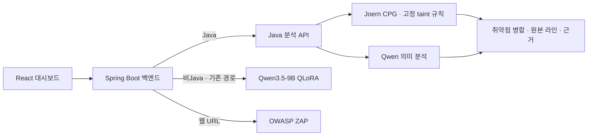

# ScanOps — CPG + LLM 보안 분석 엔진

**현재 Java 분석 엔진과 기존 파인튜닝 모델을 함께 보존한 저장소입니다.**
교수님과 프로젝트 검토자는 아래 두 경로에서 코드·실행 방법·모델 파일을 확인할 수 있습니다.

| 구분 | 현재 Java CPG + LLM | 기존 파인튜닝 모델 |
|---|---|---|
| 구성 | Joern CPG + Qwen3.8-Max 의미 분석 | Qwen3.5-9B + QLoRA (v1) |
| 역할 | Java 저장소·PR의 취약점 분석 | 기존 비Java 분석 경로 및 파인튜닝 연구 |
| 시작하기 | [현재 엔진 안내](docs/CPG_LLM.md) | [모델 카드·가중치·실행](docs/FINETUNED_MODEL.md) |
| 핵심 코드 | [CPG](scanops/core/graph_spec_prod.py), [LLM](scanops/core/java_semantic.py), [API](scripts/api_rebuild.py) | [학습](rebuild/train_qlora.py), [데이터 구성](rebuild/build_dataset.py), [서빙](runpod/handler_rebuild.py) |
| 모델 파일 | DashScope의 Qwen API 사용 | [실제 학습 어댑터 다운로드](https://github.com/26Graduation/scanops-model/releases/tag/finetuned-v1-20260914) |

## 전체 서비스 구조

Java 배포 선택은 `cpg-qwen38-ensemble`, 동적 규칙 모드는 `shadow`입니다.
고정 CPG 탐지와 LLM의 high-confidence 의미 분석 결과를 병합합니다.
현재 Java 경로는 기존 QLoRA 모델을 호출하지 않습니다.

## 먼저 확인할 자료

1. [현재 엔진과 실행 설정](docs/CPG_LLM.md)
2. [기존 파인튜닝 모델 카드 및 다운로드](docs/FINETUNED_MODEL.md)
3. [검증 범위와 재현 방법](docs/VERIFICATION.md)
4. [인프라 실행 안내](https://github.com/26Graduation/scanops-infra#readme)

2026-09-08 배포 기록에는 Java 2파일 사이트 연동 성공이 남아 있습니다.
이는 소규모 기능 검증이며, 전체 저장소 정확도나 앙상블의 성능 우위를 입증한 결과는 아닙니다.
현재 서버 상태를 실시간으로 보증하는 문서는 아닙니다.

## 디렉터리

| 경로 | 내용 |
|---|---|
| `scanops/core/`, `joern/`, `scripts/api_rebuild.py` | 현재 분석 엔진 및 API |
| `tests/` | Java 라우팅·의미 분석·오류 처리 등 회귀 테스트 |
| `rebuild/` | 9B QLoRA 데이터 구성·학습·평가와 후속 연구 |
| `runpod/` | 기존 GPU 모델 서빙 코드 |
| `models/` | 모델 파일 설명 및 체크섬; 실제 가중치는 Releases에서 제공 |
| `ml/` | 초기 학습 파이프라인 보존 |
| `benchmarks/`, `presentation/`, `rebuild/out/` | 연구 및 평가 자료; 조건별 결과를 구분해 해석 |
| `docs/history/` | 변경 전 안내 보존; 현재 실행은 위 안내를 우선 |

루트의 과거 계획서·실험 사양은 연구 이력입니다. 현재 배포 설명은 `docs/CPG_LLM.md`를 기준으로 읽어 주세요.

## 관련 저장소

- [백엔드](https://github.com/26Graduation/scanops-backend): 인증, Java/비Java 라우팅, 결과 저장
- [프론트엔드](https://github.com/26Graduation/scanops-frontend): 스캔 요청과 리포트
- [인프라](https://github.com/26Graduation/scanops-infra): Docker Compose, Java 분석 호스트 구성
