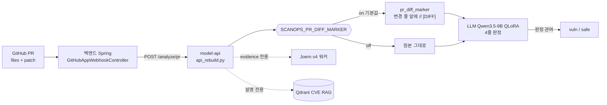
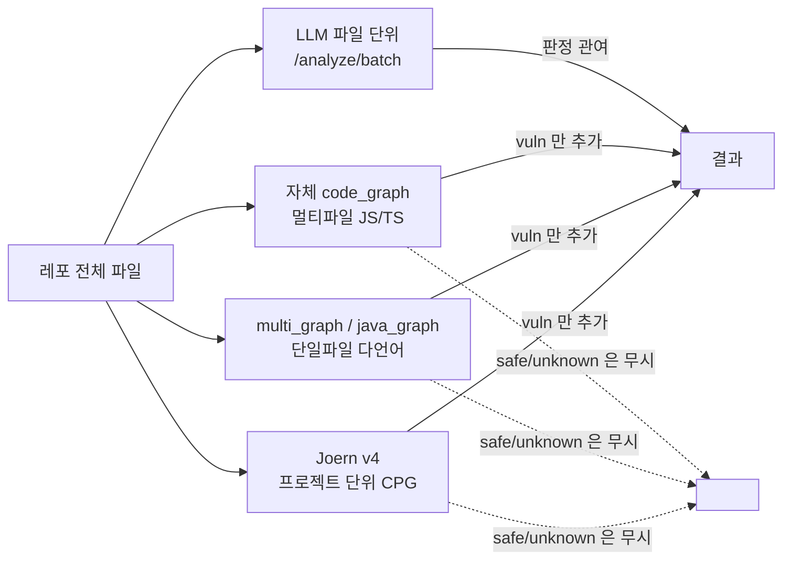
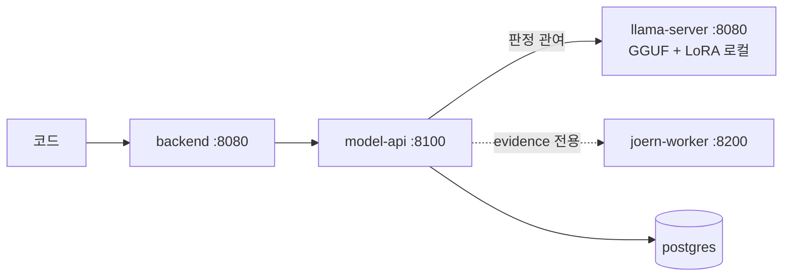

# ScanOps — 아키텍처 (발표용)

> 이 문서의 화살표 표기는 두 가지뿐이다.
> **판정 관여** = `detected` 값을 바꿀 수 있는 경로 / **evidence 전용** = 응답에 근거만 싣고 판정을 바꾸지 않는 경로.
> 그래프의 위치 문구는 `rebuild/out/repo_bench_juice-shop_metrics.json` 의
> 사전등록 판정(§B-4)에 따라 정해진다 — 결과를 보고 바꾸지 않았다.

---

## 1. 듀얼 엔진 — 두 경로는 서로 다른 능력을 쓴다

| 경로 | 입력 | 요구 능력 | 엔진 |
|---|---|---|---|
| **PR 경로** | head 파일 + **unified diff** | **바뀐 줄**이 취약을 만들었는가 (패치 전후 구분) | LLM + `[DIFF]` 마커 |
| **레포 경로** | 레포 전체 파일 목록 | 파일에 취약이 있는가 / 여러 파일에 걸친 흐름 | LLM 파일 단위 ∪ 자체 graph ∪ Joern |

이 둘을 하나의 지표로 재면 안 된다. **PR 경로는 쌍 판별**(§표2), **레포 경로는 recall/경보율**(§표1)로 잰다.

---

## 2. SaaS 경로

- 마커는 **LLM 프롬프트에만** 들어간다. graph·Joern·점수 경로는 언제나 **원본 코드**를 본다
  (`scripts/api_rebuild.py` `_detect(prompt_code=...)`).
- `SCANOPS_PR_DIFF_MARKER=0` 이면 프롬프트가 이전과 **바이트 동일**하다 — 되돌림은 환경변수 하나다.

---

## 3. 레포(전체 스캔) 경로

**그래프 불변 규칙 (근거: `rebuild/out/ABLATION_RESULTS.md`)**
graph/Joern 의 `vuln` 은 결과에 **추가**만 한다. `safe`·`unknown` 은 **어떤 판정도 덮지 않는다.**
graph 의 safe 판정은 42.5% 가 오판이었고, unknown 이 91.6% 다 — 억제 권한을 주면 미탐이 늘어난다.

---

## 4. 온프레미스 경로 (외부 호출 0)

- **LoRA 필수**: `LORA_ARG=--lora /models/adapter_v1_fix.gguf`.
  없으면 4줄 판정 서식이 안 나와 전부 미탐이 된다(실측).
- 실측 사양: CPU 19.3s(짧은 스니펫) / 88.3s(실제 CVE 함수), RAM 피크 5.58GiB
  (`FINAL_ARCHITECTURE_REPORT.md` §5-4).
- 이번 세션의 레포 벤치 S1·S2 도 **이 경로와 같은 로컬 서빙**으로 돌렸다
  (RunPod serverless 는 가용 GPU 0 이었다 — 사양 §4-a).

---

## 5. 오늘 측정으로 확정된 것 (숫자는 `RESULTS_ONEPAGER.md` 표에서만 읽는다)

| 항목 | 파일 |
|---|---|
| 레포 벤치 3 arm 표·판정 | `rebuild/out/repo_bench_juice-shop_metrics.json` |
| 정답표(스캔 전 커밋) | `rebuild/data/repo_bench/juice-shop_truth.jsonl` (커밋 `72d18e0`) |
| Joern 프로젝트 CPG 실측 | `rebuild/out/repo_bench_juice-shop_joern.json` |
| `[DIFF]` 이식 회귀 4종 | `rebuild/out/diff_marker_port_check.json` |
| 사전등록 사양 | `rebuild/DUAL_ENGINE_RUN_SPEC.md` |
