# ScanOps Java CPG + LLM 보안 탐지 엔진 개발 보고서

작성일: 2026-09-06

평가 브랜치: `codex/java-cpg-qwen38`

상태: G0~G2 통과, G3 fixed CPG 통과·dynamic rule arm 실패, G4 미개봉, 원격 push 보류

## 초록

본 과제는 Java 저장소의 소스 코드를 단순 텍스트 분류하는 대신, LLM이 외부 API의 보안
의미를 source·sink·sanitizer 규칙으로 변환하고 Joern Code Property Graph(CPG)가 실제
source-to-sink 경로를 증명하는 하이브리드 정적 분석기를 구현한다. 기존 CVEfixes 전용
Qwen3.5-9B QLoRA는 학습 분포 밖 실제 Java 개발 저장소에서 높은 오탐을 보였으므로 Java
최종 판정 경로에서 제거하였다. 현재 Java는 `CPG + Qwen3.8-Max 규칙 생성`을 기본 엔진으로
사용하며, 런타임 실패를 안전 결과로 위장하지 않고 `PARTIAL` 또는 HTTP 503으로 드러낸다.

개발 단계에서 제품 배선 10개 검사를 모두 통과했고, 41개 API 의미 골든셋에서 role
macro-F1 1.000, Juliet Java 38개 CWE에서 sanitizer 제외 기준 인스턴스 F1 0.737을 얻었다.
실제 Java 개발 저장소 3개에서는 목표 취약 프로젝트를 모두 탐지했다. 동일 15개 파일의
소규모 오픈웨이트 비교에서 ScanOps의 binary F1은 0.615로 Qwen3.5-9B QLoRA의 0.471보다
높았고, base 모델의 F1은 0이었다. 다만 이는 개발 결과이며, 논문 또는 제품 최종 성능 주장은
동결된 12개 프로젝트의 블라인드 G4 비교를 통과한 뒤에만 가능하다.

## 1. 연구 문제와 설계 목표

코드 전체를 LLM에 입력해 `취약/안전`을 직접 분류하면 긴 저장소의 문맥 손실, 근거 없는
추론, 출력 파싱 실패, 학습 데이터 분포 의존성 문제가 생긴다. 반대로 고정 정적 분석 규칙만
사용하면 라이브러리와 프레임워크 API가 계속 바뀌는 환경에서 source와 sink의 의미를 모두
수작업으로 관리해야 한다. 본 시스템은 두 방식의 역할을 다음처럼 분리한다.

- LLM: 저장소에서 관찰된 외부 API의 보안 의미를 제한된 스키마의 규칙으로 생성한다.
- CPG: AST, 호출, 타입 및 데이터 흐름을 바탕으로 실제 경로가 존재하는지 결정한다.
- 검증기: LLM 출력의 category/CWE 조합, 정규식, matcher, 인자 조건을 검사한다.
- sanitizer 엔진: 경로 위의 중화 동작을 찾아 취약 경보에서 제외한다.
- 선택적 path critic: 이미 생성된 경로의 주변 문맥만 검토하며, 근거 있는 고신뢰 FALSE만
  억제한다.

완료 기준은 단순 accuracy가 아니다. 동일한 동결 평가셋에서 ScanOps의 F1과 recall이 가장
강한 비교 모델보다 각각 5%p 이상 낮지 않아야 하며, 진탐은 sink line과 가능한 경우
source-to-sink path를 포함해야 한다. 경보 폭증, 파싱 누락, 런타임 실패도 별도 실패 조건이다.

## 2. 전체 아키텍처

```mermaid
flowchart LR
    A[Java repository / PR] --> B[Language router: JAVASRC]
    B --> C[Joern candidate extraction]
    C --> D[Java candidate prefilter]
    D --> E[Qwen3.8-Max API role labeling]
    E --> F[Schema and semantic validator]
    F --> G[Frontend-scoped rule cache]
    G --> H[Fixed/promoted spec; proposals shadowed]
    A --> I[Joern CPG construction]
    H --> J[Source/sink/sanitizer query]
    I --> J
    J --> K[Deduplication + sanitizer exclusion]
    K --> L{Optional path critic}
    L --> M[Per-file API aggregation]
    M --> N[ScanOps API / batch / PR response]
```



운영의 핵심 불변식은 `Java 판정 = 증명된 CPG finding`이다. CVEfixes QLoRA는 Java의
fallback, 투표자, 메타 생성기로도 호출되지 않는다. 다른 언어는 독립적인 평가를 마칠 때까지
기존 경로를 유지하므로 Java 변경이 JS/TS 동작을 암묵적으로 바꾸지 않는다.

## 3. 내부 동작

### 3.1 언어 분리와 입력 단위

Java는 Joern frontend `JAVASRC`, LLM prompt label `Java`, source mode `java`로 고정한다.
JS/TS는 `JSSRC`로 별도 그룹에 넣는다. 혼합 언어 batch도 frontend마다 서로 다른 CPG를
생성하기 때문에 과거의 `JSTS` 고정 또는 첫 파일 언어 재사용 문제를 제거했다. 캐시 키에도
frontend를 포함해 같은 이름의 Java API와 JavaScript API가 서로의 규칙을 오염시키지 않는다.

### 3.2 후보 추출과 Java 전용 사전 필터

Joern은 호출 이름, 해석된 method full name, 발생 횟수, 짧은 사용 예를 수집한다. 이 단계는
recall을 위해 넓게 수집한다. 그 다음 Java 전용 필터가 다음 항목만 제거한다.

1. Java에 적용되지 않는 JS DOM 성격의 property-write 후보
2. 모든 full name이 저장소 내부 package로 해석된 로컬 메서드 호출

표준 라이브러리, 제3자 라이브러리, 해석되지 않은 호출은 보존한다. G3 세 저장소에서 후보는
2,141개에서 560개로 73.8% 줄었다. 이 최적화는 호출 비용과 지연을 줄이지만, Qwen3.8-Max
전체 재실행 전에는 탐지 성능 향상으로 주장하지 않는다.

### 3.3 Qwen3.8-Max 규칙 생성

LLM은 자유 형식 취약점 설명 대신 각 후보에 대해 `source`, `sink`, `sanitizer`, `none` 중
하나와 matcher를 반환한다. sink는 category와 허용된 CWE, name/full-name/code 매칭,
`exists`, `arg_literal`, `arg_count` 같은 구조 조건을 함께 가질 수 있다. temperature는 0으로
고정하며 모든 항목 ID가 반환되지 않으면 누락 ID만 재시도한다. 정상적인 `none`도 캐시에
저장하여 매 스캔마다 같은 무관 API를 재질의하지 않는다.

동적 규칙 앞에는 감사된 Java 기본 규칙과 sanitizer 규칙을 결합한다. LLM 결과는 다음 조건을
통과해야 TSV로 변환된다.

- role과 matcher가 허용 목록에 있을 것
- category와 CWE의 조합이 의미적으로 유효할 것
- 정규식이 컴파일 가능할 것
- `arg_count` 등 matcher별 필수 값이 존재할 것
- 프롬프트에 없던 ID나 잘못된 구조를 임의로 수용하지 않을 것

G3 전수 실험에서 동적 규칙이 recall을 높이지 못하고 경보 부담을 늘렸으므로, 현재 기본 모드는
`shadow`다. Qwen3.8-Max 제안은 검증·캐시되지만 즉시 verdict에 합치지 않는다. 골든셋,
buggy/fixed, held-out을 통과해 승격된 규칙만 고정 spec에 들어간다. `enforce`는 명시적인 실험
옵션이다. 따라서 LLM을 제거한 것이 아니라, LLM 제안과 운영 판정 사이에 성능 게이트를 둔
구조다.

### 3.4 Java trust boundary

`java` source mode는 모든 파라미터를 무조건 attacker input으로 보지 않는다. 다음 네 가지
출처를 구분한다.

- `explicit_source_api`: request parameter, 환경/파일/입력 API처럼 규칙에 명시된 source
- `public_parameter`: public 메서드의 문자열·경로·컬렉션 등 data-carrier 파라미터
- `instance_state`: 생성자나 setter에서 저장된 뒤 `this.field`로 다시 읽히는 데이터
- `parameter_field_access`: 다른 frontend의 구조적 파라미터 field-access 모드

`HttpServletResponse`, application/security context, logger와 같은 framework context는
public data source에서 제외한다. call-site-only, literal-only, arity-only finding에도 각각
source provenance를 기록한다. 이 `source_kind`는 향후 경보 순위와 critic 감사를 가능하게
하지만 현재는 근거 없이 경보를 삭제하는 hard filter로 사용하지 않는다.

### 3.5 CPG 경로와 sanitizer 판정

일반 taint 규칙은 source 노드에서 sink의 명시적 인자까지 `reachableByFlows` 경로가 있는지
검사한다. receiver(`argumentIndex=0`)는 sink로 들어가는 값이 아니므로 제외한다. 하나의 call이
여러 인자 경로로 중복되는 경우 `(file, category, CWE, line)`으로 합친다. 결과에는 source,
sink, line, 최대 12개의 경로 step, sanitizer hit, rule pattern과 matcher가 남는다.

`exists`, `arg_literal`, `arg_count`는 데이터 흐름이 아니라 호출 자체 또는 호출 모양이
취약 조건인 규칙이다. 이들은 별도 분기에서 분석해 의미가 다른 규칙을 억지 taint path로
표현하지 않는다. sanitizer는 source·중간·sink 주변의 enclosing code를 검사하며, hit가 있는
finding은 원문에는 보존하되 active 취약 경보에서는 제외한다.

### 3.6 선택적 path critic의 안전장치

critic은 전체 파일 분류기가 아니라 CPG가 이미 찾은 개별 경로의 sink/source 주변 문맥을
검토한다. verdict는 `TRUE`, `FALSE`, `UNCERTAIN`의 세 값이다. `UNCERTAIN`은 안전 판정으로
간주하지 않는다. finding을 억제하려면 다음 조건을 모두 만족해야 한다.

1. verdict가 정확히 `FALSE`
2. confidence가 기본값 `high`
3. 비어 있지 않은 이유가 존재
4. `basis_line`이 모델에 실제로 제시된 sink/source 문맥 범위 안에 존재

근거가 약한 FALSE는 `UNCERTAIN`으로 강등한다. JSON 파싱 실패, 응답 누락, evidence 불일치는
fail-open이 아니라 탐지 보존 방향, 즉 finding 유지로 처리한다. raw batch 응답과 검증 후
판정을 모두 결과 파일에 남긴다. 최종 held-out에서 precision 개선과 recall 손실을 함께 확인할
때까지 운영 기본값은 off이다.

### 3.7 API 결과와 장애 의미

`/analyze`, `/analyze/batch`, `stop_on_first`, `/analyze/pr`가 모두 같은 Java CPG 경로를 쓴다.
성공한 분석에서 finding이 없는 파일은 `safe`, finding이 있는 파일은 `vuln`이다. Java CPG
런타임 또는 Qwen 설정이 없을 때 단일·batch 응답은 `PARTIAL`, PR은 HTTP 503을 반환한다.
이는 분석이 수행되지 않은 상태를 안전으로 잘못 보고하는 false clean을 방지한다.

한 파일에 경로가 여러 개면 API가 어떤 경로를 대표 evidence로 보여줄지도 결정적으로
정렬한다. high-confidence TRUE critic 판정, explicit source API, public parameter, 구조적 source,
instance state 순으로 우선하며, 같은 등급에서는 실제 path 존재 여부와 길이, line, CWE로
정렬한다. 이 순위는 finding을 삭제하지 않고 사용자에게 가장 해석하기 좋은 근거를 먼저
제시하는 용도다. 선택된 evidence의 첫 source step에도 `source_kind`를 포함해 API 사용자도
신뢰 경계의 근거를 직접 확인할 수 있다.

## 4. 평가 설계와 지표

주지표는 `(repository, file, enclosing method, CWE)` 인스턴스 단위 precision, recall, F1이다.
F1을 선택한 이유는 모든 위치에 경보를 내는 방식과 거의 아무것도 탐지하지 않는 방식을 모두
불리하게 만들기 위해서다. 하지만 보안에서는 놓침 비용이 더 크므로 F1 하나로 결론내리지 않고
다음 지표를 함께 사용한다.

- recall 및 F2: false negative의 비용을 별도로 감시
- 프로젝트/CVE 탐지율: 적어도 해당 취약 프로젝트를 포착했는지 확인
- alert burden: 프로젝트당 경보 폭증 여부 확인
- strict-CWE와 loose/binary 적중: 위치 탐지와 CWE 분류 오류를 분리
- sanitizer 전후 TP/FP 변화: 정밀도 향상이 recall 희생인지 확인
- buggy/fixed pair persistence: 패치 뒤에도 같은 경보가 남는지 확인
- CPG/LLM 성공률, 누락 ID, 파싱 실패, 시간과 호출 수: 운영 재현성 확인

데이터는 G1 API 의미 골든셋, G2 Juliet 회귀, G3 실제 프로젝트 개발셋, G4 동결 held-out으로
분리한다. 결과를 보고 규칙을 바꾼 저장소는 다시 최종 held-out으로 사용하지 않는다.

## 5. 현재 결과

### 5.1 G0 제품 배선

- 핵심 graph-spec 단위 테스트: 13/13 통과
- Docker model-api 통합 회귀 테스트: 21/21 통과
- Joern worker smoke v8: 10/10 통과
- cross-file path, public parameter, instance state, framework context 제외, sanitizer 확인
- Java/JS frontend와 cache namespace 분리 확인
- worker 결과에 `source_kind` 보존 확인

### 5.2 G1 API 규칙 골든셋

| 지표 | 결과 |
|---|---:|
| 감사 항목 | 41 |
| role macro-F1 | 1.000 |
| sink recall | 1.000 (10/10) |
| category+CWE exact sink recall | 1.000 (10/10) |
| 누락/invalid | 0/41 |
| source/sink reversal | 0 |

이 결과는 프롬프트와 검증기의 개발 게이트이며 독립적인 최종 성능 수치는 아니다.
production 후보 수에 가까운 batch 20으로 41개 전수를 다시 실행해도 세 recall/F1 지표가
모두 1.000, 누락 0, 역전 0이었다. validation 재시도 2회를 포함해 5 API 호출과 43,938
tokens가 사용됐다. 이에 기본 batch를 6에서 20으로 올려 G3의 명목 호출 수를 94에서 28로
줄였다. 첫 G3 실행에서 4개 요청이 기존 300초 제한에 동시에 도달해, G1에서 실제 검증된
재시도 상한과 동일하게 production timeout도 600초로 맞췄다. 실패 요청은 raw log에 남긴다.

### 5.3 G2 Juliet Java 38 CWE

| 단위 | TP | FP | FN | Precision | Recall | F1 |
|---|---:|---:|---:|---:|---:|---:|
| raw line | 9,168 | 8,636 | 1,179 | 0.515 | 0.886 | 0.651 |
| method/CWE, raw | 9,165 | 7,289 | 999 | 0.557 | 0.902 | 0.689 |
| method/CWE, sanitizer 제외 | 9,115 | 5,451 | 1,049 | 0.626 | 0.897 | **0.737** |

sanitizer는 인스턴스 기준 FP 1,838개와 TP 50개를 함께 제거했으며 F1을 약 4.9%p 높였다.
기존 source mode 대비 raw recall 감소는 0.9%p로 사전등록 한도 2%p 이내다.

### 5.4 G3 실제 Java 개발 저장소

Spark(CWE-22), Plexus-utils(CWE-78), Cron-utils(CWE-94)를 모두 탐지해 project recall은
3/3이다. target-CWE method 기준 TP=5, FP=4, FN=39, precision=0.556, recall=0.114이다.
전체 CWE 경보를 모두 FP로 계산하면 다른 CWE 65개가 포함되어 FP=69가 된다. 이 벤치의
`fix_info.csv`에는 보조 및 테스트 메서드도 포함되지만 CPG는 위험 sink 위치를 보고하므로,
method recall만으로 엔진 전체를 평가하지 않고 project recall과 alert burden을 함께 제시한다.

buggy/fixed 쌍에서는 목표 CWE 경보가 Spark 10→10, Plexus-utils 2→2, Cron-utils 1→0으로
변했다. Spark는 동일 `(file, CWE, sink code)` fingerprint 8개가 패치 뒤에도 남아 2/3 프로젝트가
pair-cleanliness 기준에 실패했다. 다만 fixed snapshot에 별개의 위험한 public path API가 남을
수 있고, Plexus-utils 패치는 `Runtime.exec` 자체를 제거하지 않고 shell 문자열을 직접 argument
vector로 바꾼다. 따라서 12개를 모두 확정 FP로 부르지는 않는다. 현재 엔진이 저장 전 검증과
shell/direct-exec 구조 차이를 충분히 모델링하지 못한다는 근거로 사용한다.

### 5.5 동일 파일 오픈웨이트 비교

| 채점 | 엔진 | Precision | Recall | F1 | F2 |
|---|---|---:|---:|---:|---:|
| binary | ScanOps fixed Java CPG | 0.571 | 0.667 | **0.615** | **0.645** |
| binary | Qwen3.5-9B base Q4 | 0.000 | 0.000 | 0.000 | 0.000 |
| binary | Qwen3.5-9B + CVEfixes QLoRA | 0.364 | 0.667 | 0.471 | 0.571 |
| exact CWE | ScanOps fixed Java CPG | 1.000 | 0.500 | **0.667** | **0.556** |
| exact CWE | Qwen3.5-9B base Q4 | 0.000 | 0.000 | 0.000 | 0.000 |
| exact CWE | Qwen3.5-9B + CVEfixes QLoRA | 1.000 | 0.500 | **0.667** | **0.556** |

동일한 6개 positive와 9개 nominal-negative 파일에서 CPG는 QLoRA보다 binary F1이 0.144
높고 exact-CWE F1은 같다. 표본이 작고 nominal-negative에 라벨되지 않은 다른 취약점이 있을
수 있으므로 이 표는 QLoRA 제거의 개발 근거이지 최종 우월성 주장이 아니다.

### 5.6 Qwen3.8-Max 동적 규칙 전수 ablation

| 엔진 | TP | FP(all-CWE) | FN | Recall | F1(all-CWE) | active findings |
|---|---:|---:|---:|---:|---:|---:|
| fixed CPG | 5 | 69 | 39 | 0.114 | **0.0847** | 78 |
| fixed + dynamic Qwen3.8 | 5 | 107 | 39 | 0.114 | 0.0641 | 116 |

Qwen3.8-Max는 prefilter 이후 560/560 후보를 최종적으로 반환·검증했고 동적 규칙 40행을
생성했다. 그러나 TP를 늘리지 못하고 target-CWE FP도 4에서 5로 증가해 target F1이
0.1887에서 0.1852로 하락했다. 총 wall time은 3,073.7초였다. 이 arm은 G3 실패이며 G4로
진행하지 않는다. raw log에는 최초 300초 제한 실패를 포함한 38개 호출 기록과 최종 성공
28개 batch가 모두 남아 있다.

## 6. 재현 방법

모든 명령은 `scanops-model` 루트에서 실행한다. 기존 결과를 덮어쓰지 않도록 출력 이름을 새로
지정한다.

### 6.1 빠른 회귀 테스트

```bash
python3 -m unittest tests.test_graph_spec_prod_java tests.test_joern_repo_worker
python3 -m py_compile scanops/core/graph_spec_prod.py \
  benchmarks/cwe-bench-java/run_g3_path_critic.py
```

### 6.2 제품 smoke

```bash
python3 benchmarks/java-cpg-product/smoke_product_cpg.py \
  --out rebuild/out/java_qwen38/my_g0_worker_run.json
python3 benchmarks/java-cpg-product/smoke_product_orchestrator.py \
  --out rebuild/out/java_qwen38/my_g0_product_run.json \
  --cache rebuild/out/java_qwen38/my_g0_cache.json
```

첫 명령은 Docker가 필요하다. 두 번째 명령은 Qwen3.8-Max 규칙 생성 때문에 DashScope 전송
승인이 필요하며 `.env`의 키를 사용하되 결과 파일에는 키를 기록하지 않는다.

### 6.3 G1 규칙 생성 평가

```bash
python3 benchmarks/golden-sets/java/eval_rulegen.py \
  --out rebuild/out/java_qwen38/my_g1_run
```

### 6.4 G2 Juliet

```bash
JULIET_OUT="$PWD/benchmarks/juliet-java/out_g2_reproduction" \
JULIET_SRC_MODE=java bash benchmarks/juliet-java/run_all_cwes.sh
python3 benchmarks/juliet-java/grade_all.py out_g2_reproduction
python3 benchmarks/juliet-java/grade_instances.py \
  benchmarks/juliet-java/out_g2_reproduction \
  --output rebuild/out/java_qwen38/my_g2_instances.json
```

### 6.5 G3 고정 CPG와 비교

```bash
python3 benchmarks/cwe-bench-java/collect_g3_candidates.py \
  --out rebuild/out/java_qwen38/my_g3_candidates.json
python3 benchmarks/cwe-bench-java/run_g3_local.py \
  --out rebuild/out/java_qwen38/my_g3_cpg.json
python3 benchmarks/cwe-bench-java/run_g3_dynamic_qwen38.py \
  --candidates rebuild/out/java_qwen38/g3_candidates_v1.json \
  --out rebuild/out/java_qwen38/my_g3_dynamic_qwen38.json \
  --batch-size 20 --workers 4
python3 benchmarks/cwe-bench-java/run_g3_buggy_fixed_pairs.py \
  --buggy-results rebuild/out/java_qwen38/g3_fixed_cpg_v5_scored_20260906.json \
  --out rebuild/out/java_qwen38/my_g3_buggy_fixed_pairs.json
python3 benchmarks/cwe-bench-java/compare_g3_engines.py \
  --cpg rebuild/out/java_qwen38/g3_fixed_cpg_v5_scored_20260906.json \
  --llm rebuild/out/java_qwen38/g3_qwen35_base_dev15_20260906.json \
  --llm rebuild/out/java_qwen38/g3_qwen35_qlora_dev15_deterministic_20260906.json \
  --out rebuild/out/java_qwen38/my_comparison.md
```

buggy/fixed 명령은 각 shallow clone에 `project_info.csv`의 마지막 fix commit object가 있어야
한다. 없다면 해당 공개 저장소에서 그 commit hash만 `git fetch --depth=1 origin <hash>`로 먼저
가져온다. 기존 checkout은 변경하지 않는다.

동적 Qwen runner는 프로젝트마다 checkpoint와 raw prompt/response를 저장한다. 중단 후 같은
출력 이름에 `--resume`을 추가하면 완료 프로젝트를 건너뛴다. 이 명령은 승인된 저장소 파생
정보를 DashScope로 전송한다.

### 6.6 로컬 open-weight path critic

```bash
./llama.cpp/build/bin/llama-server \
  -m models/Qwen3.5-9B-Q4_K_M.gguf -c 32768 --parallel 2 \
  --host 127.0.0.1 --port 8081 -ngl 99
python3 benchmarks/cwe-bench-java/run_g3_path_critic.py \
  --input rebuild/out/java_qwen38/g3_fixed_cpg_v5_scored_20260906.json \
  --local-url http://127.0.0.1:8081 \
  --model-label 'Qwen/Qwen3.5-9B Q4_K_M local path critic' \
  --out rebuild/out/java_qwen38/my_local_path_critic.json
```

로컬 모델은 연구용 안전성 검증이며 Qwen3.8-Max 결과를 대신하지 않는다.

실측 결과 로컬 Qwen3.5-9B Q4 critic은 78개 finding 중 24개를 억제했지만 Cron-utils의
유일한 라벨 진탐도 제거했다. project recall은 3/3에서 2/3, method recall은 0.114에서
0.091, target-CWE F1은 0.189에서 0.157로 하락했다. 따라서 recall 게이트에 실패하며 제품에
채택하지 않는다. 이 실패 결과도 raw 응답과 함께 보존한다.

승인 후 동일 finding을 Qwen3.8-Max로 검증한 결과는 달랐다. TP=5와 project recall 3/3을
유지하면서 78개 중 9개를 제거해, all-CWE FP가 69에서 60, precision이 0.0676에서 0.0769,
F1이 0.0847에서 0.0917로 상승했다. target-CWE 지표는 5/4/39와 F1 0.1887로 변하지 않아
제거된 것은 이 벤치가 라벨하지 않은 다른 CWE 경보였다. 590.2초가 걸렸고 개선폭도 작으므로
G4 이전에는 제품 기본값을 켜지 않고 실험 arm으로만 유지한다.

## 7. 한계와 타당성 위협

1. G3는 개발 저장소 3개, 직접 비교는 15개 파일뿐이므로 일반화 결론을 내릴 수 없다.
2. Juliet는 합성 벤치이며 코드 패턴 반복이 많아 실제 프로젝트 성능을 과대평가할 수 있다.
3. CWE-Bench의 수정 메서드는 sink 외 보조 코드와 테스트도 포함하므로 sink 기반 분석기의
   method recall을 과소평가할 수 있다.
4. fixed CPG 결과는 기본 규칙의 능력을 보여주지만 동적 Qwen3.8-Max 규칙의 추가 이득은 외부
   전송 승인 후 같은 입력으로 다시 측정해야 한다.
5. 로컬 Qwen3.5-9B critic 결과는 운영 예정 모델 Qwen3.8-Max와 동일하지 않다.
6. 현재 severity와 CVSS는 CPG 경로만으로 보정하지 않아 Java 응답에서 `UNKNOWN`일 수 있다.
7. 패키지 기반 후보 필터는 Joern full-name 해석 품질에 의존한다. unresolved 호출은 보존해
   recall 손실을 줄였지만, 전체 Qwen 재실행으로 검증해야 한다.

## 8. 남은 로드맵과 종료 조건

1. Qwen3.8-Max의 batch 크기 변경 전 G1 41개 전수를 다시 실행해 macro-F1과 누락률을 확인한다.
2. 동적 규칙은 API 의미 골든만으로 승격하지 않고, 규칙별 alert delta와 buggy/fixed
   persistence를 통과한 항목만 fixed spec 후보로 승격한다.
3. Qwen3.8-Max path critic을 critic-off와 비교해 recall 손실 2%p 이내에서 precision/F1이
   개선되는 경우에만 채택한다.
4. buggy/fixed 쌍에서 패치 후 목표 CWE 경보 잔존율을 측정한다.
5. 동결 12개 G4를 한 번만 열어 ScanOps와 동일 입력의 강한 오픈웨이트 모델을 비교한다.
6. 최고 비교 모델 대비 F1과 recall이 각각 5%p 이내이고 모든 회귀가 통과할 때만 push한다.
7. 미달이면 해당 held-out을 개발셋으로 이동하고, 원인 하나만 수정한 뒤 새로운 held-out을
   다시 동결한다.

현재까지의 결론은 “Java 전체 플로우가 동작하며 기존 QLoRA보다 유망하다”이다. 아직
“GPT·Claude 또는 최강 오픈소스 모델과 동등하다”는 결론은 아니다. 그 주장은 G4의 독립적인
동결 평가와 raw 결과 공개 이후에만 정당화된다.
